# Sistema operativo, gestione dei processi e scheduling

## Obiettivi di un sistema operativo

Un sistema operativo ha principalmente tre obiettivi:

- **convenienza** nell'uso del calcolatore rispetto ai potenziali utenti;
- **efficienza** nell'utilizzo del calcolatore e delle sue parti costitutive;
- **capacità di evolversi** rispetto a evoluzioni hardware, esigenze degli
  utenti e bug.

## Sistema operativo come interfaccia

<!-- markdownlint-disable MD046 -->
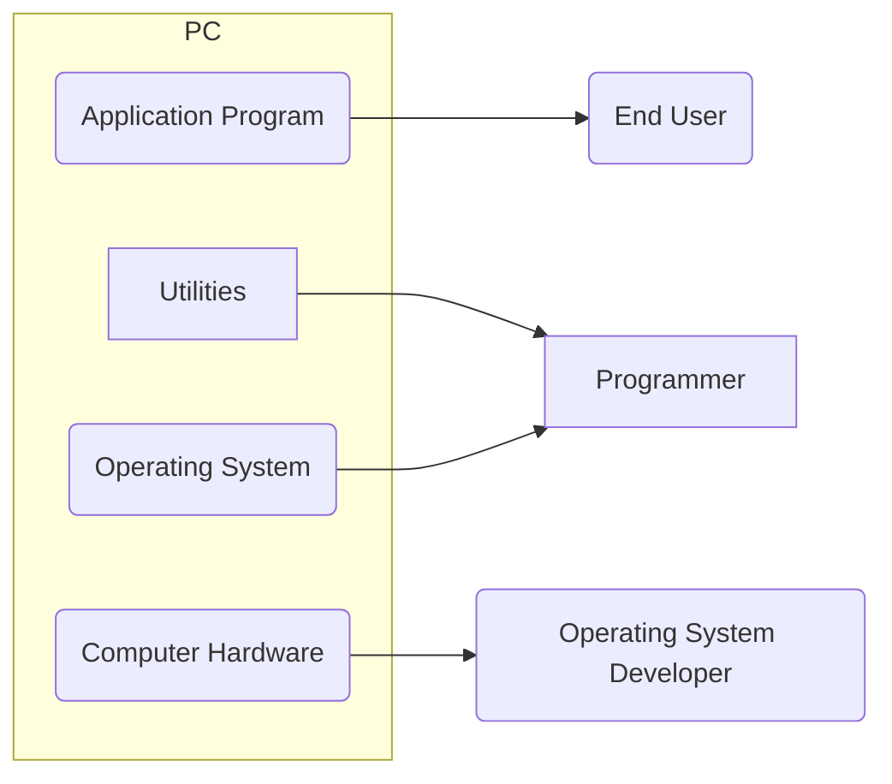
<!-- markdownlint-enable MD046 -->

Il sistema operativo:

- nasconde i dettagli hardware al programmatore;
- fornisce un'**interfaccia** per utilizzare il sistema.

Il sistema operativo agisce quindi in maniera **trasparente**.

Un'**interfaccia** è un componente fisico o logico che permette a due o più
sistemi elettronici di comunicare e interagire.

<!-- TODO: aggiungere immagine (a scala). -->

## Servizi offerti dal sistema operativo

Il sistema operativo offre vari servizi:

- **creazione dei programmi**: compilatore, debugger come utilità offerte al
  programmatore. Non sono parte del sistema operativo ma sono accessibili
  tramite esso;
- **esecuzione dei programmi**: caricamento in memoria dei programmi,
  inizializzazione dei dispositivi I/O, ecc;
- **accesso ai dispositivi di I/O**: l'utente/programmatore ignora il set di
  istruzioni e i segnali dei dispositivi;
- **accesso controllato ai file**: comprensione del formato, meccanismi di
  protezione, associazione file indirizzi di memoria;
- **accesso al sistema** (inteso in senso lato);
- **rilevazione e correzione degli errori hardware** o generati da programmi in
  esecuzione;
- **contabilità e statistiche d'uso delle risorse**, dei tempi di risposta (al
  fine di migliorare le prestazioni).

## Sistema operativo come gestore delle risorse

<!-- markdownlint-disable MD046 -->
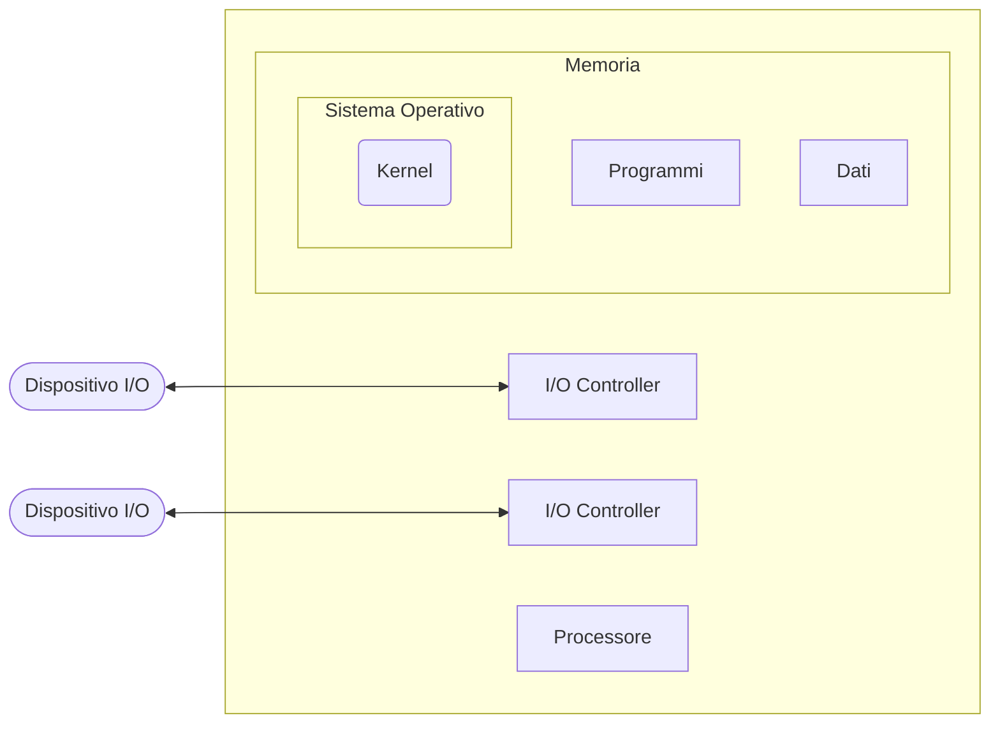
<!-- markdownlint-enable MD046 -->

Il sistema operativo:

- dirige la CPU nell'utilizzo delle altre risorse del sistema e nella
  temporizzazione dell'esecuzione dei programmi;
- decide quando un programma in esecuzione può utilizzare una risorsa. Il
  processore stesso è una risorsa.

Il **Kernel** è Parte del sistema operativo risiedente in memoria centrale,
contiene le funzioni del sistema operativo usate più frequentemente.

## Batch multiprogrammati

Con **batch multiprogrammati** si intende sistemi dove è consentita la
multiprogrammazione, ovvero l'esecuzione di più programmi in contemporanea.

<!-- markdownlint-disable MD046 -->
=== "Mono-programmazione"

    Ad esempio:

    - Lettura di un record: \(0.0015 \second\);
    - Esecuzione di \(100\) istruzioni: \(0.0001 \second\);
    - Scrittura di un record: \(0.0015 \second\);
    - Totale \(0.0031 \second\).

    Percentuale di utilizzo della CPU:

    \[
        \frac{0.0001 \cancel{\second}}{0.0031 \cancel{\second}} = 0.032
                                                                = 3.2 \%
    \]

=== "Multi-programmazione"

    - Presenza di più programmi in memoria;
    - Obiettivo: limitare l'inattività del processore, quando un job effettua
      un'operazione di I/O la CPU può essere impegnata da un altro processo;
    - Elaborazione seriale dei task.

<!-- markdownlint-enable MD046 -->

### Multi-programmazione

<!-- TODO: aggiungere immagine della multiprogrammazione. -->

Le difficoltà della multi-programmazione sono le seguenti:

- Gestione della memoria;
- Decidere quale Job mandare in esecuzione (*schedulazione*).

## Processo = Job = Task

!!! def "Processo"
    Un'attività caratterizzata dall'esecuzione di una sequenza di istruzioni,
    uno stato corrente e un set di istruzioni di sistema

Le componenti di un processo sono le seguenti:

- ^^Programma^^, che comprende il codice eseguibile;
- ^^Dati^^, che comprendono: variabili, spazio di lavoro, buffer
- ^^Contesto di esecuzione^^, ovvero le informazioni necessarie al sistema
  operativo per gestire il processo:
      - Contenuto dei registri della CPU
      - Priorità
      - Stato di esecuzione
      - Stato di attesa su un dispositivo di I/O

### Implementazione di un processo

L'immagine è veramente troppo complicata per ricrearla.

<!-- TODO: aggiungere immagine dell'implementazione di un processo. -->

### Gestione della memoria

Il sistema operativo deve assolvere cinque compiti

1. isolamento dei processi;
2. allocazione e gestione automatica della memoria: la gerarchia delle memorie
   deve essere trasparente all'utente;
3. supporto alla programmazione modulare: variazione di dimensione dei programmi;
4. protezione e controllo dell'accesso: gestione di aree di memoria condivise
   tra i processi;
5. memorizzazione a lungo termine.

Queste necessità sono soddisfatte da:

- **memoria virtuale**: i programmi indirizzano la memoria con riferimenti
  logici ignorando gli aspetti fisici, quando un programma è in esecuzione solo
  una sua parte risiede effettivamente in memoria centrale;
- **file system**: implementa la memorizzazione a lungo termine.

### Stati dei processi

Il compito principale di un sistema operativo è il controllo dell'esecuzione
dei processi. In particolare, è possibile classificare lo stato attuale di un
processo mediante, appunto, uno **stato**. Tale classificazione consente di
gestire in maniera differente processi in stato differente.

### Descrizione dei Processi

Il sistema operativo necessita di uno strumento per gestire i processi, che
tenga traccia di tutte le informazioni disponibili. Esso prende il nome di
**Descrittore di Processo**, oppure **Process Control Block** (*PCB*).

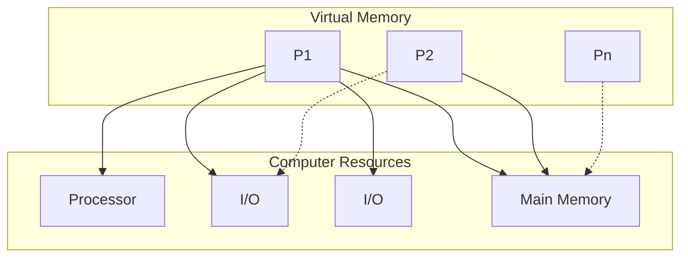

#### Process Control Block (PCB)

È costituito da:

1. un identificatore di processo, detto anche **Process IDentification** (**PID**),
   è un valore numerico univoco;
2. le informazioni sullo stato del processore, queste contengono:
      - registri dati visibili all'utente, questi dipendono dall'architettura
        del calcolatore;
      - registri di controllo e di stato, che a loro volta contengono:
           - *Program Counter*: indirizzo della prossima istruzione da eseguire;
           - *Registri di stato*: includono i flag per l'abilitazione degli
             interrupt;
           - *Registri* che contengono codici relativi alla condizione, come:
             segno, overflow, etc.
      - Puntatori allo stack, che vengono usati per procedure e funzioni.
3. le informazioni di controllo del processo, queste contengono:
      - schedulazione e informazioni di stato:
          - stato del processo (*Running*, *Ready*, etc.);
          - priorità nelle code di scheduling;
          - informazioni correlate alla schedulazione (tempo di attesa, tempo
            di esecuzione, etc);
          - evento del quale è in attesa (se è in attesa).
      - Strutturazione dati, ovvero puntatori ad altri processi che siano
        figli/padre o che siano per l'implementazione di code.
      - Comunicazione tra processi, avviene mediante flag, segnali e messaggi
        per la comunicazione.
      - privilegi, in relazione all'uso della memoria, dei dispositivi, etc.
      - gestione della memoria, sono presenti dei limiti di memoria, ovvero un
        insieme degli indirizzi accessibili (base, limite).
      - Contabilizzazione delle risorse, ovvero le risorse controllate dal
        processo, come lista dei file aperti, lista dei dispositivi I/O, e la
        loro storia.

### Immagine dei processi in memoria

<!-- TODO: aggiungere immagine dei processi in mem. -->

Nell'esempio le immagini occupano locazioni contigue di memoria, in una
implementazione reale ciò può non essere vero. Dipende dalla politica di
gestione della memoria.

### Creazione e terminazione dei processi

Eventi che portano alla **creazione** dei processi:

1. richiesta da terminale (un utente accede al sistema);
2. il sistema operativo genera un processo sulla base della richiesta di un
   processo utente (es. stampa: il processo generatore continua la sua
   esecuzione);
3. un processo utente genera un nuovo processo, processo padre e processo figlio
   (es. sfruttare il parallelismo: un processo server genera diverse istanze per
   gestire diverse richieste).

Eventi che portano alla terminazione dei processi:

1. terminazione normale (end);
2. uscita dell'utente dall'applicazione;
3. superamento del tempo massimo;
4. memoria non disponibile;
5. violazione dei limiti di memoria;
6. fallimento di un'operazione, che sia aritmetica o di I/O, etc.;
7. terminazione del genitore;
8. richiesta del genitore.

#### Modello a due stati

<!-- markdownlint-disable MD046 -->
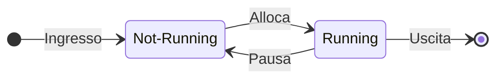
<!-- markdownlint-enable MD046 -->

Nel modello a due stati, lo stato *Not-Running* include due possibilità:

1. il processo è pronto per essere eseguito
2. il processo è in attesa di un evento o di un dispositivo I/O

Il dispatcher (scheduler) non può semplicemente scegliere il processo da più
tempo in attesa, poiché esso potrebbe essere in attesa di un trasferimento I/O

Si giunge dunque al modello a cinque stati:

- vengono introdotti gli stati *New* e *Exit* (anche *Terminated*);
- lo stato di *Not-Running* viene diviso negli stati *Ready* (pronto
  all'esecuzione) e *Blocked* (in attesa di un evento, una risorsa, etc).

#### Modello a cinque stati

<!-- markdownlint-disable MD046 -->
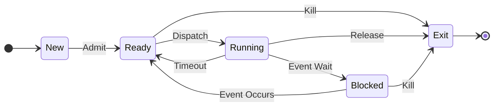
<!-- markdownlint-enable MD046 -->

Le transizioni *Ready*-->*Exit* e *Blocked*-->*Exit* si hanno nel caso in cui
un processo genitore termina il processo figlio.

I nuovi stati *New* e *Exit*:

- **New**: il sistema operativo associa al processo il PID, alloca e costruisce
  le tabelle per la gestione del processo. Il processo ^^**non**^^ è caricato
  in memoria;
- **Exit**: rilascio delle risorse. Il sistema operativo può mantenere alcune
  informazioni (es. contabilità).

### Strategie di accodamento

La prima strategia è quella della coda di *Blocked* singola:

<!-- markdownlint-disable MD046 -->
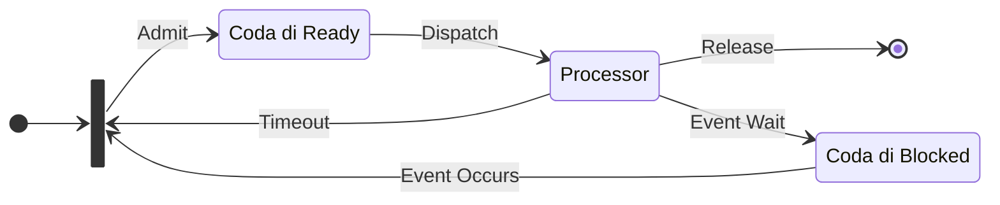
<!-- markdownlint-enable MD046 -->

L'altra strategia di accodamento fa uso di più code di *Blocked*:

<!-- markdownlint-disable MD046 -->
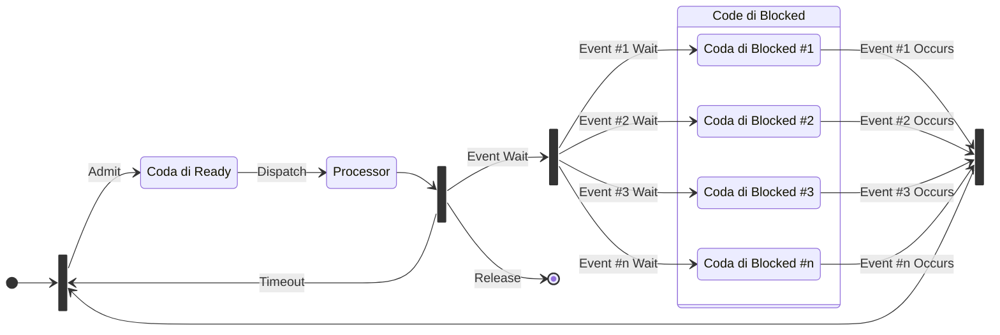
<!-- markdownlint-enable MD046 -->

### Context Switch

Il context-switch avviene quando c'è passaggio della CPU a un nuovo processo.
Le cause principali sono:

- clock interrupt: il processo termina il tempo a sua disposizione e torna nella
  coda di ready;
- I/O interrupt: un'operazione di I/O termina, il sistema operativo sposta il
  processo in attesa di tale evento da *Blocked* a *Ready* e decide se far
  riprendere l'esecuzione del processo precedente.
- memory fault: l'indirizzo di memoria generato è sul disco (memoria virtuale) e
  deve essere portato in RAM. Il sistema operativo carica il blocco, nel
  frattempo il processo che ha generato la richiesta è in *Blocked*, al termine
  del trasferimento andrà in *Ready*;
- trap: errore di esecuzione, il processo potrebbe andare in *Exit*;
- supervisor call (es. file open, il processo utente va in *Blocked*).

<!-- TODO: aggiungere diagramma del context switch. Forse troppo difficile. -->

Le operazioni svolte dal sistema operativo in modalità supervisor al momento del
cambio di processo in stato di *Running* sono le seguenti:

- salvataggio del contesto del processo che abbandona la CPU, ovvero dei valori
  dei registri della CPU, quali: pc, psw, reg, etc;
- cambio del valore di stato nel PCB, da *Running* si passa a *Ready* o
  *Blocked* o *Exit*;
- spostamento del PCB in nuova coda (*Ready* o *Blocked*) o deallocare le sue
  risorse (*Exit*);
- aggiornamento delle strutture dati gestione memoria (area dello stack);
- selezione di nuovo processo per lo stato running (dispatcher);
- aggiornamento del suo stato nel PCB;
- ripristino del contesto.

Il context-switch time è **overhead**, ovvero il sistema operativo non svolge
alcun compito che sia utile all'utente. Il tempo dipende dalla complessità del
sistema operativo e dall'hardware.

### Modalità di esecuzione dei processi

Le modalità di esecuzione sono due: *modalità utente*, ovvero l'esecuzione di
processi utente e *modalità sistema* o *Kernel* o *Controllo*, ovvero
l'esecuzione di istruzioni che hanno come scopo:

- la gestione dei processi, ovvero creazione e terminazione, schedulazione,
  cambio di contesto, sincronizzazione e PCB;
- la gestione della memoria, ovvero allocazione, trasferimento da disco a RAM
  e viceversa, gestione della paginazione, della segmentazione, etc;
- la gestione I/O, ovvero la gestione dei buffer, l'allocazione a canali I/O;
- il supporto, ovvero la gestione delle interruzioni, la contabilità.

### Creazione dei Processi

Per creare un processo si seguono i seguenti passi:

1. assegnare al processo un PID unico, dunque aggiungere una entry level alla
   tabella dei processi;
2. allocare lo spazio per il processo e per tutti gli elementi della sua
   immagine (PCB, User Stack, area di memoria dati e istruzioni, aree condivise);
3. inizializzazione del PCB, ovvero (in pseudocodice):

    ```txt
    stato del processore := 0
    process counter := prossima istruzione
    puntatori allo stack
    stato := ready
    ```

4. inserimenti nella coda di ready;
5. estende le strutture al fine della fatturazione o delle statistiche.

### Evoluzione del modello a cinque stati

Nonostante la memoria virtuale, un programma per essere eseguito deve essere in
RAM. Con elevata probabilità tutti i processi in memoria restano in attesa di
operazioni di I/O. Questo significa che il processore resta inattivo poiché è
molto più veloce dei dispositivi I/O. Le soluzioni applicabili sono le seguenti:

- espandere la memoria, risulta essere costoso e poco efficiente dato che i
  programmi sono sempre più grandi;
- effettuare lo **swapping**, ovvero spostare un processo dalla RAM alla memoria
  secondaria. Questo porta all'introduzione dello stato di **Suspend**. Lo
  swapping è anch'esso un'operazione di I/O, ma in generale è la più rapida tra
  queste.

#### Modello a sei stati

<!-- markdownlint-disable MD046 -->
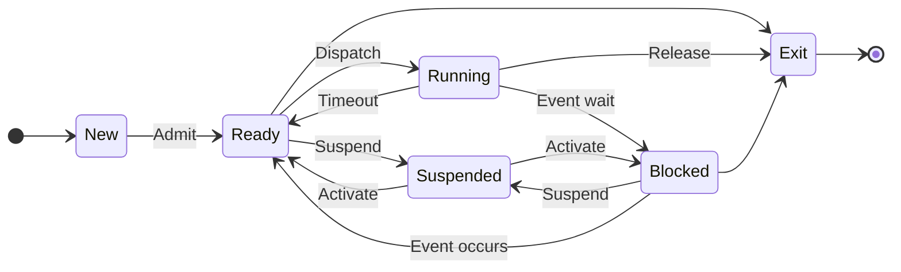
<!-- markdownlint-enable MD046 -->

Con **swap out** si intende lo scaricamento del processo sul disco, ovvero la
transizione da blocked a suspended.
Invece con **swap in** si intende l'operazione inversa allo swap out.

Il modello a sei stati pone un problema analogo a quello a due stati: va quindi
scisso lo stato di *Suspended* in *Ready/Suspended* e *Blocked/Suspended*.

Ciò consente al sistema operativo di scegliere tra i processi in *New* e in
*Suspended*, per essere portati in *Ready*.

#### Modello a sette stati

<!-- markdownlint-disable MD046 -->
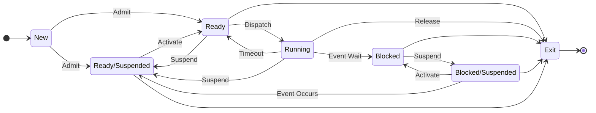
<!-- markdownlint-enable MD046 -->

È simile al modello a cinque stati di sospensione. È presente un parallelismo
tra i processi in memoria principale e quelli in memoria secondaria.

Esiste uno schema di gestione della memoria noto come memoria virtuale, nel
quale un processo può trovarsi solo parzialmente in RAM. Quando si fa
riferimento a un indirizzo su disco questo viene caricato. Dunque gli stati di
sospensione in quel caso sono inutili.

La transizione da *Ready* a *Ready/Suspended* avviene laddove vi sia la
necessità di maggiore memoria per allocare un processo più grande o a maggiore
priorità.

## Schedulazione

La schedulazione, ossia la scelta dell'ordine di esecuzione dei processi, e la
relativa politica di allocazione deve tenere in considerazione i seguenti
fattori:

- **equità**, ovvero tutti i processi che appartengono alla stessa classe o che
  hanno richieste simili o che hanno lo stesso costo devono avere la stessa
  possibilità di accesso alle risorse;
- **tempo di risposta differenziale**, ovvero il sistema operativo discrimina
  tra classi che hanno bisogno di risorse diverse e di tempi diversi (es. i
  processi I/O-bound che fanno forte uso di I/O vengono schedulati per primi);
- **efficienza**, è necessario massimizzare il *throughput*, ovvero la quantità
  di dati trasmessi, e minimizzare il tempo di risposta.

Con scheduling si intende un insieme di tecniche e meccanismi interni del
sistema operativo che amministrano l'ordine in cui il lavoro viene svolto.
L'obiettivo primario dello scheduling è l'ottimizzazione delle prestazioni del
sistema.

Il sistema operativo può prevedere fino a tre tipi di scheduler:

- Scheduler di *lungo* termine (**SLT**);
- Scheduler di *medio* termine (**SMT**);
- Scheduler di *breve* termine (**SBT**).

Gli scheduler intervengono secondo il seguente schema:

<!-- markdownlint-disable MD046 -->
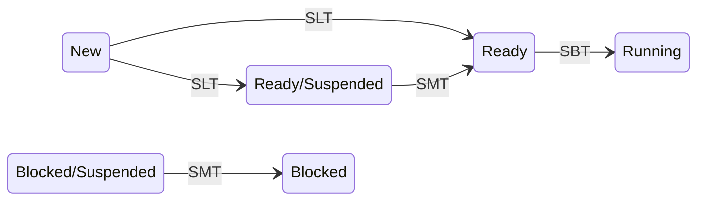
<!-- markdownlint-enable MD046 -->

### Scheduler di lungo termine

Determina quali programmi sono ammessi nel sistema per essere processati, quindi
controlla le transizioni da *New* a *Ready* e da *New* a *Ready/Suspended*.
Controlla, inoltre, il grado di multiprogrammazione (*New*-->*Ready*), avere
più processi significa avere minor tempo percentuale di esecuzione per ciascuno
di questi.

Le stime effettuate dal programmatore o dal sistema forniscono informazioni sulle
risorse necessarie all'esecuzione, come le dimensioni della memoria, il tempo
di esecuzione totale, etc.

Il lavoro dello scheduler di lungo termine si basa quindi sulla stima del
comportamento globale dei job.

Le strategie principali dello scheduler sono:

1. fornire alla coda dei processi pronti, quindi allo scheduler di breve termine,
   gruppi di processi che siano bilanciati tra loro nello sfruttamento della CPU
   e dell'I/O;
2. aumentare il numero di processi provenienti dalla coda batch quando il
   carico della CPU diminuisce;
3. diminuire, fino anche a bloccare, i lavori provenienti dalla coda batch
   quando il carico aumenta e/o i tempi di risposta del sistema diminuiscono.

La frequenza di chiamata dello scheduler a lungo termine è bassa e consente di
implementare strategie anche complesse di selezione dei lavori e di
dimensionamento del carico dei processi da inviare alla coda di *Ready*.

### Scheduler di medio termine

Si occupa di gestire la schedulazione delle transizioni:

- *Ready/Suspended*-->*Ready*;
- *Blocked/Suspended*-->*Blocked*.

Si basa sulla necessità di gestire il livello di multiprogrammazione. La
presenza di molti processi sospesi in memoria riduce la disponibilità per nuovi
processi pronti. In questo caso lo scheduler di breve termine è obbligato a
scegliere tra i pochi processi pronti, dunque:

- utilizza le informazioni del Descrittore di Processo (**PCB**) per stabilire
  la richiesta di memoria del processo;
- tenta di allocare spazio in memoria centrale;
- riposiziona il processo in memoria nella coda di *Ready*.

Viene attivato quando:

- si rende disponibile lo spazio in memoria;
- l'arrivo di processi pronti scende al di sotto di una soglia specificata.

### Scheduler di breve termine

Prende anche il nome di **dispatcher**. Si occupa di gestire la transizione
da *Ready* a *Run* e viene eseguito molto frequentemente. Viene invocato quando
si verifica un evento:

- clock interrupts;
- I/O interrupts;
- chiamate del sistema operativo;
- signals.

La sua principale strategia è orientata alla massimizzazione delle prestazioni
del sistema secondo un specifico insieme di obiettivi.

### Scheduling della CPU nel Dispatcher

<!-- TODO: aggiungere immagine. -->

Esecuzione di un processo:

1. Ciclo di elaborazione (CPU);
2. Attesa di completamento di I/O.

Lo scheduling della CPU riguarda la distribuzione delle sequenze di elaborazione
della CPU.

Un processo si dice **I/O-bound** quando presenta molte operazioni di I/O, al
contrario si dice **CPU-bound** quando presenta poche operazioni di I/O.

## Algoritmi di schedulazione

Innanzitutto, si definiscano:

- il **tempo di ricircolo** come il tempo trascorso tra l'avvio di un processo,
  ovvero la sua immissione nel sistema, e la terminazione dello stesso;
- il **tempo di attesa** come il tempo che un processo trascorre in attesa delle
  risorse a causa di conflitti con altri processi. Si può calcolare come la
  differenza tra il tempo di ricircolo e il tempo di esecuzione. Sostanzialmente
  valuta la sorgente di inefficienza, essendo il prezzo da pagare per condividere
  delle risorse.

L'efficienza degli algoritmi di schedulazione è misurabile utilizzando i tempi
sopracitati. Un buon algoritmo di scheduling cerca di bilanciare l'esecuzione
dei processi al meglio, massimizzando l'uso del processore e riducendo i tempi
di attesa.

<!-- markdownlint-disable MD046 -->
!!! tip "Decision mode"

    Può essere di due tipi.

    === "Non-Preemptive (non-interrompibile)"
        Un processo in *Running* abbandonerà tale stato solo se termina
        l'esecuzione o si blocca per un'operazione di I/O.

    === "Preemptive (interrompibile)"
        Un processo in *Running* può essere interrotto e spostato in *Ready*
        del sistema operativo (es. se giunge un processo "più importante" in
        *Ready*).

        Il **pro** è che nessun processo può monopolizzare il processore, il
        **contro** è che crea problemi dove vi sono processi che condividono
        dati e dunque richiedono meccanismi di sincronizzazione.
<!-- markdownlint-enable MD046 -->

### First Come First Served (FCFS)

```mermaid
gantt
  title First Come First Served
  dateFormat  ss
  axisFormat  %S

  section A
    Running     :A, 0, 3s
  section B
    Running     :B, after A, 9s
  section C
    Running     :C, after B, 3s
  section D
    Running     :D, after C, 3s
  section E
    Running     :E, after D, 2s
```

Applica il principio della coda:

- Ogni processo entra in coda di *Ready*;
- Quando un processo abbandona lo stato di *Running* si seleziona il processo
  che da più tempo è in stato di *Ready*.

Favorisce i processi CPU-bound. Un processo I/O-bound che richiede poco tempo
di esecuzione potrebbe attendere molto tempo prima che gli venga assegnata la
CPU. Genera l'effetto convoglio: tutti i processi in coda attendono che un
processo CPU-bound termini.
È senza prelazione, ovvero con basso sfruttamento delle componenti e con un
basso lavoro utile del sistema.

Le prestazioni dipendono unicamente dall'ordine di arrivo dei Jobs. Ad esempio,
siano \(p_1\) e \(p_2\) due processi con tempo di esecuzione totale di
\(20\second\) e \(2\second\) rispettivamente.

<!-- markdownlint-disable MD046 -->
=== "\(p_1\) prima di \(p_2\)"

    ```mermaid
    stateDiagram-v2
        direction LR
        state Ordine {
            direction LR
            p2 --> p1
        }
        Ordine --> FCFS
    ```

    Tempi di riciclo:

    - \(p_1 = 20 \second\);
    - \(p_2 = 22 \second\);
    - \(t_{\rm medio} = 21 \second\).

    Tempo di attesa:

    - \(p_1 = 0 \second\);
    - \(p_2 = 20 \second\);
    - \(t_{\rm medio} = 10 \second\).

=== "\(p_2\) prima di \(p_1\)"

    ```mermaid
    stateDiagram-v2
        direction LR
        state Ordine {
            direction LR
            p1 --> p2
        }
        Ordine --> FCFS
    ```


    Tempi di riciclo:

    - \(p_1 = 2 \second\);
    - \(p_2 = 22 \second\);
    - \(t_{\rm medio} = 12 \second\).

    Tempo di attesa:

    - \(p_1 = 0 \second\);
    - \(p_2 = 2 \second\);
    - \(t_{\rm medio} = 1 \second\).
<!-- markdownlint-enable MD046 -->

### Event Driven

<!-- markdownlint-disable MD046 -->
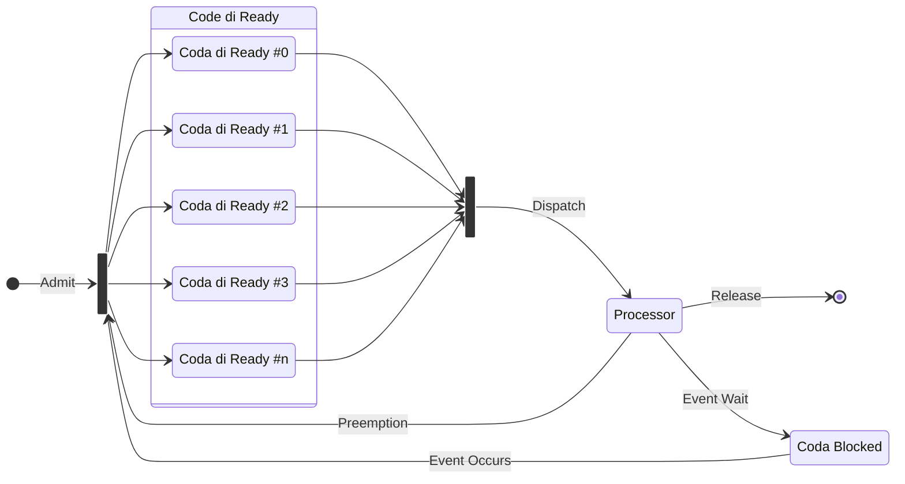
<!-- markdownlint-enable MD046 -->

È uno schema che ragiona secondo un **valore di priorità** assegnato a ciascun
processo: lo scheduler sceglierà sempre il processo pronto con priorità maggiore.
La priorità può essere assegnata dall'utente o dal sistema e può essere di tipo
statico o dinamico. La priorità dinamica varia in base a:

- valore iniziale;
- caratteristiche del processo;
- richiesta di risorse;
- comportamento durante l'esecuzione.

Tale modello è generalmente applicato nei sistemi dove il tempo di risposta,
soprattutto ad eventi esterni, è critico.

Il sistemista può influire sull'ordine in cui uno scheduler serve gli eventi
esterni modificando le priorità assegnate ai processi. Le prestazioni sono
dipendenti da una accurata pianificazione nell'assegnazione delle priorità.
Le priorità possono essere definite:

- internamente al sistema operativo, utilizzando grandezze misurabili quali
  l'uso di memoria, file aperti, rapporto tra picchi medi di I/O e di CPU;
- esternamente al sistema operativo, utilizzando la rilevanza del processo,
  la sua criticità.

Il **problema** sta nel fatto che non è in grado di garantire il completamento
di un processo in un intervallo di tempo finito dalla sua creazione. Questo
perché potrebbe essere continuamente sorpassato da processi a priorità più alta.
Tale situazione prende il nome di ^^starvation^^.

La soluzione **soluzione** sta nell'usare l'aging, ovvero al passare del tempo
in stato di *Ready*, la priorità del processo aumenta.

### Round Robin (RR)

```mermaid
gantt
  title Round Robin (RR)
  dateFormat  ss
  axisFormat  %S

  section A
    Running     :A1,       0, 2s
    Running     :A2, after B1, 1s

  section B
    Running     :B1, after A1, 1s
    Running     :B2, after A2, 1s
    Running     :B3, after C1, 1s
    Running     :B4, after C2, 1s
    Running     :B5, after C3, 1s
    Running     :B6, after C4, 1s

  section C
    Running     :C1, after B2, 1s
    Running     :C2, after D1, 1s
    Running     :C3, after D2, 1s
    Running     :C4, after D3, 1s

  section D
    Running     :D1, after B3, 1s
    Running     :D2, after E1, 1s
    Running     :D3, after E2, 1s
    Running     :D4, after B6, 2s

  section E
    Running     :E1, after B4, 1s
    Running     :E2, after B5, 1s
```

Utilizza come principio il **time slice**, ovvero una preemption basata sul
clock (clock interrupt). Ogni processo utilizza il processore per un dato
intervallo di tempo, i valori tipici sono \(10\)–\(100 \millisecond\).

Al verificarsi dell'interrupt il processo in esecuzione viene portato nella coda
di *Ready*, che è gestita First In First Out (*FIFO*).

Con \(n\) processi in *Ready* e un time quantum \(q\), ogni processo ottiene
\(\ifrac{1}{n}\) del tempo di CPU, con frazioni di tempo al più pari a \(q\).
Il tempo massimo di attesa in *Ready* è pari a \(q \cdot (n − 1)\). Le
prestazioni sono dipendenti dal time quantum, infatti:

- se \(q\) è troppo grande, degenera in First Come First Served;
- se \(q\) troppo piccolo, il numero di context switch aumenta, causando un
  consumo di risorse.

La schedulazione Round Robin fornisce una buona condivisione delle risorse del
sistema, perché:

- i processi più brevi possono completare l'operazione in un \(q\), il che
  equivale ad un buon tempo di risposta;
- i processi più lunghi sono forzati a passare più volte per la coda dei
  processi pronti, il tempo è proporzionale alle loro richieste di risorse;
- per i processi interattivi lunghi, se l'esecuzione tra due fasi interattive
  riesce a completarsi in un \(q\), il tempo di risposta è buono.

La realizzazione di uno scheduler Round Robin richiede il supporto di un Timer
che invia un'interruzione alla scadenza di ogni \(q\), forzando lo scheduler a
sostituire il processo in esecuzione. Il timer viene riazzerato se un processo
cede il controllo al sistema operativo prima della scadenza del suo \(q\).

### Highest Response Ratio Next (HRRN)

Siano:

- \(w\) il tempo speso in coda di Ready, quindi in attesa della disponibilità
  del processore;
- \(s\) il tempo di servizio previsto.

Si definisce il response ratio come:

\[ \text{response ratio} = \frac{w + s}{s} = 1 + \frac{w}{s} \]

L'algoritmo Highest Response Ratio Next manda in esecuzione il processo con il
più alto valore di response ration. Osservazioni:

- quando un processo entra in coda per la prima volta ha un response ratio pari
  a \(1\);
- tiene in considerazione l'età del processo, applica quindi un meccanismo di
  aging, è proprio \(w\).

### Shortest Process Next (SPN)

```mermaid
gantt
  title Shortest Process Next (SPN)
  dateFormat  ss
  axisFormat  %S

  section A
    Running     :A,     0, 3s

  section B
    Running     :B, after A, 6s

  section C
    Running     :C, after E, 4s

  section D
    Running     :D, after C, 2s

  section E
    Running     :E, after B, 2s
```

Il processo scelto dalla coda di *Ready* è quello con il più breve tempo di
esecuzione stimato, ovvero la più breve sequenza di operazioni svolte dal
processore.

Il **pro** è che il Shortest Process Next è ottimale nel fornire il tempo di
attesa minimo per un dato insieme di processi. Il **contro** è che è sia
difficile stimare la durata della prossima sequenza di CPU che oneroso, è
inoltre possibile la starvation per processi fortemente CPU-bound.

Ha una versione preemptive: se arriva nuovo processo con una sequenza di CPU
minore del tempo necessario per la conclusione della sequenza di CPU del processo
attualmente in esecuzione, si ha il prerilascio della CPU a favore del processo
appena arrivato. Questo schema è anche noto come **Shortest Remaining Time First**
(**SRTF**) oppure **Shortest Remaining Time Next** (**SRTN**).

### Schedulazione a code multiple

<!-- markdownlint-disable MD046 -->
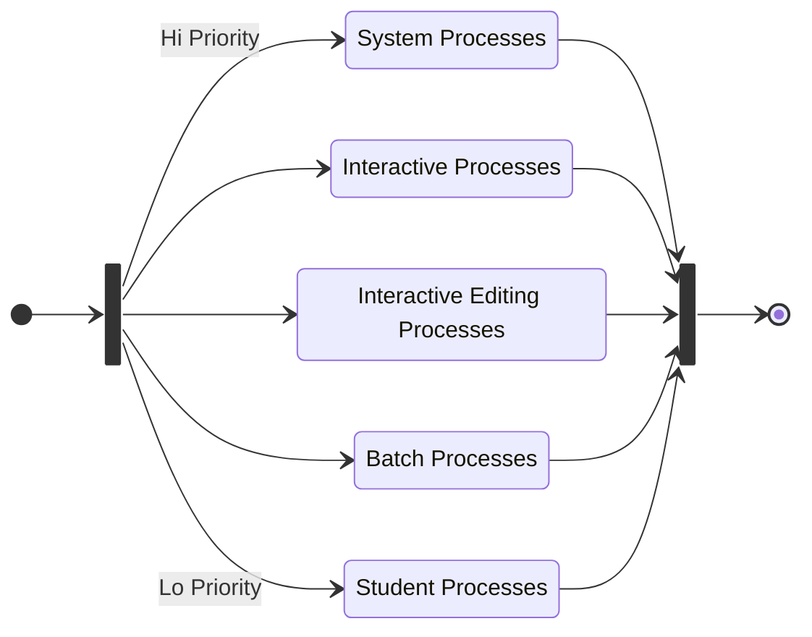
<!-- markdownlint-enable MD046 -->

La coda di *Ready* viene divisa in sotto-code:

- Foreground, per processi interattivi;
- Background, per processi batch.

Ogni coda ha un proprio algoritmo di schedulazione (es. Foreground con Round
Robin, Background con First Come First Served). Vi è necessita di uno scheduling
tra le code:

- a priorità fissa e con prelazione (es. serve prima la coda Foreground e
  poi quella di Background);
- time slice, a ogni coda è associato un certo ammontare di tempo di CPU (es.
  \(80\%\) alla Foreground con Round Robin, \(20\%\) alla Background con FCFS).

### Schedulazione a code multiple con feedback

<!-- markdownlint-disable MD046 -->
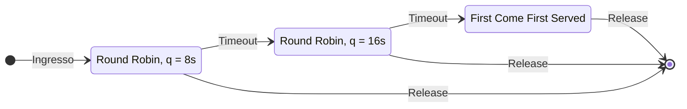
<!-- markdownlint-enable MD046 -->

Implementa l'aging: un processo può essere spostato da una coda all'altra.

Le code Multilevel-Feedback sono definite dai seguenti parametri:

- Numero di code;
- Algoritmo di scheduling per ogni coda;
- Metodi usati per l'upgrading e il downgrading di ogni processo.

<!-- markdownlint-disable MD046 -->
!!! example "Esempio"

    Tre code:

    - \(Q_0\) con Round Robin con \(q = 8 \millisecond\);
    - \(Q_1\) con Round Robin con \(q = 16 \millisecond\);
    - \(Q_2\) con First Come First Served.

    Scheduling:

    - Un nuovo processo entra nella coda \(Q_0\)
    - Quando ottiene la CPU, la impegna per \(8 \millisecond\). Se non termina
      entro gli \(8 \millisecond\) viene spostato in \(Q_1\);
    - Il processo in \(Q_1\) viene nuovamente servito con politica Round Robin
      e riceve la CPU per ulteriori \(16 \millisecond\);
    - Se ancora non termina viene spostato in \(Q_2\) e servito con First Come
      First Served.
