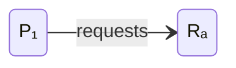
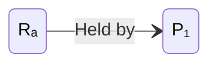
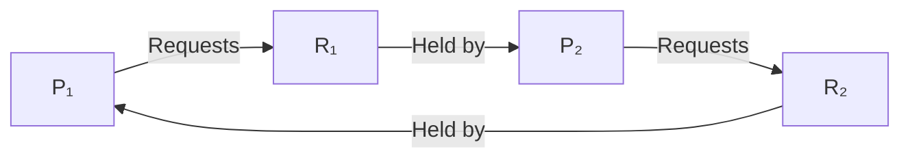

# Gestione delle risorse e problematiche annesse

## Gestione delle risorse

I processi utilizzano delle risorse (es. bus, CPU, stampanti, etc). Tali risorse
sono gestite dal sistema operativo, che le governa e le amministra. Il sistema
operativo decide in merito all'assegnazione delle risorse ai processi, disponendo
l'ordine di accesso dei processi a queste e le modalità di accesso

I processi utilizzano le risorse per tramite del sistema operativo, che trasmette
le operazioni agli strati sottostanti per conto dei processi. La gestione delle
risorse può portare a diverse problematiche, le quali devono essere accuratamente
attenzionate. Tali problematiche sono legate alla concorrenza e alla mutua
esclusione delle risorse. Una risorsa singola può generalmente essere assegnata
a un solo processo alla volta (mutua esclusione).

### Grafo di allocazione delle risorse

Un grafo di allocazione delle risorse è un grafo che rappresenta in che modo le
risorse sono assegnate ai processi e le richieste dei processi.

<!-- markdownlint-disable MD033 -->
<figure markdown>



<figcaption>La risorsa viene richiesta</figcaption>
</figure>

<figure markdown>



<figcaption>La risorsa viene tenuta</figcaption>
</figure>
<!-- markdownlint-enable MD033 -->

## Stallo di processi

Lo **stallo di processi** (*deadlock*) è una delle condizioni problematiche che
possono verificarsi nell'ambito della gestione delle risorse.

!!! def "Deadlock"
    Un insieme di processi è detto "in stallo" se ciascun processo nell'insieme
    è in attesa di un evento che solo un altro processo nello stesso insieme
    può generare.

Generalmente l'evento è il rilascio di una risorsa detenuta da uno dei processi.

Negli scacchi, lo stallo è la condizione in cui il Re non può effettuare mosse
legittime pur non essendo sotto scacco.

Lo stallo comporta che, essendo tutti i processi in attesa di un evento, sono
nello stato di *Blocked*. Tale situazione comporta che nessuno dei processi in
stallo può:

- passare in esecuzione, poiché necessita del verificarsi dell'evento;
- rilasciare risorse, in quanto non può passare in esecuzione.

Nessuno dei processi in stallo può quindi passare in *Running*, pertanto nessuno
dei processi in stallo può essere riattivato. I processi in stallo sono quindi
congelati nella situazione di stallo a meno di un intervento da parte del
sistema operativo o dell'amministratore.



Lo stallo di processi per verificarsi necessità della congiunzione di quattro
condizioni:

1. mutua esclusione (oppure risorse seriali): un solo processo alla volta può
   utilizzare una risorsa;
2. hold & wait (oppure possesso e attesa): un processo può mantenere il
   possesso delle risorse allocate mentre attende di averne altre;
3. assenza di prerilascio (oppure assenza di prelazione o risorse non
   prerilasciabili): i processi non possono essere forzati a rilasciare in
   anticipo le risorse acquisite;
4. **attesa circolare**: un processo aspetta una risorsa occupata da un altro
   processo in attesa circolare

Le prime tre condizioni sono necessarie ma non sufficienti, aggiungendovi
l'attesa circolare, diventano necessarie e sufficienti.
Inoltre, le prime tre derivano direttamente dalla progettazione e sono in molti
casi auspicabili, l'attesa circolare invece è un evento che si può verificare e
che dipende dalla particolare sequenza di richieste e rilasci.

### Strategie per affrontare lo stallo

Sono possibili quattro diverse strategie per affrontare il problema dello
stallo di processi:

1. ignorare il problema (algoritmo dello struzzo);
2. consentire il verificarsi dello stallo, rilevarlo e risolverlo;
3. evitarlo con politiche di allocazione: le tre condizioni necessarie sono
   permesse, un algoritmo verifica dinamicamente che una richiesta non produca
   una situazione di stallo;
4. impedirlo rimuovendone le condizioni: progettare un sistema operativo in modo
   che la possibilità di avere uno stallo sia esclusa a priori tramite la
   negazione di una delle quattro condizioni.

#### Algoritmo dello struzzo

L'algoritmo dello struzzo pretende che il problema non esista. È una soluzione
ragionevole se:

- lo stallo capita di rado
- il costo per evitare lo stallo è troppo elevato

Si ha quindi un compromesso tra convenienza e correttezza. Windows e UNIX
utilizzano principalmente questo approccio.

#### Consentirlo, rilevarlo e risolverlo

La seconda strategia possibile è quella di consentire il verificarsi dello
stallo, rilevarlo e risolverlo. Tale strategia prevede quindi di operare
normalmente e verificare periodicamente se si è verificato uno stallo.

È possibile dividerla in due fasi:

1. rilevare lo stallo;
2. eliminare la situazione di stallo.

##### Rilevarlo

Avendo a disposizione una sola risorsa di ogni tipo si può rilevare lo stallo
costruendo il grafo di assegnazione delle risorse. Un ciclo all'interno del
grafo denota uno stallo. È concretamente irragionevole da implementare in
quanto molto complesso.

Lo si può applicare solo nei casi di una risorsa per tipologia.

Serve quindi una soluzione che funzioni in generale, ovvero anche nei casi in
cui si hanno più risorse per ogni tipologia. Siano dunque:

\[
  E = \ipmatrix{E_1 & E_2 & \dots & E_m}
  \qquad
  A = \ipmatrix{A_1 & A_2 & \dots & A_m}
\]

\[
  C = \begin{bmatrix}
        C_{11} & C_{12} & \dots  & C_{1m} \\
        C_{21} & C_{22} & \dots  & C_{2m} \\
        \vdots & \vdots & \ddots & \vdots \\
        C_{n1} & C_{n2} & \dots  & c_{nm}
      \end{bmatrix}
  \qquad
  R = \begin{bmatrix}
        R_{11} & R_{12} & \dots  & R_{1m} \\
        R_{21} & R_{22} & \dots  & R_{2m} \\
        \vdots & \vdots & \ddots & \vdots \\
        R_{n1} & R_{n2} & \dots  & R_{nm}
      \end{bmatrix}
\]

dove \(E\) sono le risorse esistenti, \(A\) sono le risorse disponibili, \(C\)
è la matrice di allocazione corrente e \(R\) è la matrice delle richieste.

Sia \(r_i\) l'\(i\)-esima riga della matrice \(R\). Dati due vettori
\(X = [\oneton[m]{x}]\) e \(Y = [\oneton[m]{y}]\), si dice che:

\[ X \leq Y \iff \forall i \in [1,\; m] \quad x_i \leq y_i \]

L'algoritmo di individuazione dello stallo opera nel seguente modo:

1. inizialmente ogni processo \(P_i\) non è marcato;
2. per ogni processo non marcato \(P_i \tc r_i \leq A\) (si individuano i
   processi che possono ottenere le risorse necessarie alla loro terminazione):
    - \(A = A + C_i\);
    - marca \(P_i\) (il processo può terminare la sua normale esecuzione:
      avviene il rilascio delle risorse).
3. se rimangono processi non marcati:
    - i processi non marcati sono in stallo (nessuno di loro può acquisire
      risorse sufficienti a terminare, tenendo occupate le risorse già prese).

!!! example "Rilevo dello stallo"

    === "1^o^ esempio"

        Siano:

        \[ E = \ipmatrix{4 & 2 & 3 & 1} \qquad A = \ipmatrix{2 & 1 & 0 & 0} \]

        \[
          C = \begin{bmatrix}
                0 & 0 & 1 & 0 \\
                2 & 0 & 0 & 1 \\
                0 & 1 & 2 & 0
              \end{bmatrix}
          \qquad
          R = \begin{bmatrix} 
                2 & 0 & 0 & 1 \\
                1 & 0 & 1 & 0 \\
                2 & 1 & 0 & 0
              \end{bmatrix}
        \]

        In questo caso:
        
        1. viene marcato il processo \(P_1\);
        2. viene marcato il processo \(P_2\);
        3. viene marcato il processo \(P_3\).

        Pertanto i processi non sono in stallo.

    === "2^o^ esempio"

        Siano:

        \[ 
          E = \ipmatrix{2 & 1 & 1 & 2 & 1} 
          \qquad
          A = \ipmatrix{0 & 0 & 0 & 0 & 1} 
        \]

        \[
          C = \begin{bmatrix}
                1 & 0 & 1 & 1 & 0 \\
                1 & 1 & 0 & 0 & 0 \\
                0 & 0 & 0 & 1 & 0 \\
                0 & 0 & 0 & 0 & 0 
              \end{bmatrix}
          \qquad
          R = \begin{bmatrix}
                0 & 1 & 0 & 0 & 1 \\
                0 & 0 & 1 & 0 & 1 \\
                0 & 0 & 0 & 0 & 1 \\
                1 & 0 & 1 & 0 & 1
              \end{bmatrix}
        \]

        In questo caso:

        1. viene marcato il processo \(P_1\)

        \[ 
          A = A + C_3 
            = \ipmatrix{0 & 0 & 0 & 0 & 1} + \ipmatrix{0 & 0 & 0 & 1 & 0}
            = \ipmatrix{0 & 0 & 0 & 1 & 1}
        \]

        Non vi sono altri indici, dunque processi, per i quali viene soddisfatto
        \(r_i \leq A\). Pertanto i processi non marcati \(P_1\), \(P_2\), \(P_4\)
        sono in stallo.

Quando e quanto spesso invocare l'algoritmo dipende da:

- frequenza presunta con la quale si verifica lo stallo;
- numero di processi coinvolti nello stallo.

In generale uno stallo si verifica quando un processo avanza una richiesta che
non può essere soddisfatta immediatamente.

**Utilizzare l'algoritmo a ogni richiesta**, consente la determinazione dello
stallo e del processo la cui richiesta ha cagionato lo stallo. Vi è un aumento
notevole del carico (overhead).

**Invocare l'algoritmo quando la percentuale di utilizzo delle risorse scende
al di sotto di una soglia.**

**Invocare l'algoritmo ad istanti arbitrari**, nel grafo di assegnazione delle
risorse potrebbero esistere molti cicli e diventa difficile determinare quale
processo ha "causato" lo stallo.

##### Eliminarlo

Si può operare secondo diverse modalità.

###### Terminazione dei processi

Generalmente si effettua l'abort di tutti i processi coinvolti nello stallo.

In alternativa si può effettuare l'abort di un processo alla volta fino a quando
il ciclo non è eliminato. Dopo ogni abort si deve rieseguire l'algoritmo di
determinazione dello stallo. L'ordine con cui abortire i processi viene dato da
una funzione di minimo costo basata su:

- priorità dei processi;
- tempo trascorso in esecuzione e necessario al completamento;
- risorse già utilizzate e risorse richieste (processo in fase di stampa, etc);
- tipo di processo (interattivo, ecc.).

###### Prelazione di risorse

Si seleziona un processo vittima che minimizzi i costi e viene effettuato il
rollback del processo a cui è stata sottratta la risorsa, ovvvero si effettua
un return a uno stato sicuro per poterlo riavviare in seguito. Per questo motivo
vi è un salvataggio periodico dello stato dei processi. In caso di stallo:

- si ripristina il processo all'ultimo stato salvato;
- si fa ripartire il processo, il non-determinismo dei processi concorrenti
  dovrebbe garantire il non ri-verificarsi dello stallo.

In generale conviene uccidere il processo

Si può andare incontro a starvation: alcuni processi potrebbero essere
selezionati costantemente come vittime, include number of rollback in cost
factor.

#### Evitarlo con politiche di allocazione

La strategia di evitare lo stallo mediante politiche di allocazione prevede di
definire un ordine di assegnazione delle risorse tale che non si verifichi mai
uno stallo.

Un esempio grafico è il seguente:

TODO: aggiungere immagine.

Sugli assi sono riportate le istruzioni che devono essere eseguite,
sull'ascissa per il processo \(A\) e sull'ordinata per il processo \(B\). Sono
presenti due risorse: printer e plotter, le quali sono usate dai processi nelle
istruzioni indicate con la freccia a punta doppia. Le aree sbarrate non sono
percorribili, in quanto si avrebbe la stessa risorsa assegnata a due processi

Qual è l'ordine giusto per evitare lo stallo?

Con ordine di esecuzione \(I_1 \to I_5\) si arriva allo stallo, in quanto non
vi sono percorsi percorribili:

- printer è assegnato ad \(A\), plotter a \(B\);
- per proseguire, \(A\) necessita del plotter;
- per proseguire, \(B\) necessita del printer.

Con ordine di esecuzione \(I_1\to I_2\to I_3\to I_4\to I_5\to I_6\to I_7\to I_8\)
non si verifica stallo.

I vantaggi di questa politica è che non è necessario interrompere processi e
riportarli in uno stato precedente, il che era un problema presente nelle
strategie di rilevamento dello stallo.

Le restrizioni sono però le seguenti:

- il numero massimo di risorse necessitate da ogni processo deve essere noto a
  priori (prima dell'esecuzione);
- i processi devono essere indipendenti: l'ordine di esecuzione non deve essere
  vincolato a esigenze di sincronizzazione;
- deve esserci un numero fissato di risorse da allocare
- quando un processo richiede risorse potrebbe essere posto in attesa
- quando un processo ottiene tutte le risorse di cui necessita, deve rilasciarle
  in un tempo finito.

##### Stato sicuro e insicuro

Si possono pertanto definire due stati del sistema, rispetto alle risorse
assegnate:

- sicuro: esiste almeno una sequenza di esecuzione dei processi che ne consente
  la terminazione senza incorrere in una situazione di stallo;
- insicuro.

Lo stato sicuro garantisce l'impossibilità di verificarsi dello stallo. Quello
insicuro indica che vi è possibilità (non certezza) che si verifichi lo stallo.

La strategia di evitare lo stallo si basa sulla certezza che uno stato sicuro
non possa determinare uno stallo.

!!! def "Deadlock avoidance"
    Assicurarsi che il sistema non entri mai in uno stato non sicuro.

##### Algoritmo del banchiere

La strategia di evitare lo stallo mediante politiche di allocazione vede la sua
applicazione pratica nell'algoritmo del banchiere. Questo assegna risorse al
processo solo se il sistema resta in uno stato sicuro: i processi procedono,
terminano e restituiscono le risorse al sistema.

Lo stato sicuro viene determinato utilizzando l'algoritmo di rilevazione dello
stallo. Tale strategia prende il nome dal comportamento del banchiere: nessun
banchiere presterebbe dei soldi senza avere certezze che questi tornino a sé.
Il principio è attuato utilizzando le risorse come se fossero il denaro.

Segue una bozza in C/pseudocodice dell'algoritmo del banchiere:

```c title="Strutture dati globali"
struct state {
  int resource[m];
  int available[m];
  int claim[n][m];
  int alloc[n][m];
}
```

```c title="Algoritmo di allocazione risorse"
if (alloc[i][*] + request[*] > claim[i][*]) {
  // <error>
} else if (requests[*] > available[*]) {
  // <suspend-process>
} else {
  // <define-new-state>
  alloc[i][*] = alloc[i][*] + request[*];
  available[*] = available[*] + request[*];
}

if (safe(newstate)) {
  // <carry-on-allocation>
} else {
  // <restore-original-state>
  // <suspend-process>
}
```

```c title="Algoritmo per test della sicurezza"
boolean safe(state S) {
  int currentavail[m];
  process rest[number_of_processes];
  currentavail = available;
  rest = {all_processes};
  possible = true;
  while (possible) {
    // find a process Pk in rest sush that
    claim[k][*] - alloc[k][*] <= currentavail;
    if (found) { // simulate execution of Pk
      currentavail = currentavail + alloc[k][*];
      rest = rest - {Pk};
    } else {
      possible = false;
    }
    return (rest == null);
  }
}
```

#### Impedirlo rimuovendone le condizioni

È possibile impedire il verificarsi dello stallo rimuovendo una delle quattro
condizioni. Si impongono pertanto dei vincoli sulla richiesta delle risorse.
Le classi di prevenzione sono:

- metodi indiretti: prevengono il verificarsi di una delle tre condizioni
  necessarie;
- metodi diretti: prevengono il verificarsi dell'attesa circolare.

##### Negare la mutua esclusione

In questo caso, un processo non deve mai attendere una risorsa condivisibile,
devono essere possibili degli accessi multipli contemporanei alle risorse
condivise. Questa soluzione non è generalmente applicabile.

È applicabile in alcuni casi specifici: alcuni dispositivi (es. stampanti)
possono essere gestiti con *spool*:

- i processi scrivono l'output in un'area di spool;
- solo il gestore della stampante richiede e usa la stampante;
- quindi lo stallo per la stampante è eliminabile;

Non tutti i dispositivi possono essere però gestiti con spool e vi può comunque
essere stallo nell'accesso all'area di spool.

Principio:

- evitare di assegnare una risorsa quando non strettamente necessario;
- Far in modo che il minor numero possibile di processi possa richiedere una
  risorsa.

##### Negare l'hold and wait

In questo caso ogni processo deve richiedere all'inizio della sua esecuzione
tutte le risorse. I problemi sono i seguenti:

- il processo potrebbe non sapere di quali risorse avrà bisogno;
- il processo entra in *Blocked* fino a quando tutte le richieste non vengono
  soddisfatte contemporaneamente.
- vincola risorse che altri processi potrebbero utilizzare

Questo approccio è inefficiente, poiché:

- prima di andare in run tutte le risorse devono essere disponibili, in realtà
  potrebbe procedere utilizzandone solo una parte;
- le risorse assegnate al processo potrebbero rimanere inutilizzate per molto
  tempo, gli altri processi sono in attesa indefinita.

##### Negare l'assenza di prerilascio

In questo caso vi sono due possibilità:

1. un processo che non riesce ad ottenere le risorse di cui necessita, rilascia
  quelle che detiene per richiederle nuovamente in un istante successivo;
2. il sistema operativo può richiedere il pre-rilascio delle risorse al processo
  che le detiene per assegnarle al richiedente.

L'approccio è applicabile solo se lo stato della risorsa è facilmente salvabile
(CPU), non è applicabile nel caso di stampanti, etc.

##### Negare l'attesa circolare

Si definisce un ordine lineare (di numerazione) per tutte le risorse, Se un
processo richiede una risorsa \(R\), successivamente potrà richiedere solo una
risorsa che nell'ordinamento segue \(R\).

!!! example "Esempio"
    \(R_i\) precede \(R_j\) se \(i < j\), un processo potrà chiedere le risorse
    solo nell'ordine \(R_i\), \(R_j\).

Questo metodo può essere inefficiente.

## Concorrenza

Con multiprogrammazione si intende la gestione di più processi su un singolo
processore, mentre con multiprocessing si intende la gestione di più processi
su più processori. I processi distribuiti prendono il nome di *cluster*.

Vi è competizione tra i processi/threads per ottenere e condividere le risorse:
CPU, Memoria, Canali di I/O, Files, etc.

!!! def "Terminologia"

    `Sessione critica`
    :   Porzione di codice all'interno di un processo/thread che richiede accesso
        a risorse condivise.

    `Deadlock`
    :   Situazione nella quale due o più processi sono impossibilitati dal 
        procedere poiché sono in attesa l'uno dell'altro.

    `Livelock`
    :   Situazione nella quale due o più processi cambiano continuamente il 
        proprio stato a causa del cambiamento di stato degli altri, senza fare 
        alcun lavoro utile.

    `Mutua esclusione`
    :   Requisito per il quale, quando un processo è nella propria sezione 
        critica, nessun altro processo può essere nella propria sezione critica 
        se questa fa riferimento a risorse condivise con il primo processo.

    `Race condition`
    :   Situazione nella quale thread o processi leggono e scrivono un dato 
        condiviso e il risultato dipende dalla loro velocità reciproca.

    `Starvation`
    :   Situazione nella quale un processo non riceve mai l'utilizzo di una 
        risorsa e viene costantemente scavalcato da altri processi.

I vantaggi della concorrenza sono i seguenti:

- benefici sull'esecuzione nonostante il sovraccarico dovuto dal context
  switching;
- migliore utilizzo delle risorse.

I problemi su singolo processore sono:

- condivisione pericolosa: ordine delle operazioni di lettura e scrittura su
  aree di memoria condivise;
- difficoltà nell'assegnare le risorse ai processi in maniera ottimale;
- difficoltà nella rilevazione degli errori nel codice e dei conflitti di
  interlacciamento.

```c
char in, out; // condivise
void echo() {
  scanf("%c", &in);
  out = in;
  printf("%c", out);
}
```

La procedura `#!c echo()` è condivisa, in questo modo c'è risparmio dello spazio
di memoria ma anche due processi concorrenti.

- \(P_1\) viene interrotto dopo la `#!c scanf()`;
- \(P_2\) esegue tutto `#!c echo()`;
- \(P_1\) viene riattivato da `#!c scanf()` in poi e ha perso il dato che aveva
  letto.

La soluzione sta nell'avviare un solo processo alla volta (mutua esclusione).

I problemi in caso di SMP invece sono:

- stessi problemi di un calcolatore a singolo processore, una interruzione può
  fermare l'esecuzione di un processo in un qualsiasi istante;
- interlacciamento esecuzione processi paralleli.

=== "Processo \(P_1\), Processore 1"

    ```c
    // ...
    scanf("%c", &in);
    // ...
    out = in;
    printf("&c", out);
    // ...
    ```

=== "Processo \(P_2\), Processore 2"

    ```c
    // ...  
    // ...
    scanf("%c", &in);
    out = in;
    // ...
    printf("&c", out);
    ```

Il carattere letto da \(P_1\) è perso prima di poter essere stampato, questo è
dovuto alla perdita di aggiornamento. La soluzione è nuovamente la mutua
esclusione.

Un solo programma per volta può entrare nella propria sezione critica (es. un
solo programma per volta può inviare comandi alla stampante).

## Mutua esclusione

I meccanismi che provvedono alla mutua esclusione devono garantire i seguenti
requisiti:

- un solo processo alla volta deve accedere alla sezione (o risorsa) critica;
- un processo fuori della sezione critica non deve interferire con il processo
  nella sezione critica;
- ogni processo deve poter accedere dopo un tempo finito di attesa in coda alla
  risorsa critica (no stallo o starvation);
- se nessun processo è nella sezione critica, un processo deve poter entrare
  nella sezione critica senza attese;
- non ci devono essere supposizioni sulla velocità di esecuzione relativa dei
  processi;
- il tempo di permanenza nella sezione critica è (de)finito.

### Approcci software

I processi, senza ausilio del sistema operativo o del linguaggio di
programmazione, devono coordinarsi tra loro (Dekker). Questo porta ad un aumento
del tempo di esecuzione e a errori frequenti.

#### Algoritmo di Dekker

##### Primo tentativo

**Protocollo dell'Igloo**: prima di entrare nella sezione critica, i processi
controllano uno alla volta una variabile turno. Questo provoca il *busy wait*
(attesa attiva) che consuma tempo utile di esecuzione.

=== "Processo \(0\)"

    ```c title="Dekker – v1"
    var turno = 0..1;  // variabile globale condivisa
    // ...
    while (turno != 0) {
      nulla;  // busy wait
    }
    // !!sezione-critica!!
    turno = 1;
    // ...
    ```

=== "Processo \(1\)"

    ```c title="Dekker – v1"
    var turno = 0..1;  // variabile globale condivisa
    // ...
    while (turno != 1) {
      nulla;  // busy wait
    }
    // !!sezione-critica!!
    turno = 1;
    // ...
    ```

Il **pro** è che garantisce la mutua esclusione. I **punti deboli** però sono i
seguenti:

1. i processi devono osservare l'alternanza, il più lento determina la velocità
   di avanzamento di entrambi i processi;
2. se un processo fallisce nella propria sezione critica e non, l'altro processo
   rimarrà bloccato per sempre.

##### Secondo tentativo

Ogni processo ha un flag relativo all'utilizzo della risorsa e può leggere il
flag dell'altro senza modificarlo.

=== "Processo \(0\)"

    ```c title="Dekker – v2"
    boolean flag[2];  // variabile condivisa

    //  ...
    while (flag[1]) {
      nulla;
    }
    flag[0] = true;
    // !!sezione-critica!!

    flag[0] = false;
    // ...
    ```

=== "Processo \(1\)"

    ```c title="Dekker – v2"
    boolean flag[2];  // variabile condivisa

    //  ...
    while (flag[0]) {
      nulla;
    }
    flag[1] = true;
    // !!sezione-critica!!

    flag[1] = false;
    // ...
    ```

Il **pro** è che sèun processo fallisce al di fuori della sua sezione critica,
l'altro può continuare a lavorare. I **contro** sono i seguenti:

- se un processo fallisce entro la sezione critica o prima di mettere `#!c false`
  nel suo flag allora l'altro è bloccato per sempre;
- se entrambi vedendo il flag dell'altro `#!c false`, mettono il loro flag a
  `#!c true`, entrambi vanno nella sezione critica, senza mutua esclusione.
  Vi è dipendenza della velocità dei processi.

##### Terzo tentativo

=== "Processo \(0\)"

    ```c title="Dekker – v3"
    boolean flag[2];
    // ...
    // la volontà di entrare in **sezione critica** viene
    // espressa prima della stessa
    flag[0] = true;
    while (flag[1]) {
      nulla
    }
    // !!sezione-critica!!
    flag[0] = false;
    // ...
    ```
=== "Processo \(1\)"

    ```c title="Dekker – v3"
    boolean flag[2];
    // ...
    // la volontà di entrare in **sezione critica** viene
    // espressa prima della stessa
    flag[1] = true;
    while (flag[0]) {
      nulla
    }
    // !!sezione-critica!!
    flag[1] = false;
    // ...
    ```

Il **pro** è che la mutua esclusione è garantita. Vi sono però dei problemi:

- se un processo fallisce entro la sua sezione critica l'altro è bloccato;
- se entrambi settano il flag a true prima che uno dei due verifichi la
  condizione del `#!c while` si ha stallo.

##### Quarto tentativo

=== "Processo \(0\)"

    ```c title="Dekker – v4"
    // ...
    flag[0] = true;
    while (flag[1]) {
      flag[0] = false;
      pausa;
      flag[0] = true;
    }
    // sezione critica
    flag[0] = false;
    // ...
    ```

=== "Processo \(1\)"

    ```c title="Dekker – v4"
    // ...
    flag[1] = true;
    while (flag[0]) {
      flag[1] = false;
      pausa;
      flag[1] = true;
    }
    // sezione critica
    flag[1] = false;
    // ...
    ```

Anche in questo caso la mutua esclusione viene garantita. I **problemi** sono i
seguenti:

- si può avere una situazione nella quale i due processi cambiano
  contemporaneamente le flag, generando attesa. In realtà non'è uno stallo
  poiché chi esce prima dal ciclo di attesa riesce ad entrare nella sezione
  critica;
- se un processo fallisce entro la sua sezione critica l'altro è bloccato.

##### Soluzione corretta

Ogni processo ha una propria variabile `#!c flag` che indica se vuole andare
nella sezione critica o meno. La variabile `#!c turno` specifica chi ha il
diritto di insistere nel tentativo di entrare nella propria sezione critica.

Es.:
P0 vuole entrare (pone il suo flag a true)
P0 controlla il flag di P1
se falso entra nella sezione critica
se vero controlla il turno
se turno è 0 (il suo) continua a controllare periodicamente il flag di P1
se turno è 1 pone il suo flag a falso lasciando il passo a P1

```c title="ALGORITMO DI DEKKER"
boolean flag[2];
int turno;

void main() {
  flag[0] = false;
  flag[1] = false;
  turno = 1;
  // turno = 0;

  // ...
  processo(0);
  processo(1);
  // ...
}

void processo(num) {
  if (num == 0) {
    i = 0;
    j = 1;
  }
  if (num == 1) {
    i = 1;
    j = 0;
  }
  // ...
  flag[i] = true;
  while (flag[j]) {
    if (turno == 1) {
      flag[j] = false;
      while (turno == 1) {
        nulla; // ATTESA ATTIVA
      }
      flag[i] = true;
    }
  }
  // !!sezione-critica!!
  flag[i] = false;
  // ...
}
```

L'algoritmo è complesso e genera *attesa attiva*: un processo controlla
continuamente il flag dell'altro processo se pari a `#!c true`.

Se un processo fallisce nella propria sezione critica l'altro processo rimane
bloccato.

### Supporti hardware

L'utilizzo di particolari **istruzioni macchina** permette una riduzione del
sovraccarico, nonostante non sia una soluzione del tutto soddisfacente.

#### Macchine monoprocessore

I processi si alternano in esecuzione e la mutua esclusione si ottiene evitando
l'interruzione di un processo attivando e disattivando gli interrupt, è proprio
qui che è presente il supporto hardware.

```c title="Supporto hardware"
// <disattiva-le-interruzioni>
// !!sezione-critica!!
// <attiva-le-interruzioni>
```

Il **pro** è che la mutua esclusione viene garantita, però:

- l'efficienza peggiora poiché il processore non può alternare i processi
  liberamente;
- non funziona su macchine SMP.

#### Soluzioni su SMP

Su SMP sono presenti delle istruzioni macchina speciali per l'accesso a
locazioni di memoria in modo atomico (non interrompibile), queste sono
`#!c TestAndSet()` e `#!c Swap()`

L'accesso sequenziale ad una locazione di memoria è garantita dall'hardware.
Se si eseguono due test-and-set (o swap) contemporaneamente, le funzioni
vengono serializzate.

```c title="TEST AND SET"
boolean TestAndSet(boolean *target) {
  boolean val = *target;
  *target = true;
  return val;
}
```

Come si utilizza la funzione `#!c TestAndSet()`? Sia `#!c boolean lock` una
variabile booleana condivisa inizializzata a `#!c false` (la risorsa è libera).

```c
boolean lock = false;
while (true) {
  while (TestAndSet(&lock))
    nulla;

  // !!sezione-critica!!
  lock = false; // rilascio
  // ...
}
```

Lo swap permette di scambiare due variabili.

```c title="SWAP"
void Swap(boolean *a, boolean *b) {
  boolean temp = *a;
  *a = *b;
  *b = temp:
}
```

Come si usa `#!c Swap()` per garantire la mutua esclusione? Sia `#!c boolean lock`
una variabile booleana condivisa inizializzata a `#!c false` (ovvero la risorsa
è accessibile).

```c
boolean lock = false;
while (true) {
  key = true;
  while (key == true) {
    swap(&lock, &key); // key torna `false`
  }
  // !!sezione-critica!!
  lock = false;
  // ...
}
```

Anche i supporti hardware hanno i loro vantaggi e svantaggi

=== "Vantaggi"

    - si può applicare a un qualsiasi numero di processi anche su 
      multiprocessori a memoria condivisa;
    - si può usare per gestire più di una sezione critica, ciascuna con una
    propria variabile;

=== "Svantaggi"

    - attesa attiva, poiché i processi consumano tempo di CPU
    - starvation, poiché la scelta di quale processo andrà nella sezione 
      critica è arbitraria;
    - stallo.

    !!! example "Esempio di stallo su singolo processore"

        Siano \(p_0\) e \(p_1\) due processi, con \(p_0\) a priorità più alta
        di \(p_1\). 

        Se \(p_0\) è in sezione critica, \(p_1\) tenterà di accedere (o tramite
        `#!c TestAndSet()` o `#!c Swap()`) alla risorsa bloccata da \(p_0\) e 
        nella sua attesa attiva non lascerà mai il posto a \(p_0\) che ha
        priorità più bassa.

### Supporto del sistema operativo o del linguaggio di programmazione

Le soluzioni offerte dal sistema operativo e dai linguaggi di programmazione
sono:

- scambio messaggi (Inter ProcessCommunication);
- semafori;
- monitor.

Il semaforo può essere binario, ovvero che gestisce una sola risorsa o contatore,
che gestisce un lotto di risorse dello stesso tipo.

#### Semafori

Il semaforo utilizza una variabile booleana o intera su cui sono possibili tre
operazioni:

- inizializzazione ad un valore non negativo;
- operazione atomica `#!c wait()` che decrementa il valore della variabile. Se
  il valore della variabile diventa negativa, il processo che ha eseguito la
  `#!c wait()` viene bloccato;
- operazione atomica `#!c signal()`che incrementa il valore della variabile. Se
  il valore della variabile era negativo, uno dei processi bloccati
  sull'operazione di `#!c wait()` viene sbloccato.

##### Implementazione

1. si associa un semaforo ad ogni risorsa condivisa;
2. il processo che vuole utilizzare la risorsa effettua una operazione di
   `#!c wait()`;
3. il processo che rilascia la risorsa effettua il `#!c signal()`;
4. la variabile numerica indica il numero di istanze di una specifica risorsa
   condivisa (semaforo contatore);
5. se la variabile è negativa, essa rappresenta (presa in valore assoluto) il
   numero di processi in attesa.

Le funzioni `#!c wait()` e `#!c signal()` nel semaforo binario impostano il
valore del semaforo rispettivamente a `#!c false` e `#!c true`.

```c
wait(S);
// !!sezione-critica!!
signal(S);
```

```c title="SEMAFORO CONTATORE"
typedef struct {
  int istanze;
  struct processo *P; // lista dei processi in coda
} semaforo;

void wait(semaforo s) {
  s.istanze--;
  if (s.istanze < 0) {
    // <poni-processo-in-coda>
    // <blocca-questo-processo>  *Running*-->*Blocked*
  }
}

void signal(semaforo s) : {
  s.istanze++;
  if (s.istanze <= 0) {
    // <rimuovi-un-processo-in-coda>
    // <sveglia-il-processo>  *Blocked*-->*Ready*
  }
}
```

```c title="SEMAFORO BINARIO"
typedef struct {
  boolean val;
  struct processo *P; // lista dei processi in coda
} semaforo_bin;

void wait(semaforo_bin s) {
  if (s.val == 1)
    s.val = 0;
  else {
    // <poni-processo-in-coda-a-P>
    // <blocca-questo-processo>: *Running*-->*Blocked*
  }
}

void signal(semaforo_bin s) {
  if (*P == NULL) // coda vuota
    s.val = 1;
  else {
    // <rimuovi-un processo-in-coda>
    // <sveglia-il-processo>: *Blocked*-->*Ready*
  }
}
```

Il semaforo binario è un semaforo il cui valore intero può essere solo `#!c 0`
o `#!c 1`. La gestione è più complessa che non con semafori contatore.

Come fare affinché le operazioni `#!c signal()` e `#!c wait()` siano atomiche?

1. **implementarle in hardware o firmware**;
2. Dekker o Peterson, si genera però sovraccarico di elaborazione;
3. utilizzo dell'istruzione atomica `#!c TestAndSet()`;
4. se il sistema è monoprocessore basta disabilitare gli interrupt durante le
   operazioni;

I semafori non presentano attesa attiva in quanto i processi in coda vengono
bloccati. Se un processo fallisce nella sezione critica, il semaforo si occupa
di dare comunque il signal della risorsa.

#### Deadlock e starvation

Siano \(S\) e \(Q\) due semafori inizializzati a \(1\), si avrà:

=== "Processo \(0\)"

    ```c
    wait(S);
    wait(Q);
    // ...
    signal(S);
    signal(Q);
    ```

=== "Processo \(1\)"

    ```c
    wait(Q);
    wait(S);
    // ...
    signal(Q);
    signal(S);
    ```

Il processo \(p_1\) non rilascia \(Q\) fin quando non ottiene \(S\), \(p_0\)
invece non rilascia \(S\) fino a quando non ottiene \(Q\). Le operazioni di
`#!c signal()` non verranno eseguite e si va in stallo.

##### Produttore e consumatore

Tipica rappresentazione dei processi concorrenti:

- uno o più produttori generano dati inserendoli in un buffer
- un consumatore preleva i dati uno alla volta

=== "Produttore"

    ```c
    /* <produce-dato> */ {
      buffer[in] = dato;
      in++;
    }
    ```

=== "Consumatore"

    ```c
    while (in >= out) {
      w = buffer[out];
      out++;
      // <consuma-w>
    }
    ```

Vi è l'ipotesi che il buffer sia infinito: l'accesso al buffer tra produttore
e consumatore deve essere mutuamente esclusivo

```c title="Produttore e Consumatore (semafori binari)"
int n;                      // numero di elementi nel buffer
binary_semaphore s = 1;     // gestisce l'accesso al buffer
bynary_semaphore delay = 0; // gestisce il caso di nessun elemento nel buffer

void producer() {
  while (true) {
    produce();
    semWaitB(s);
    // Essendo il buffer infinito, il produttore può inserire tutto
    // quello che produce
    append();
    n++;
    // Se n == 1, significa che il buffer prima era vuoto ed occorre
    // avvisare il consumator
    if (n == 1) {
      semSignalB(delay);
    }
    semSignalB(s);
  }
}

void consumer() {
  int m; // variabile locale
  // Si pone in attesa che il primo elemento
  // venga prodotto
  semWaitB(delay);
  while (true) {
    semWaitB(S);
    take();
    n--;
    semSignalB(s);
    consume();
    // Se il consumatore ha svuotato il buffer, si mette in attesa
    // che venga prodotto un nuovo elemento
    if (n == 0) {
      semWaitB(delay);
    }
  }
}

void main() {
  n = 0;
  parbegin(producer, consumer);
}
```

```c title="Produttore e Consumatore (semafori contatore)"
semaphore n = 0;
semaphore s = 0;

void producer() {
  while (true) {
    produce();
    semWaitB(s);
    append();
    semSignalB(s); // Il loro ordine di chiamata
    semSignalB(n); // è indifferente
  }
}

void consumer() {
  while (true) {
    // Qui l'ordine è invece importante. Il consumatore entrerebbe in
    // sezione critica quando il buffer è vuoto e nessun produttore
    // potrebbe aggiungere elementi: STALLO
    semSignalB(n);
    semSignalB(s);
    take();
    semSignalB(s);
    consume();
  }
}

void main() { parbegin(producer, consumer); }
```

#### Monitor

I semafori sono primitive potenti per gestire la mutua esclusione, ma la
scrittura di un programma con l'utilizzo dei semafori può essere tutt'altro che
semplice. Per questo esistono i monitor, che sono un costrutto di
sincronizzazione di alto livello.

È un modulo software le cui caratteristiche principali sono:

- variabili locali accessibili solo dalle procedure (metodi) definite al suo
  interno e non da procedure esterne;
- un processo entra nel monitor chiamando le sue procedure
- un solo processo alla volta può essere in esecuzione all'interno del monitor.
  Gli altri processi sono sospesi nell'attesa che il monitor diventi disponibile

Vengono utilizzati per garantire la mutua esclusione e per la protezione delle
strutture dati condivise.

La sincronizzazione avviene tramite dell variabili di condizione. Su tali
variabili si opera mediante due funzioni:

- `#! cwait(c)`, che sospende l'esecuzione del processo chiamante sulla
  condizione `#!c c`;
- `#!c csignal(c)`, che riattiva un processo sospeso sulla condizione `#! c`.

!!! tip "Nota Bene"

    Se non c'è nessun processo in attesa su tale condizione il segnale viene
    perso.
