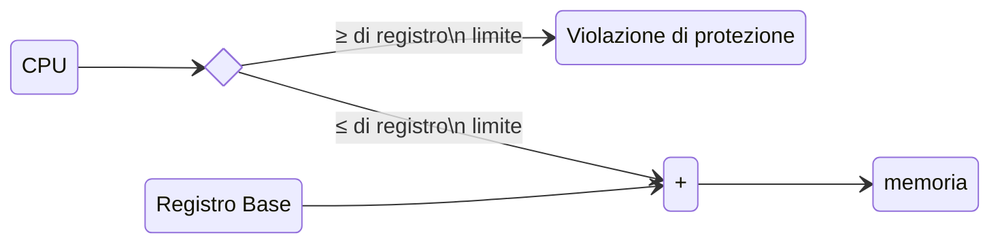

# Gestione della memoria centrale

<!-- markdownlint-disable MD024 -->
## Principi di base

La gestione della memoria si occupa di allocare la memoria fisica ai processi
che ne fanno richiesta. Nessun processo può diventare attivo prima di avere
ottenuto un certo quantitativo di memoria.

L'utilizzo globale delle risorse e tutte le altre prestazioni di un calcolatore
vengono influenzate dalle prestazioni del *modulo di gestione della memoria* sia
in funzione della sua efficienza nell'allocare memoria, sia per l'influenza che
può avere sullo scheduler.

Un buon gestore di memoria in un ambiente multiprogrammato deve garantire la
protezione dei dati, impedendo ai processi attivi di sconfinare nello spazio di
indirizzamento di altri processi, e permettere allo stesso tempo la loro
condivisione affinché i processi cooperanti possano accedere ad aree comuni di
memoria.

### Allocazione della memoria

I moduli di gestione della memoria si differenziano in base al tipo di
allocazione della stessa, che può  essere:

=== "Contigua"

    La memoria viene allocata in modo tale che ciascun oggetto occupa un insieme
    di locazioni i cui indirizzi sono strettamente consecutivi. Esistono vari
    tipi di allocazione contigua:

    - monoallocazione;
    - partizionamento statico;
    - partizionamento dinamico;
    - segmentazione.

=== "Non contigua"

    La memoria viene allocata in modo tale che un unico oggetto logico viene
    posto  in aree separate e non adiacenti. Durante l'esecuzione di un processo
    viene eseguita la traduzione degli indirizzi per ristabilire la
    corrispondenza tra lo spazio virtuale di indirizzamento (contiguo) e gli
    indirizzi fisici. Le tipologie afferenti sono:

    - paginazione;
    - memoria virtuale.

## Monoallocazione

### Monitor Monoprocesso

È lo schema più semplice per la gestione della memoria che viene suddivisa in
due aree contigue:

- la prima allocata permanentemente ad una porzione residente del sistema
  operativo (Monitor);
- la seconda assegnata ai processi in esecuzione, processi utente o porzioni
  non residenti del sistema operativo, per il tempo necessario al completamento.

Questo schema viene generalmente utilizzato da sistemi operativi monoprocesso
per microcomputer.

### Modalità dello schema

Il sistema operativo:

- tiene traccia solo della prima e dell'ultima locazione disponibile per i
  processi transienti;
- viene posto ad uno dei due estremi della memoria;
- ingloba i vettori di interrupt;
- altri suoi moduli temporanei vengono posti all'altra estremità della memoria.

Alla richiesta di esecuzione di un programma, il sistema operativo:

- si assicura che le dimensioni del processo siano compatibili con la memoria
  disponibile;
- conferisce il controllo al processo utente fino al suo completamento o ad
  eventuali condizioni di errore;
- al termine del processo la memoria viene liberata e può essere assegnata ad
  un altro processo in attesa.

### Meccanismi di protezione

Raramente un monitor monoprocesso supporta meccanismi di protezione tra processi
utente in quanto in ogni istante vi può essere al massimo un solo processo
residente in memoria. Gli eventuali meccanismi si riferiscono alla protezione
del codice del sistema operativo da eventuali sconfinamenti del processo
transiente in esecuzione.

La protezione del sistema operativo dai processi utente è spesso effettuata
mediante supporti hardware come:

- registri barriera;
- diritti di accesso mediante bit di protezione;
- sistema operativo in memoria a sola lettura.

I **registri barriera** sono usati per tracciare un confine tra le aree dei
processi di sistema e dei processi transienti. Nel registro viene memorizzata
la prima locazione disponibile al processo e il sistema operativo effettua i
controlli di sconfinamento. Questo metodo richiede la capacità di distinguere
l'esecuzione del sistema operativo da quella dei processi utente definendo gli
stati "utente" e "supervisore".

Un altro metodo per proteggere la memoria consiste nel memorizzare i diritti
di accesso, mediante bit di protezione, nella memoria stessa. Ad ogni parola
di memoria viene associato un bit di protezione che viene posto a \(1\) nelle
zone che contengono il sistema operativo e a \(0\) nelle restanti. I processi
utente accedono solo a parole con bit \(0\), mentre il sistema operativo ha
accesso illimitato.

Un modo semplice e diffuso per proteggere il codice del sistema operativo dai
programmi utente consiste nel porre il sistema operativo in memoria a sola
lettura. Nelle applicazioni generiche, come i personal computer, questo metodo
non è solitamente utilizzato per la sua scarsa flessibilità e impossibilità di
correggere o aggiornare il codice del sistema operativo.

La condivisione del codice e dei dati in memoria non ha molto senso negli
ambienti monoprocesso e raramente viene supportata dai relativi monitor. I
programmi utente potrebbero passarsi dei dati, mediante accordi interni,
ponendoli in locazioni di memoria che non vengono sovrascritte durante
l'esecuzione di processi partecipanti, o mediante file.

### Prestazioni

Difetti:

- la mancanza di supporti per la multi-programmazione produce un abbassamento
  dell'efficienza sia della memoria che della CPU;
- la memoria può risultare sovradimensionata per la maggioranza dei processi
- processi di dimensione più grande della memoria non possono essere eseguiti,
  oppure richiedono particolari suddivisioni del codice (overlay);
- i programmi tendono ad essere ottimizzati rispetto alla dimensione, comportando
  spesso sacrifici di funzionalità e velocità.

Pregi:

- basso costo di progettazione del modulo di gestione della memoria;
- contenuti supporti hardware specifici per la gestione della memoria.

## Partizionamento statico

Un modo per supportare la multiprogrammazione consiste nel dividere la memoria
in diverse partizioni, ciascuna delle quali può essere allocata a un processo
diverso. Il partizionamento statico implica che la suddivisione della memoria
venga fatta "fuori linea" e che da quel momento le partizioni rimangano di
dimensioni fisse.

Il numero e la dimensione di ciascuna partizione vengono determinati durante la
generazione del sistema considerando:

- capacità della memoria fisica disponibile;
- grado desiderato di multiprogrammazione;
- dimensioni dei processi più frequentemente eseguiti;

Alcuni calcolatori permettono una ridefinizione manuale delle dimensioni delle
partizioni senza dover ripetere l'intero processo di generazione del sistema.

### Principi operativi

Il sistema operativo deve tener traccia delle partizioni definite. Lo stato
corrente delle partizioni ed i loro attributi vengono raccolti in una struttura
dati chiamata **tabella di descrizione delle partizioni** (TDP).

L'unico campo variabile nella TDP è lo stato della partizione che indica in ogni
istante se la partizione è allocata o no. Gli altri campi contengono valori
definiti al momento del partizionamento.

\[
  \begin{array}{ cc }
    \begin{array}{ |c| }\hline
      \hspace{2.5cm} OS \hspace{2.5cm} \\             \hline
    \end{array}
    & \text{Sistema operativo} \\
%
    \begin{array}{ |c| }\hline
      \\ \hspace{2.65cm} p_1 \hspace{2.65cm} \\ \\      \hline
    \end{array}
    & \text{Processo utente} \\
%
    \begin{array}{ |c| }\hline
      \\ \hspace{5.8cm} \\             \hline
    \end{array}
    & \text{Partizione libera} \\
%
    \begin{array}{ |c| }\hline
      \\ \hspace{2.65cm} p_2 \hspace{2.65cm} \\ \\             \hline
    \end{array}
    & \text{Processo utente} \\
  \end{array}
\]

TDP dell'esempio precedente:

| \# partizione | Base partizione | Dimensione partizione | Stato partizione |
| ------------- | --------------- | --------------------- | ---------------- |
| 0             | 0 kB            | 200 kB                | Allocata         |
| 1             | 200 kB          | 400 kB                | Allocata         |
| 2             | 600 kB          | 600 kB                | Libera           |
| 3             | 1200 kB         | 500 kB                | Allocata         |

Quando un processo non residente deve essere creato o attivato, il sistema
operativo tenta di allocare una partizione di memoria libera di dimensioni
sufficienti per contenerlo, consultando la TDP. Se il test è positivo, il campo
"stato della partizione" viene impostato ad "Allocata" e l'immagine del processo
viene caricata nella corrispondente partizione. Quando il processo termina è
necessario effettuarne uno swapping dalla memoria. Questa informazione verrà
utilizzata per localizzare e aggiornare lo stato della partizione
associata al valore "Libera".

I metodi più comuni per la ricerca di una partizione libera sono:

- first fit: consiste nell'allocare la prima partizione libera sufficientemente
  larga per contenere il processo;
- best fit: consiste nell'allocare la più piccola delle partizioni libere che
  contenga il processo.

Il metodo first fit è più veloce in esecuzione poiché si arresta nella ricerca,
alla prima partizione libera disponibile, mentre il metodo best fit deve
controllare, prima di arrestarsi, tutte le partizioni libere disponibili per
individuarne la migliore.

Il metodo best fit, tuttavia, è più accurato in esecuzione e quindi può
raggiungere un miglior utilizzo della memoria, rispetto al metodo first fit,
riducendo al minimo la differenza di dimensione tra il processo e la partizione
allocata.

Quando il numero delle partizioni è molto grande nessuno dei due metodi si
rivela particolarmente adatto.

Riassumendo, se esiste una partizione allocabile al processo richiedente:

- l'allocazione viene effettuata;
- la TDP viene aggiornata;
- nel descrittore del processo si registra la partizione associata;
- quando il processo termina la partizione viene disallocata.

Le cause di mancata disponibilità di una partizione sono:

1. non vi sono partizioni di memoria sufficientemente grandi per contenere il
   processo entrante;
2. tutte le partizioni sono allocate;
3. alcune partizioni sono libere ma nessuna di esse è sufficientemente grande.

=== "Caso 1"
    Non vi sono partizioni di memoria sufficientemente grandi per contenere il
    processo entrante. Cause:

    - errore di scelta della dimensione delle partizioni;
    - Processo eccezionalmente più grande della norma.

    La soluzione sta nel ridefinire la dimensione delle partizioni, oppure 
    progettare il programma di origine utilizzando uno schema di overlay.

=== "Caso 2"
    Tutte le partizioni sono allocate. Soluzioni:

    - attesa di una partizione libera;
    - swapping del processo.

    Entrambe le soluzioni possono essere anche applicate al caso \(3\).

=== "Caso 3"
    Alcune partizioni sono libere ma nessuna di esse è sufficientemente grande.
    In questo caso l'assegnazione di partizioni può continuare

    - vengono allocate partizioni a processi più piccoli;
    - l'utilizzo della memoria viene mantenuto più elevato;
    - si può violare l'ordinamento di attivazione dei processi dallo scheduler 
      modificando, così, le prestazioni del sistema.

Il funzionamento del gestore della memoria e dello scheduler sono strettamente
correlati:

- lo scheduler determina quali processi sono pronti, e quindi residenti in
  memoria, in attesa della CPU;
- il gestore della memoria può decidere di "sfrattare" un processo in memoria
  per liberare una partizione.

### Swapping

Lo swapping è l'operazione di rimozione dalla memoria di un processo sospeso e
il suo successivo caricamento. Nel partizionamento statico questo aumenta il
livello di occupazione della memoria centrale e, conseguentemente, il livello
di utilizzo della CPU.

Quando lo scheduler decide l'introduzione in memoria di un nuovo processo il
gestore dello swapping ne sceglie uno da rimuovere in base a:

- dimensione della partizione richiesta;
- priorità del processo;
- tipo di evento atteso dal processo;
- tempo già trascorso in memoria.

Un processo residente in memoria, già parzialmente eseguito, è costituito da:

- codice eseguibile;
- dati finora elaborati;
- stack;
- registri di stato;
- file aperti;
- descrittore del processo.

Al momento dello swapping questi oggetti vengono registrati in un file su hard
disk detto file di swapping.

Tutti i processi che hanno subito uno swapping possono essere mantenuti:

- in un file unico per tutto il sistema
- in file separati, ciascuno associato ad un singolo processo

Un file di swapping di sistema viene solitamente creato al momento
dell'inizializzazione del sistema e collocato su una periferica veloce di
memorizzazione secondaria. L'indirizzo e la dimensione di tale file sono
solitamente statici in modo da beneficiare di un indirizzamento diretto su disco.

Un parametro critico per la realizzazione di un file di swapping è la dimensione:

- se troppo grande spreca spazio su dischi veloci
- se troppo piccolo può rendere indisponibile l'operazione di swapping

L'alternativa è disporre di un file di swapping per ciascun processo presente
nel sistema che può essere creato dinamicamente al momento della creazione del
processo o staticamente al momento della preparazione del programma.

Vantaggi:

- eliminazione del problema del dimensionamento del file unico
- nessuna restrizione sul numero di processi attivi

Svantaggi:

- maggior spreco di spazio
- maggiori tempi di accesso ai file distribuiti sul disco

Uno swapping efficiente richiede che i processi siano rilocabili dinamicamente:

- il processo può iniziare l'esecuzione in qualunque area di memoria
- può essere spostato in un'altra area di memoria
- il calcolo degli indirizzi viene effettuato dinamicamente ad esempio con l'uso
  di un registro base.

I processi non rilocabili dinamicamente sono legati alle partizioni in cui iniziano
l'esecuzioni e rendono inefficiente lo swapping. In linea di principio lo
swapping va utilizzato solo in casi di necessità poiché la CPU spreca un tempo
elevato nelle operazioni di trasferimento.

### Meccanismi di protezione

L'integrità di un sistema multiprogrammato dipende anche dalla sua capacità di
garantire l'isolamento tra spazi di indirizzi separati. Non solo si deve
proteggere il sistema operativo dai processi utente ma bisogna anche proteggere
i processi utente tra di loro perché nessuno possa invadere lo spazio riservato
all'altro.

Un sistema di protezione efficace non può prescindere dall'esistenza di un supporto
hardware. Nei sistemi che utilizzano per la rilocazione i registri base, vengono
di solito usati dei registri limite per la protezione.

Il compito principale di un registro limite consiste nell'individuare i tentativi
di accesso oltre i limiti dello spazio di indirizzamento assegnato al programma
in esecuzione dal sistema operativo. Il registro limite contiene solitamente il
valore dell'indirizzo virtuale più alto contenuto dal programma.

Ad ogni accesso alla memoria la CPU controlla che il programma non richieda
indirizzi oltre il limite. Le violazioni vengono rilevate e riferite al sistema
operativo che le gestisce. L'indirizzo più basso del processo è contenuto nel
registro base.



### Meccanismi di condivisione

Un buon sistema di gestione della memoria deve occuparsi, oltre che della
protezione, anche della condivisione controllata di dati e codice tra processi
cooperanti. I sistemi a partizioni fisse non sono adatti alla condivisione,
poiché basano i propri meccanismi sull'isolamento degli spazi di indirizzamento.

Alcuni possibili metodi di condivisione sono:

1. affidare gli oggetti condivisi al sistema operativo che così è in grado di
   accedere a tutte le risorse. Gli svantaggi di questa tecnica sono:
    - l'area del sistema operativo dovrebbe poter variare dinamicamente;
    - le routine dei processi utente devono poter essere "linkate" al sistema operativo
      dinamicamente.
2. ogni processo possiede una copia identica dell'oggetto condiviso, che usa e
   diffonde gli aggiornamenti. Lo svantaggio di questa tecnica consiste nel fatto
   che se il sistema supporta lo swapping, uno o più processi potrebbero non
   essere in memoria e quindi non esse re pronti a ricevere gli aggiornamenti.
3. collocare i dati in una partizione comune dedicata. In questo caso, però, il
   sistema operativo considera come violazione i tentativi dei processi
   partecipanti alla condivisione di accedere a zone di memoria esterne alle
   rispettive partizioni. Se il sistema usa registri base e limite sono necessari
   accorgimenti per indirizzare partizioni che potrebbero non essere contigue.

### Conclusioni

Il partizionamento statico:

- è uno dei metodi più semplici di gestione della memoria, pur supportando la
  multiprorammazione;
- richiede un supporto hardware modesto;
- si adegua ad ambienti statici con carico predicibile di lavoro come ambienti
  in cui vengono eseguiti solo applicativi, controllo di processi e sistemi di
  tipo bancario.

Svantaggi:

- il problema principale è la frammentazione interna;
- può richiedere progettazione dei programmi con schemi ad overlay;
- non si adatta a contenere oggetti come stack che possono crescere in maniera
  non facilmente controllabile;
- il numero di partizioni fissato limita il grato di multiprogrammazione.

## Partizionamento dinamico

Il sistema delle partizioni è analogo a quello del partizionamento statico.

Il gestore della memoria crea ed assegna partizioni di *dimensione variabile
dinamicamente* in base alle richieste dei processi. Quando un processo termina o
subisce uno swapping, il gestore della memoria restituisce lo spazio liberato
all'insieme di aree di memoria libere. Il gestore della memoria può creare e
allocare partizioni finché non viene esaurita la memoria fisica o finché non
viene raggiunto il massimo grado di multiprogrammazione.

### Principi operativi

Alla richiesta di una partizione il gestore della memoria (GM) ricerca una zona
di memoria libera contigua di dimensione sufficiente. Se si trova un'area adatta
il sistema operativo vi ricava una partizione in modo da soddisfare esattamente
le necessità del processo.

L'eventuale parte rimanente di memoria libera viene restituita all'insieme della
memoria libera e posta a disposizione del modulo di allocazione. La partizione
viene creata registrando la sua base, la sua dimensione e il suo stato (Allocata)
nella TDP o in una tabella equivalente.

Alcune di queste informazioni vengono anche registrate nel descrittore di
processo. Dopo aver caricato l'immagine del processo nella partizione creata,
il processo in oggetto viene sottoposto al controllo di un modulo del sistema
operativo che si occupa delle operazioni successive. Quando un processo termina
o subisce uno swapping il sistema operativo restituisce la partizione all'area
libera e cancella la riga corrispondente nella TDP. L'insieme delle aree libere
varia dinamicamente, gli spazi interni all'area libera vengono utilizzati per
mantenere una lista a puntatori.

!!! example "Esempio"
  
    === "Tabella"

        | \#  | Base | Dimensione | Stato    |
        | --: | ---- | ---------- | -------- |
        |   0 | 0    | 200        | Allocata |
        |   1 | -    | -          | -        |
        |   2 | 400  | 100        | Allocata |
        |   3 | 500  | 250        | Allocata |
        |   4 | 750  | 150        | Allocata |
        |   5 | -    | -          | -        |
        |   6 | -    | -          | -        |
        |   7 | -    | -          | -        |

    === "Memoria"

        \[
          \begin{array}{ c }
            \begin{array}{ |c| }\hline
              \hspace{2.55cm} OS \hspace{2.55cm} \\ \hline
            \end{array} \\
        %
            \begin{array}{ |c| }\hline
              \\ \\ \hspace{5.65cm} \\ \\ \hline
            \end{array} \\
        %
            \begin{array}{ |c| }\hline
              \hspace{2.65cm} p_1 \hspace{2.65cm} \\ \hline
            \end{array} \\
        %
            \begin{array}{ |c| }\hline
              \\ \hspace{2.65cm} p_2 \hspace{2.65cm} \\ \\ \hline
            \end{array} \\
        %
            \begin{array}{ |c| }\hline
              \\ \hspace{2.65cm} p_3 \hspace{2.65cm} \\ \\ \hline
            \end{array} \\
        %
            \begin{array}{ |c| }\hline
              \hspace{5.65cm} \\ \hline
            \end{array} \\
          \end{array}
        \]

    === "Lista aree libere"

        ```mermaid
        stateDiagram-v2
          direction LR
          a1: 100
          a1: 300

          a2: 900
          a2: 100

          [*] --> a1: puntatore alla\n prima area libera
          a1 --> a2
          a2 --> [*]
        ```

    Dopo che viene allocata la partizione \(1\):

    === "TDP"
        | \#  | Base | Dimensione | Stato    |
        | --: | ---- | ---------- | -------- |
        |   0 | 0    | 200        | Allocata |
        |   1 | 100  | 120        | Allocata |
        |   2 | 400  | 100        | Allocata |
        |   3 | 500  | 250        | Allocata |
        |   4 | 750  | 150        | Allocata |
        |   5 | -    | -          | -        |
        |   6 | -    | -          | -        |
        |   7 | -    | -          | -        |

    === "Memoria"

        \[
          \begin{array}{ c }
            \begin{array}{ |c| }\hline
              \hspace{2.5cm} OS \hspace{2.5cm} \\ \hline
            \end{array} \\
        %
            \begin{array}{ |c| }\hline
              \hspace{2.65cm} p_4 \hspace{2.65cm} \\ \hline
            \end{array} \\
        %
            \begin{array}{ |c| }\hline
              \\ \hspace{5.65cm} \\ \hline
            \end{array} \\
        %
            \begin{array}{ |c| }\hline
              \hspace{2.65cm} p_1 \hspace{2.65cm} \\ \hline
            \end{array} \\
        %
            \begin{array}{ |c| }\hline
              \\ \hspace{2.65cm} p_2 \hspace{2.65cm} \\ \\ \hline
            \end{array} \\
        %
            \begin{array}{ |c| }\hline
              \\ \hspace{2.65cm} p_3 \hspace{2.65cm} \\ \\ \hline
            \end{array} \\
        %
            \begin{array}{ |c| }\hline
              \hspace{5.65cm} \\ \hline
            \end{array} \\
          \end{array}
        \]

    === "Lista aree libere"

        ```mermaid
        stateDiagram-v2
          direction LR
          a1: 220
          a1: 180

          a2: 900
          a2: 100

          [*] --> a1: puntatore alla\n prima area libera
          a1 --> a2
          a2 --> [*]
        ```

    Dopo che viene liberata la partizione \(3\):

    === "TDP"

        | \#  | Base | Dimensione | Stato    |
        | --: | ---- | ---------- | -------- |
        |   0 | 0    | 200        | Allocata |
        |   1 | 100  | 120        | Allocata |
        |   2 | 400  | 100        | Allocata |
        |   3 | -    | -          | -        |
        |   4 | 750  | 150        | Allocata |
        |   5 | -    | -          | -        |
        |   6 | -    | -          | -        |
        |   7 | -    | -          | -        |

    === "Memoria"

        \[
          \begin{array}{ c }
            \begin{array}{ |c| }\hline
              \hspace{2.55cm} OS \hspace{2.55cm} \\ \hline
            \end{array} \\
        %
            \begin{array}{ |c| }\hline
              \hspace{2.65cm} p_4 \hspace{2.65cm} \\ \hline
            \end{array} \\
        %
            \begin{array}{ |c| }\hline
              \\ \hspace{5.65cm} \\ \hline
            \end{array} \\
        %
            \begin{array}{ |c| }\hline
              \hspace{2.65cm} p_1 \hspace{2.65cm} \\ \hline
            \end{array} \\
        %
            \begin{array}{ |c| }\hline
              \\ \hspace{5.65cm} \\ \\ \hline
            \end{array} \\
        %
            \begin{array}{ |c| }\hline
              \\ \hspace{2.65cm} p_3 \hspace{2.65cm} \\ \\ \hline
            \end{array} \\
        %
            \begin{array}{ |c| }\hline
              \hspace{5.65cm} \\ \hline
            \end{array} \\
          \end{array}
        \]

    === "Lista aree libere"

        ```mermaid
        stateDiagram-v2
          direction LR
          a1: 220
          a1: 180

          a2: 500
          a2: 250

          a3: 900
          a3: 100

          [*] --> a1: puntatore alla\n prima area libera
          a1 --> a2
          a2 --> a3 
          a3 --> [*]
        ```

Gli algoritmi più comuni per selezionare un'aria di memoria all'interno della
quale creare una partizione sono:

- **first-fit**, termina la ricerca quando viene individuato il primo blocco di
  memoria sufficientemente grande da contenere il processo;
- **best-fit**, (variante del first-fit) il puntatore alla lista delle aree
  libere, dopo avere effettuato un'allocazione, viene salvato cosicché la ricerca
  successiva continua da dove si era fermata la precedente;
- **next-fit**, alloca il blocco di memoria libero più piccolo che può contenere
  il processo;
- **worst-fit**, al contrario, alloca il blocco di memoria libero più grande le
  cui dimensioni superino quelle della partizione richiesta.

### Compattazione

Lo schema di partizionamento dinamico genera, inevitabilmente, "buchi" di
memoria inutilizzabile. Per questo motivo può anche diventare impossibile
l'allocazione di memoria richiesta da un processo, pur contenendo la memoria
globalmente un'area di dimensione sufficiente. Questo fenomeno si chiama
frammentazione esterna.

Quando la frammentazione raggiunge un grado elevato è necessario effettuare la
**compattazione della memoria** che consiste nello spostare i processi residenti
in memoria in modo da creare partizioni libere più grandi. Questa operazione
generalmente richiede un grande costo di CPU.

La compattazione può essere effettuata:

1. Continuamente:
    - la memoria viene compattata ogni volta che un processo libera un'area;
    - la frammentazione è ridotta al minimo;
    - questa operazione ha un grande costo di CPU.
2. Su necessità:
    - la compattazione viene effettuata quando non si riesce ad allocare memoria
      ad un processo richiedente;
    - un controllo preliminare verifica se il totale dell'area liberabile è
      sufficiente a contenere il processo.

La compattazione può essere effettuata in due modi:

1. Spostamento selettivo incrementale:
    - ricerca di una strategia ottima di movimento per compattare al meglio la
      memoria;
    - consente di risparmiare tempo negli spostamenti;
    - Poco utilizzata perché richiede un sovraccarico notevole.
2. Spostamento globale:
    - tutte le partizioni vengono rilocate ad uno dei due estremi della memoria;
    - il tempo di trasferimento delle partizioni non è ottimizzabile;
    - non richiede strategie particolari.

=== "Memoria"
    \[
      \begin{array}{ c }
        \begin{array}{ |c| }\hline
          \hspace{2.55cm} OS \hspace{2.55cm} \\ \hline
        \end{array} \\
    %
        \begin{array}{ |c| }\hline
          \\ \hspace{2.7cm} P \hspace{2.7cm}\\ \\ \hline
        \end{array} \\
    %
        \begin{array}{ |c| }\hline
          \hspace{2.7cm} Q \hspace{2.7cm}\\ \hline
        \end{array} \\
    %
        \begin{array}{ |c| }\hline
          \\ \\ \\ \\ \hspace{5.8cm} \\ \hline
        \end{array} \\
    %
        \begin{array}{ |c| }\hline
          \hspace{2.7cm} R \hspace{2.7cm} \\ \hline
        \end{array} \\
    %
        \begin{array}{ |c| }\hline
          \hspace{5.8cm} \\ \hline
        \end{array} \\
      \end{array}
    \]

=== "Spostamento Selettivo"
    \[
      \begin{array}{ c }
        \begin{array}{ |c| }\hline
          \hspace{2.55cm} OS \hspace{2.55cm} \\ \hline
        \end{array} \\
    %
        \begin{array}{ |c| }\hline
          \\ \hspace{2.7cm} P \hspace{2.7cm}\\ \\ \hline
        \end{array} \\
    %
        \begin{array}{ |c| }\hline
          \\ \\ \\ \\ \\ \\ \hspace{5.8cm} \\ \hline
        \end{array} \\
    %
        \begin{array}{ |c| }\hline
          \hspace{2.7cm} R \hspace{2.7cm} \\ \hline
        \end{array} \\
    %
        \begin{array}{ |c| }\hline
          \hspace{2.7cm} Q \hspace{2.7cm}\\ \hline
        \end{array} \\
      \end{array}
    \]

=== "Spostamento Globale"
    \[
      \begin{array}{ c }
        \begin{array}{ |c| }\hline
          \hspace{2.55cm} OS \hspace{2.55cm} \\ \hline
        \end{array} \\
    %
        \begin{array}{ |c| }\hline
          \\ \hspace{2.7cm} P \hspace{2.7cm}\\ \\ \hline
        \end{array} \\
    %
        \begin{array}{ |c| }\hline
          \hspace{2.7cm} Q \hspace{2.7cm}\\ \hline
        \end{array} \\
    %
        \begin{array}{ |c| }\hline
          \hspace{2.7cm} R \hspace{2.7cm} \\ \hline
        \end{array} \\
    %
        \begin{array}{ |c| }\hline
          \\ \\ \\ \\ \\ \\ \hspace{5.8cm} \\ \hline
        \end{array} \\
      \end{array}
    \]

### Meccanismi di protezione e condivisione

Le tecniche di protezione e condivisione sono analoghe a quelle del
partizionamento statico, considerato che il supporto hardware è simile. Nel
partizionamento dinamico è possibile una particolare forma di condivisione:

- a due partizioni contigue è consentito sovrapporsi, mettendo un'area in comune
- questa forma di condivisione è molto restrittiva, in quanto, può avvenire solo
  tra due processi.

### Conclusioni

Il partizionamento dinamico:

- richiede un supporto hardware modesto, analogo al partizionamento statico;
- la differenza tra i due schemi risiede sostanzialmente nel software;
- elimina la frammentazione interna ma produce quella esterna che può essere
  eliminata con la compattazione;
- si adegua ad ambienti con carico non predicibile di lavoro come ad esempio
  sviluppo di software.

## Segmentazione

La segmentazione è uno schema di gestione della memoria che si basa sulla
divisione dello spazio di indirizzamento dei processi in entità logiche che
possono essere poste in aree non contigue di memoria. La segmentazione fornisce
strumenti per la rilocazione dinamica, la protezione e la condivisione.

La frammentazione esterna può essere ridotta se la dimensione delle aree richieste
è più piccola. Un programma eseguibile può essere suddiviso, ad esempio, in
codice, dati e stack; ciascuno di questi oggetti può essere posto in un segmento
diverso di dimensioni differenti. La segmentazione condivide alcune proprietà:

- degli **schemi di allocazione contigua** relativamente ad un singolo segmento,
  poiché i dati di ogni singola entità logica devono essere posti in un'area
  contigua di memoria;
- degli **schemi di allocazione non contigua** relativamente all'intero spazio di
  indirizzamento del processo, poiché blocchi logici diversi possono essere
  messi in segmenti non contigui.

### Principi operativi

- La raccolta degli oggetti in segmenti viene predisposta dal programmatore;
- Ciascun segmento inizia all'indirizzo virtuale zero;
- Ogni segmento ha un nome che viene poi tradotto in un indirizzo in fase di
  caricamento in memoria;
- Un singolo dato all'interno del segmento viene identificato dallo
  "spiazzamento" relativo all'inizio del segmento cui appartiene.

L'indirizzamento nella segmentazione è di tipo bidimensionale, infatti la
designazione univoca di un dato o di una istruzione richiede il nome del
segmento e lo spiazzamento all'interno del segmento. La memoria fisica,
naturalmente, mantiene l'indirizzamento lineare, per cui è necessario un
meccanismo per la traduzione degli indirizzi bidimensionali di segmenti virtuali
in indirizzi fisici.

Il caricamento di un processo segmentato avviene nel seguente modo:

- il sistema operativo cerca di allocare \(n\) partizioni adatte per gli \(n\)
  segmenti in cui è suddiviso il processo;
- il sistema operativo crea un descrittore di segmento registrandovi l'indirizzo
  fisico in cui è stato posto il segmento e la sua dimensione;
- l'insieme dei descrittori di segmento di un processo viene raccolto nella
  tabella dei descrittori di segmento (TDS).

La traduzione di un indirizzo avviene nel seguente modo:

- l'indirizzo bidimensionale virtuale I (segment, displacement) è tradotto in
  modo equivalente al meccanismo del registro base;
- il segment viene utilizzato per ritrovare l'indirizzo fisico del segmento
  nella TDS;
- il displacement viene sommato all'indirizzo fisico del segmento per ottenere
  l'indirizzo fisico richiesto;
- la dimensione del segmento, riportata nella TDS, viene utilizzata anche per
  controllare eventuali violazioni.

Le dimensioni della TDS sono legate alle dimensioni dello spazio virtuale di
indirizzamento di un processo. I processori della famiglia Intel, ad esempio,
supportano fino a \(16000\) segmenti di \(64 \KB\). La TDS può essere costituita
da qualche riga fino a qualche migliaia di righe. Essa viene tenuta in memoria,
in uno dei segmenti associati al processo.
Due registi hardware, RBTDS e RLTDS, contengono l'indirizzo di inizio e fine
della TDS associata al processo in esecuzione. Ciò consente anche il controllo
d'accesso a segmenti non assegnati al processo.

- RBTDS: Registro Base della Tabella dei Descrittori di Segmento
- RLTDS: Registro Limite della Tabella dei Descrittori di Segmento

La base ed il limite della nuova TDS vengono caricati nei registri RBTDS e RLTDS.
Quando un processo subisce uno swapping, al ritorno in memoria va aggiornata la
sua TDS. Generalmente si preferisce rigenerarla totalmente utilizzando la mappa
statica fornita dal linker. L'eventuale compattazione richiede l'aggiornamento
nella TDS delle righe relative ai segmenti spostati.

La traduzione di ciascun indirizzo bidimensionale virtuale richiede due accessi in
memoria:

- uno alla TDS per tradurre l'indirizzo del segmento da virtuale a fisico;
- l'altro per accedere fisicamente alla locazione richiesta.

La segmentazione, quindi, raddoppia il tempo per l'accesso ad una locazione di
memoria.

Se i descrittori di segmento sono pochi, o se alcuni sono utilizzati più
frequentemente, conviene specificare il loro caricamento in opportuni registri
hardware. I processori della famiglia Intel, ad esempio, dispongono di \(4\)
registri utilizzabili da schemi di segmentazione:

- CS: Code Segment;
- DS: Data Segment;
- SS: Stack Segment;
- ES: Extra Segment.

### Meccanismi di protezione

La forma più naturale di protezione per un sistema segmentato è l'utilizzo di
registri base e limite. La protezione tra spazi di indirizzamento di processi
differenti è garantita dalla collocazione dei segmenti in aree disgiunte di
memoria. Una caratteristica offerta dai sistemi segmentati consiste nel fornire
un livello di protezione all'interno dello spazio di indirizzamento di un singolo
processo. È possibile definire diritti e modalità di accesso per ogni "tipo" di
segmento. È possibile definire ad esempio:

- accesso in modalità "execute" (o anche "read-only") al segmento codice;
- accesso in modalità "read/write" al segmento stack;
- accesso "read-only" o "read/write" al segmento dati.

I diritti di accesso possono essere registrati in un campo dellaTDS

### Meccanismi di condivisione

La segmentazione offe una condivisione semplice e flessibile. Gli oggetti
condivisi sono collocati in segmenti dedicati e separati. Il segmento condiviso
può essere mappato, attraverso la TDS, nello spazio di indirizzamento virtuale
di tutti i processi autorizzati ad accedervi. Lo spiazzamento interno di un dato
risulta identico per tutti i processi che lo condividono.

Nell'esempio in figura (pagina successiva) è possibile vedere tre processi che
condividono il codice di un editor. Ogni processo ha il proprio documento in un
segmento dati privato. La condivisione del codice di un applicativo tra molti
utenti può consentire un notevole risparmio di memoria. Particolari accorgimenti
vanno adottati in sistemi che supportano lo swapping.

<!-- TODO: aggiungere immagine -->

### Collegamento dinamico

Il Collegamento Dinamico indica il caricamento di una procedura, ad esempio una
libreria, in fase di esecuzione di un processo e solo su sua richiesta. Lo
spazio in memoria per una procedura viene occupato solo se e quando tale
procedura viene richiesta. La segmentazione consente di aggiungere nuovi segmenti
al processo richiedente, aggiornando la TDS e i registri base e limite della TDS.

### Conclusioni

- eliminando la necessità di allocare processi in aree contigue si rende più
  efficiente la gestione della memoria fisica;
- viene eliminata la frammentazione interna;
- viene ridotta la frammentazione esterna;
- sono supportate efficientemente protezione e condivisione;
- viene supportato il collegamento dinamico;

Gli svantaggi principali sono:

- necessità di effettuare comunque la compattazione che è resa più complessa;
- il duplice accesso alla memoria deve essere supportato da hardware apposito;
- la gestione della memoria da parte del sistema operativo è più complessa
  rispetto a quella per il partizionamento statico e dinamico;
- non rende ancora possibile l'esecuzione di processi più grandi delle
  dimensioni fisiche della memoria.

## Paginazione

La memoria fisica viene concettualmente suddivisa in pagine di dimensione fissa
chiamate pagine fisiche. Anche lo spazio di indirizzamento dei processi viene
diviso in pagine virtuali della stessa dimensione delle pagine fisiche. Il
meccanismo di traduzione fa corrispondere indirizzamenti all'interno di pagine
virtuali ad indirizzamenti in pagine fisiche. Ogni pagina è mappata separatamente,
per cui non è necessaria la contiguità delle pagine fisiche.

### Principi operativi

Ogni indirizzo all'interno di un processo è diviso in:

- bit più significativi --> numero di pagina (virtuale);
- bit meno significativi --> spiazzamento (reale).

Il sistema operativo tiene traccia della corrispondenza tra pagine virtuali e
pagine fisiche mediante la tabella delle pagine (TDP):

- la TDP viene costruita al momento del caricamento del processo
- ogni riga della tabella contiene l'indirizzo di partenza della pagina fisica
  in cui è allocata la corrispondente pagina virtuale (solo i bit più
  significativi);
- la tabella è costituita da un numero di righe pari al numero di pagine
  occupate.

Principi operativi: esempio

- Memoria: \(1 \MB\);
- Dimensione Pagina: \(256 \byte\);
- Numero di pagine: \(4096\);
- Lunghezza dell'indirizzo: \(20 \bit\).

Lo spazio di indirizzamento di un ipotetico processo utente che occupi \(1008 \byte\)
viene diviso in quattro pagine virtuali numerate da \(0\) a \(3\).

La traduzione dell'indirizzo virtuale avviene nel seguente modo:

- un meccanismo hardware divide l'indirizzo virtuale in:
      - 12 bit più significativi (numero di pagina)
      - 8 bit meno significativi (displacement interno alla pagina)
- il numero di pagina viene usato all'interno della TDP per ottenere il
  corrispondente indirizzo della pagina fisica.
- l'indirizzo ottenuto, concatenato con il displacement, fornisce l'indirizzo
  fisico cercato.

<!-- TODO: aggiungere immagine (slide 65) -->

Il sistema operativo tiene traccia dello stato di tutte le pagine fisiche
mediante la tabella di memoria (TDM):

- in ogni riga della TDM è indicato lo stato della relativa pagina: "Libera" o  
  "Allocata";
- il numero di righe della tabella è uguale al numero di pagine fisiche.

Quando un processo termina o subisce uno swapping:

- restituisce tutte le pagine fisiche ad esso assegnate;
- la sua TDP viene eliminata.

Quando il processo richiedente ha uno spazio di indirizzamento non multiplo della
dimensione delle pagine fisiche si crea il fenomeno della frammentazione interna
della pagina. Questo è comunque un fenomeno molto ridotto e legato alla
dimensione della pagina fisica.

Particolare attenzione va posta nella scelta della tecnica di memorizzazione
delle aree libere. La consultazione della TDM statica per trovare \(n\) pagine
fisiche libere, infatti, richiede una ricerca su un numero di righe in media
\(x = \ifrac{n}{q}\), dove \(q\) è la probabilità che una pagina sia libera e
si lega alla percentuale di memoria libera \(u\):

\[ q = \frac{u}{100} \qquad  0 < q < 1 \]

In sostanza \(x\) è legata ad \(\ifrac{1}{q}\) e quindi aumenta con l'aumentare
della memoria utilizzata.

!!! example "Esempio"
    Dati:

    \[ n = 10, \qquad u = 40\%, \qquad q = 0.4 \]

    \(x\) in media è di \(25\) righe per ritrovare \(10\) pagine libere 
    (nell'ipotesi che le pagine siano distribuite casualmente).

Per questo motivo si preferisce sostituire la TDM con una lista a puntatori
contenente i numeri delle pagine fisiche:

- \(n\) pagine da allocare si individuano nei primi \(n\) nodi della lista;
- in fase di deallocazione vengono inseriti in testa alla lista gli \(n\) nodi
  relativi alle pagine liberate.

Vantaggi: il tempo di allocazione e disallocazione non dipende dalla percentuale
di occupazione della memoria.

Svantaggi: per il singolo elemento vi è un lieve spreco di memoria e di tempo
rispetto alla gestione di una tabella statica.

<!-- TODO: aggiungere immagine della $ di traduzione (slide 70) -->

I meccanismi hardware per la paginazione vengono utilizzati per due scopi:

1. **Risparmiare la memoria necessaria per le TDP**;
2. **Velocizzare la traduzione da indirizzi virtuali a fisici**.

#### Organizzazione delle TDP

!!! example "Esempio"
    Si abbiano \(16 \MB\) di RAM, una dimensione pagina di \(256 \byte\) un numero
    di righe della TDP pari a \(64\,000\), una dimensione della riga di \(16 \bit\)
    e una dimensione della tabella di \(128 \KB\). Non è quindi possibile
    allocare il massimo numero di righe indirizzabili per ogni TDP.

È ragionevole costruire tabelle con un numero di righe uguale alle pagine
effettivamente utilizzate. Si rende necessario quindi l'uso di due registri
hardware:

- registro limite della TDP (RLTDP), che contiene il numero di pagina virtuale
  più alto utilizzato dal processo;
- registro base della TDP (RBTDP) che contiene l'indirizzo di partenza della
  TDP.

I valori dei registri sono di norma memorizzati nel descrittore di processo.
Questo meccanismo consente anche il controllo di accesso a pagine non assegnate  
al processo.

#### Velocizzazione del tempo di traduzione

La traduzione di ciascun indirizzo virtuale richiede due accessi in memoria:

- uno alla TDP per prelevare il numero di pagina fisica
- l'altro per accedere fisicamente alla locazione richiesta

In sostanza la paginazione raddoppia il tempo per l'accesso ad una locazione di
memoria. Un metodo di velocizzazione è l'uso di una cache di traduzione in cui
vengono mantenuti gli indirizzi delle pagine usate più frequentemente.

### Meccanismi di protezione

Spazi di indirizzamento distinti vengono di norma allocati in zone disgiunte
della memoria fisica. Gli accessi alla memoria sono ristretti al proprio spazio
di indirizzamento. Il registro limite della TDP blocca i tentativi di accedere a
pagine virtuali oltre il limite assegnato al processo. I valori dei registri
sono modificati esclusivamente da istruzioni privilegiate del sistema operativo.

L'aggiunta di alcuni bit alle righe delle TDP consente di definire e controllare
il tipo di accesso alla pagina. Nella paginazione non ha senso la protezione
interna allo spazio di indirizzamento del processo, poiché non prevede
tipizzazione di dati.

### Meccanismi di condivisione

La condivisione è immediata con lo schema di paginazione, infatti:

- una copia unica di una pagina fisica può essere mappata in molti spazi di
  indirizzamento;
- i diversi processi possono avere un tipo di accesso diverso alla pagina.

- la condivisione viene riconosciuta ed effettuata da programmi di sistema,
  poiché la paginazione è trasparente all'utente;
- il codice condiviso deve naturalmente essere rientrante o eseguito in mutua
  esclusione.

!!! def "Codice rientrante"
    È un codice che non si automodifica e variabili, costanti e stack sono
    raggruppati in aree separate.

## Memoria virtuale

La memoria virtuale è uno schema di gestione della memoria in cui soltanto una
parte dello spazio di indirizzamento virtuale di un processo "residente" viene
effettivamete caricata in memoria. Con questo tipo di gestione si ha che:

- la somma di tutti gli spazi di indirizzamento virtuali dei processi attivi può
  superare la capacità della memoria fisica;
- la dimensione ammissibile per lo spazio di indirizzamento virtuale di un
  singolo processo può superare la capacità della memoria fisica disponibile in
  un sistema.

Gli schemi dei precedenti tipi di gestione della memoria tendevano ad una
occupazione della memoria vicina al \(100\%\) mentre lo schema con memoria
virtuale "sembra" fornire un grado di occupazione superiore al \(100\%\). Questo
risultato si ottiene:

- mantenendo in memoria secondaria l'immagine dell'intero spazio virtuale di
  indirizzamento del processo;
- trasferendo in memoria fisica soltanto alcune parti al momento in cui sono
  necessarie.

- il sistema operativo sceglie tempi e modalità di trasferimento in memoria
  fisica tenendo conto di fattori quali:
      - richieste dei processi attivi
      - priorità dei processi
      - disponibilità globali del sistema

Dal punto di vista del programmatore:

- i dettagli della gestione sono trasparenti;
- non è necessario l'adeguamento di un programma ad una memoria limitata;
- un programma può essere eseguito su sistemi con disponibilità di memoria fisica
  diversa, senza alcun adattamento.

Dal punto di vista del Sistema Operativo:

- un processo può essere caricato in uno spazio di dimensione arbitrarie;
- si riduce la frammentazione esterna;
- non è necessario modificare l'ordine previsto di esecuzione di un processo;
- il quantitativo di memoria assegnato ad un processo può variare durante la
  sua esecuzione;
- il sistema operativo può dinamicamente scegliere di velocizzare l'esecuzione
  di un processo allocando un quantitativo maggiore di memoria o, in alternativa,
  aumentare il grado di multiprogrammazione.

Osservazioni:

- un'istruzione può essere completata soltanto se quanto gli è necessario (codice,
  stack, dati) è presente in memoria;
- un processo che richiede un "oggetto" fuori dalla memoria viene sospeso per un
  tempo "relativamente" lungo;

L'importanza dell'uso dello schema di memoria virtuale si basa sulle seguenti
osservazioni:

- durante una specifica esecuzione, alcune parti del programma non vengono
  indirizzate;
- le diverse condizioni interne o esterne causano diversi tracciati ad ogni
  esecuzione di un processo;
- alcune parti di un programma vengono eseguite molto raramente (es. routine di
  gestione errori);
- alcuni programmi contengono tracciati complementari (es. compilatori).

### Principi operativi

Il funzionamento della memoria virtuale è analogo alla paginazione ed alla
segmentazione e quindi con uso di tabelle di traduzione. La differenza sostanziale
è che alcune pagine possono essere "mancanti", per cui il processo di traduzione
è più articolato. Sia \(V = \set{0,\; 1,\; \dotsc,\; v-1}\) lo spazio di
indirizzamento di un processo e sia \(M = \set{0,\; 1,\; \dotsc,\; m-1}\) lo
spazio di memoria fisica assegnato con \(v > m\). Il meccanismo di traduzione
deve realizzare la funzione \(f\) che associa i nomi virtuali alle locazioni
fisiche:

\[
  f\colon V \to M \tc f(x) =
  \begin{cases}
    r                        & \text{se \(x\) è in memoria reale in locazione } r\\
    \text{``cond. critica''} & \text{se \(x\) non è nella memoria reale} \\
  \end{cases}
\]

### Tabelle

Lo schema di memoria virtuale fa uso della tabella di traduzione delle pagine
(nel caso di memoria virtuale con schema a paginazione) con aggiunta di \(1 \bbit\)
di "presenza" che viene posto a \(1\) se la pagina è in memoria reale mentre
viene posto a \(0\) se si tratta di una pagina mancante (page fault).

Il caricamento di un processo avviene nel seguente modo: il sistema operativo
crea la TDP, ponendo ad \(1\) i bit di presenza delle pagine portate in memoria.
Se viene richiesta, successivamente, una pagina mancante il processo viene
sospeso in attesa del suo caricamento, altri processi vengono posti in esecuzione
nel frattempo.

Lo schema di memoria virtuale fa uso anche della Tabella di Descrizione del File
(TDF). La TDF è equivalente alla TDP, associa al numero di pagine virtuali
l'indirizzo di residenza di queste sulla memoria secondaria.

<!-- TODO: aggiungere immagine (slide 84) -->

### Interrompibilità dell'istruzione

In genere i sistemi supportano:

- l'interruzione di un processo tra due istruzioni;
- ma non supportano l'interrompibilità della singola istruzione.

Lo schema di memoria virtuale è implementabile solo su sistemi che supportano
l'interrompibilità della singola istruzione.

<!-- TODO: che è sta cosa -->
Istruzione Decrement and branch to
Indirizzo i: decrement reg(1) and branch to address(i+1)
if reg(1) = 0
Indirizzo i+1 address

Gli indirizzi i e i+1 della singola istruzione potrebbero essere posti rispettivamente
sull'ultima locazione di una pagina e sulla prima della successiva.

L'assenza della memoria della pagina successiva causa una interruzione della
istruzione che deve essere gestita oltre alla interrompibilità della istruzione,
l'hardware deve essere in grado di gestire i cambiamenti avvenuti durante
l'esecuzione della stessa. Le possibili soluzioni a questo problema sono:

- gli effetti parziali di una istruzione vengono cancellati e l'istruzione viene
  ricominciata dopo aver risolto il page fault;
      - dipende strettamente dal tipo di istruzioni, non è facile generalizzare;
      - alcuni cambiamenti possono essere irreversibili;
      - può richiedere molto lavoro;
- l'istruzione viene fatta partire dal punto esatto in cui era stata interrotta,
  questo tipo di soluzione richiede forme sofisticate di memorizzazione dello
  stato CPU;
- prima di iniziare l'esecuzione si controllano gli accessi in memoria che
  l'istruzione eseguirà, però può non essere possibile giustificare il controllo.

Le soluzioni adottate sono spesso miste e rientrano nelle scelte architetturali

### Gestione della memoria virtuale

La gestione della memoria virtuale segue gli schemi analoghi alla paginazione o
alla segmentazione già discussi, con l'aggiunta della TDF. Ai fini dell'efficienza
della memoria virtuale l'allocazione di un sottoinsieme delle pagine virtuali su
pagine fisiche richiede l'applicazione di specifiche strategie. Tali strategie
si possono classificare in:

- strategie di allocazione: quanta memoria reale allocare a ciascun processo;
- strategie di ricerca: quali oggetti trasferire e quando dalla memoria secondaria
  alla memoria centrale;
- strategie di sostituzione: in mancanza di spazio, quali oggetti rimuovere per
  assegnare spazio alle nuove richieste;
- strategie di posizionamento: dove collocare un oggetto che entra in memoria.

#### Strategie di allocazione e sostituzione

Le strategie di allocazione e sostituzione sono immediate, in quanto:

- gli oggetti vengono trasferiti quando servono, si parla infatti di paginazione
  o segmentazione a richiesta;
- non sono facilmente applicabili strategie di previsione;
- il posizionamento delle pagine segue le regole dello schema con cui è realizzata
  la memoria virtuale, ossia paginazione e segmentazione.

Queste due strategie sono particolarmente importanti per l'efficienza della
gestione della memoria virtuale e richiedono particolare attenzione.

Importante infatti analizzare il comportamento di un processo, dal punto di vista
delle sequenze di accesso alla memoria durante la sua esecuzione al fine di:

- minimizzare il tempo di residenza in memoria di un processo(un processo viene
  sospeso in caso di page fault);
- minimizzare i trasferimenti di pagine (coinvolgono la CPU e i dispositivi di
  I/O).

##### Località dei programmi

Numerosi studi mostrano che i programmi hanno una forte tendenza a favorire un
sottoinsieme del loro spazio di indirizzamento durante l'esecuzione. Questo
fenomeno è conosciuto con il nome di località dei programmi. Dal punto di vista
del sistema operativo la località si concretizza nel fatto che una parte notevole
degli accessi, in un periodo di tempo, vengono effettuati su un set ridotto delle
pagine virtuali di un processo. Un processo si "muove" lentamente da una località
ad un'altra nel corso della sua esecuzione. La località è una proprietà dinamica
dei programmi, ossia il set di pagine più referenziate varia lentamente nel tempo.
Questa importante proprietà è utilizzata per realizzare le strategie di
allocazione e sostituzione delle pagine nello schema di gestione della memoria
virtuale.

#### Strategie di sostituzione

All'occorrenza di una page fault, se il gestore della memoria non ha pagine
disponibili può disporre due operazioni:

- sospensione del processo che ha generato la page fault
- sostituzione di una pagina in memoria

La prima operazione è raramente scelta perché:

- l'eccezione di page fault è dovuta allo schema di gestione e non al processo
- la sospensione del processo influirebbe sullo scheduling e sul tempo di risposta
  relativi al processo;
- in condizioni di memoria piena il tempo che una pagina si liberi può essere
  lungo.

La seconda operazione è la via generalmente scelta perché:

- richiede preferibilmente la presenza di 1 bit per il controllo di pagina
  modificata;
- il dirty bit può rientrare tra i fattori presi in considerazione per scegliere
  la pagina da sostituire.

#### Algoritmi di sostituzione

Esistono numerosi algoritmi per la sostituzione delle pagine tra cui esaminiamo:

- algoritmo FIFO (First In First Out)
- algoritmo LRU (Least Recently Used)
- algoritmo di Belady
- algoritmo NRU (Not Recently Used)

##### First In First Out

L'algoritmo FIFO sostituisce le pagine che da più tempo risiedono in memoria.
Il gestore della memoria deve tenere traccia dell'ordine di caricamento delle
pagine in memoria, ad esempio con una coda FIFO dei numeri di pagina.

Pregi:

- è di semplice realizzazione;
- richiede di aggiornare la coda solo ad ogni page fault;
- non richiede supporti hardware specifici.

Difetti:

- la politica FIFO spesso getta via pagine più frequentemente indirizzate, poiché
  per loro natura permangono più tempo in memoria;
- ciò succede perché questo metodo non tiene traccia dell'ordine di riferimento
  delle pagine.

<!-- TODO: aggiungere grafichetto (slide 93-94) -->

##### Least Recently Used

L'algoritmo LRU sostituisce le pagine residenti che meno recentemente sono state
utilizzate. L'LRU considerala sequenza del comportamento di un programma con
l'ipotesi che la pagina meno utilizzata recentemente è quella che ha la minore
probabilità di essere referenziata in futuro. Una possibile modalità operativa è:

- memorizzare l'uso delle pagine attraverso l'uso di una struttura simile ad
  uno stack;
- ogni volta che la pagina viene referenziata, viene ricercata nello stack e
  posta in cima ad esso;
- la pagina da rimuovere viene presa dalla parte bassa dello stack.

Pregi:

- in media si comporta meglio dell'algoritmo FIFO.

Difetti:

- l'aggiornamento dello stack va effettuato ad ogni riferimento alla pagina
  (praticamente ad ogni accesso in memoria);
- l'organizzazione dell'LRU è tale da richiedere un supporto hardware sofisticato
  e dedicato alle operazioni relative all'aggiornamento dello stack.

<!-- TODO: aggiungere grafichetto (slide 96-97) -->

##### Belady

L'algoritmo di Belady sostituisce le pagine che saranno referenziate nel più
lontano futuro. Non è realizzabile, ma è di importanza teorica poiché consente
di confrontare le prestazioni degli altri algoritmi.

<!-- TODO: aggiungere grafichetto (slide 99) -->

##### Not Recently Used

L'algoritmo NRU combina il basso costo FIFO con la registrazione delle pagine
residenti tipico dell'LRU sostituendo le pagine non recentemente usate.

Principi di funzionamento:

- associa \(1 \bbit\) a ciascuna pagina residente;
- il bit viene posto a \(1\) ad ogni riferimento alla pagina;
- i bit di tutte le pagine vengono posti a zero ciclicamente;
- al momento di scegliere la pagina, l'algoritmo sceglie tra quelle con bit a
  \(0\);
- facendo uso di una lista circolare, riparte ogni volta dall'ultima pagina
  esaminata.

Esistono numerose varianti a questo algoritmo, ma si fondano
tutte sul principio di basare le proprie decisioni sull'effettivo e
misurato uso delle pagine prendendo quindi in considerazione le
sequenze del comportamento di ogni programma

<!-- TODO: aggiungere tabelle (slide 100) -->

##### Algoritmi di sostituzione globale

Gli algoritmi di sostituzione globale scelgono la pagina da rimuovere non solo
tra quelle appartenenti al processo ma tra tutte quelle residenti. Questi algoritmi
guardano più alle esigenze di sistema che all'andamento individuale di ciascun
processo e possono variare la strategia degli algoritmi di allocazione. Tra gli
algoritmi di sostituzione sono i meno utilizzati.

### Strategie di allocazione delle pagine

Le strategie di allocazione servono per decidere quanta memoria fisica allocare
a ciascun processo attivo. L'allocazione di un numero di pagine ottimale:

- riduce la frequenza di page fault
- riduce al minimo indispensabile il tempo di esecuzione
- aumenta l'uso della CPU

L'allocazione di un numero di pagine molto grande:

- riduce il numero di processi attivi
- abbassa il fattore di utilizzo della CPU

L'allocazione di un numero di pagine troppo ridotto:

- produce un aumento delle page fault
- aumenta il tempo di residenza in memoria dei processi
- aumenta lo spreco di CPU e dei dispositivi di I/O per il trasferimento delle pagine

Si consideri, ad esempio, l'istruzione `ADD [x], [y]` assumendo che il codice
operativo e gli operandi siano codificati ciascuno in una parola, tale istruzione
richiede:

- \(3\) accessi in memoria per leggere l'istruzione;
- \(2\) per leggere gli operandi;
- \(2\) per leggere i valori finali da sommare;
- \(1\) per scrivere il risultato.

Nel caso peggiore, l'esecuzione di questa istruzione richiede \(6\) pagine
differenti! Poiché una possibile realizzazione dello schema di memoria virtuale
è la riesecuzione completa di un istruzione che ha generato una page fault, se
al processo sono allocate meno di \(6\) pagine si avrà che:

- non completerà mai questa istruzione;
- provocherà continui page fault.

Esistono quindi delle indicazioni sul numero minimo di pagine da assegnare ad un
processo. A riguardo del numero massimo si fanno alcune considerazioni:

- relazione tra frequenza di errori di pagina e memoria assegnata;
- i parametri dipendono dal particolare programma, ma l'andamento degli errori
  di pagina è simile.

Un buon algoritmo di allocazione deve variare dinamicamente il numero di pagine
allocate ad un processo, in base alle sue richieste ed allo stato del sistema
tenendo presente:

- il limite inferiore: sotto il quale l'aumento degli errori di pagina aumenta
  molto rapidamente:
- il limite superiore: oltre il quale l'allocazione di altre pagine produce un
  modesto miglioramento delle prestazioni.

Algoritmi troppo semplificati possono provocare il thrashing: eccessivo scambio
di pagine di dati tra la RAM e la memoria secondaria.

### Working set

Orientamento comune nella gestione della memoria virtuale è che le strategie di
allocazione e di sostituzione delle pagine non possono essere trattate in modo
indipendente in quanto:

- le strategie di allocazione, determinano le condizioni operative delle strategie
  di sostituzione;
- le strategie di sostituzione possono variare il quantitativo di memoria allocata
  ai processi.

La teoria del Working Set tratta in maniera interattiva l'allocazione e la
sostituzione indicando:

- quante pagine assegnare ad un processo;
- quali pagine è necessario tenere in memoria.

Le premesse su cui si poggia la teoria del Working set sono:

- durante qualsiasi intervallo di tempo, un processo in esecuzione favorisce un
  sottoinsieme delle proprie pagine;
- la sequenza d'accesso alla memoria da parte di un processo mostra una relazione
  tra il passato immediato ed il futuro;
- la frequenza con cui una pagina viene referenziata è una funzione variante
  lentamente nel tempo.

Il working-set \(W(t, \Delta)\) viene definito come l'insieme delle pagine
referenziate da un programma durante un recente intervallo di tempo:

\[
  W(t, \Delta) = \set{i \in \N \mid r_{t-\Delta+1} < i < r_t}
\]

dove \(r_t\) denota l'accesso in memoria all'istante \(t\). In concreto, la
teoria del working-set suggerisce che:

- un programma deve essere in esecuzione se e solo se il suo working-set è in
  memoria;
- una pagina di memoria può essere rimpiazzata solo se non fa parte del working-set.

La determinazione accurata del working-set richiede l'intervento del sistema
operativo dopo ogni accesso in memoria, pertanto la maggior parte delle
realizzazioni pratiche approssimano la teoria del working-set.

### Supporti hardware

I supporti hardware richiesti sono gli stessi dello schema di gestione che
realizza la memoria virtuale, segmentazione o paginazione in più la memoria
virtuale richiede i supporti per l'aggiornamento di:

- \(1 \bbit\) di presenza;
- \(1 \bbit\) d'uso.

Particolare attenzione deve essere posta nella scelta della dimensione della
pagina in relazione alla dimensione di allocazione dei blocchi sulla memoria
secondaria.

La protezione e la condivisione in un sistema a memoria virtuale mantengono le
caratteristiche dello schema con cui è realizzata la memoria virtuale.

La rimozione dalla memoria di un oggetto condiviso comporta un aggravio tale di
operazioni da compiere che usualmente si preferisce semplificarne la gestione
lasciandolo in memoria.

### Conclusioni

Dal punto di vista dell'utente:

- la memoria virtuale consente ai programmatori di concentrarsi sulle prestazioni
  dei loro programmi senza preoccuparsi del quantitativo di memoria richiesta;
- lo stesso programma può essere eseguito su elaboratori con memoria fisica
  diversa.

Dal punto di vista del sistema operativo:

- la memoria virtuale consente di variare il quantitativo di memoria fisica
  assegnata ad un processo e quindi di variare il numero di processi attivi e
  di diminuire la memoria sprecata;
- parti di codice dei processi mai utilizzate non vengono mai caricate in memoria.
