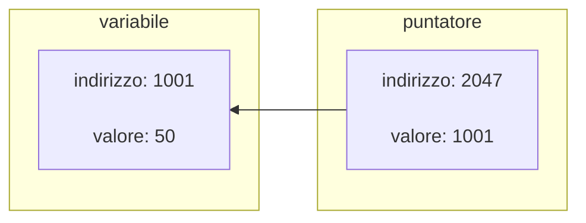

# Tipi di dato e la loro rappresentazione

## Il bit

L'alfabeto del calcolatore costituito da due simboli: `0` e `1`.

!!! def "BIT (binary digit)"

    È l'unità elementare di informazione. La cifra binaria può assumere solo due
    valori alternativi: `0` oppure `1`. Archiviato da un dispositivo digitale o
    un sistema fisico che esiste in uno di due possibili stati distinti.

| Presenza   | Assenza   |
|:-----------|:----------|
| Vero       | Falso     |
| `1`        | `0`       |
| \(+\)      | \(-\)     |
| Sì         | No        |
| Favorevole | Contrario |
| Yang       | Ying      |
| Lisa       | Bart      |

!!! example "Esempi"

    - i due stati stabili di un flip-flop;
    - due posizioni di un interruttore elettrico;
    - due distinte tensione o gli attuali livelli consentiti da un circuito;
    - due distinti livelli di intensità della luce;
    - due direzioni di magnetizzazione o di polarizzazione, ecc;

### Sequenze di bit

Per poter rappresentare un numero maggiore di informazione si usano sequenze di
bit. Il processo che fa corrispondere ad un dato reale una sequenze di bit prende
il nome di **codifica dell'informazione**.

!!! example "Esempi"

    === "Esiti di un esame"

        Ad esempio, un esame può avere quattro possibili esiti. Quanti bit sono
        necessari per codificare tale informazione?

        \[
            \begin{array}{ l|l }
                \text{Voto} & \text{Bit}    \\ \hline
                \text{Ottimo}        & 0  0 \\
                \text{Discreto}      & 0  1 \\
                \text{Sufficiente}   & 1  0 \\
                \text{Insufficiente} & 1  1 \\
            \end{array}
        \]

    === "Rappresentazione di otto colori"

        Ad esempio, per la rappresentazione di otto colori:

        \[
            \begin{array}{ l|l }
                \text{Colore} & \text{Bit} \\ \hline
                \text{Rosso}  & 000        \\
                \text{Blu}    & 001        \\
                \text{Verde}  & 010        \\
                \text{Giallo} & 011        \\
                \text{Viola}  & 100        \\
                \text{Bianco} & 101        \\
                \text{Nero}   & 110        \\
                \text{Grigio} & 111        \\
            \end{array}
        \]

### Bit, byte e word

Con \(n\) bit si possono rappresentare \(2^n\) stati o valori differenti. Per
rappresentare \(n\) stati o valori, bisogna usare almeno \(\lceil\log_2 n\rceil\).

I sistemi moderni memorizzano e manipolano miliardi di bit: vi è quindi la
necessità di avere dei multipli, infatti si ha \(8 \bbit = 1 \bbyte\).

Con la lettera "\(\bit\)" minuscola si indicano i bit, mentre con la lettera
"\(\byte\)" maiuscola si indicano i byte.

#### Multipli del byte

| Unità     | Simbolo   | Valore relativo | Valore pot. \(10\) |
| :-------- | :-------- | :-------------- | :----------------- |
| Byte      | \(\byte\) | \(8 \bit\)      | \(10^0 \byte\)     |
| KiloByte  | \(\KB\)   | \(1000 \byte\)  | \(10^3 \byte\)     |
| MegaByte  | \(\MB\)   | \(1000 \KB\)    | \(10^6 \byte\)     |
| GigaByte  | \(\GB\)   | \(1000 \MB\)    | \(10^9 \byte\)     |
| TeraByte  | \(\TB\)   | \(1000 \GB\)    | \(10^{12} \byte\)  |
| PetaByte  | \(\PB\)   | \(1000 \TB\)    | \(10^{15} \byte\)  |
| ExaByte   | \(\EB\)   | \(1000 \PB\)    | \(10^{18} \byte\)  |
| ZettaByte | \(\ZB\)   | \(1000 \EB\)    | \(10^{21} \byte\)  |
| YottaByte | \(\YB\)   | \(1000 \ZB\)    | \(10^{24} \byte\)  |

Esistono misure in potenza di due dove \(1 \KiB = 1024 \byte\) dove \(\KiB\) sta
per KibiByte. Gli altri multipli sono equivalente a quelli elencati sopra, eccetto
che sono in potenza di due e non di dieci.

Esistono analoghe misure per i multipli dei \(\bbit\) (\(\small{\rm Kb}\), ovvero
KiloBit, quindi \(1000\bbit\)), utilizzati generalmente come misura nelle quantità
di dati trasmessi.

Fino a qualche anno fa le misure \(\KiB,\, \GiB,\, \TiB,\,\dotsc\,\) non
esistevano e i nomi dei multipli in tabella erano corrispondenti agli altri,
ovvero \(1 \KB = 1024 \byte\).

## Tipi di dati non numerici

La rappresentazione dei numeri, così come tutte le altre rappresentazioni dei
dati, in informatica, a livello circuitale, avviene per tramite del
**codice binario**. Le unità in memoria sono valori binari (corrispondenti ai bit).

Vi sono molteplici tipi di dati non numerici.

### Booleani

I dati booleani sono contenuti all'interno di singoli bit che assumono valore
`0/1`-`F/V`. Comunemente si considera come falso il valore `0` e come vero
qualsiasi altro valore.

!!! example "Esempio"

    L'espressione `#!C if(a)` corrisponde a `#!C if(a != 0)`.

In questa situazione il valore viene memorizzato all'interno di uno (es. per il
`#!C char`) o più byte (es. per `#!C short`, `#!C int`, \(\dots\)).

L'unico caso in cui un booleano viene effettivamente memorizzato in un singolo
bit si ha quando si utilizzano le **mappe di bit**: viene considerato un byte
come se fosse un array di bit, ciascuno dei quali rappresenta un valore booleano.

### Caratteri

Mappati come interi equivalenti in ASCII/UNICODE. In particolare si ha che
l'UNICODE ha diversi "tipi", rappresentati in tabella.

| Sigla  | \# di bit (\(\bit\,\)) | Descrizione                        |
|:-------|:-----------------------|:-----------------------------------|
| UTF-8  | \(8\; (1 \byte)\)      | ASCII esteso                       |
| UTF-16 | \(16\; (2 \byte)\)     | Espansione a linguaggi occidentali |
| UTF-32 | \(32\; (4 \byte)\)     | Set più completo di caratteri      |

L'ASCII invece occupa \(7 \bit\).

### Puntatori

Rappresentano e memorizzano delle locazioni in memoria. Lo spazio occupato per
un puntatore dipende dalla dimensione dello spazio di indirizzamento.

<!-- markdownlint-disable MD046 -->

<!-- markdownlint-enable MD046 -->

Ovvero il puntatore, appunto, punta all'indirizzo della variabile con valore
\(50\).

## Basi numeriche

Il nostro sistema numerico è in base \(10\). Un numero \(n\) si denota come
scritto in una certa base numerica \(b\) mediante la seguente notazione:

\[ n_b \]

!!! example "Esempi"

    - \(15_{10}\) indica il numero \(15\) in base \(10\);
    - \(010001_{2}\) indica il numero \(010001\) in base \(2\);
    - \(23C_{16}\) indica il numero \(23C\) in base \(16\);

Un numero scritto in base \(b\) può essere composto unicamente dalle cifre
comprese tra \(0\) e \(b − 1\) incluse.

Per le basi superiori a \(10\) si usano le lettere dell'alfabeto per indicare le
cifre successive. Ad esempio, in base \(16\) si usano le seguenti cifre:

\[
    \begin{array}{ cccccccccccccccc }
        0 & 1 & 2 & 3 & 4 & 5 & 6 & 7 & 8 & 9 &  A &  B &  C &  D &  E &  F \\
        \hline
        0 & 1 & 2 & 3 & 4 & 5 & 6 & 7 & 8 & 9 & 10 & 11 & 12 & 13 & 14 & 15 \\
    \end{array}
\]

Le basi più utilizzate in informatica (oltre alla base \(10\)) sono:

- La base \(2\), detto sistema binario. Le stringhe binarie sono generalmente
  indicate con il prefisso \(\bin{}\) (es. \(\bin{01001010}\));
- La base \(8\), detto sistema ottale
- La base \(16\), detto sistema esadecimale (HEX). Le stringhe esadecimali sono
  generalmente indicate con il prefisso \(\hex{}\) (es. \(\hex{FF2C9A}\)).

### Conversione da base \(b\) in base \(10\)

Sia \(k_b = {(c_{n-1} \,\dots\, c_3\, c_2\, c_1\, c_0)}_b\) un numero di \(n\)
cifre in base \(b\), dove \(c_i\) rappresenta la cifra \(i\)-esima in base \(b\)
partendo da destra. Un numero si converte in base \(10\) mediante la seguente
formula:

\[
    k_{10} = \sum_{i=0}^{n-1} c_i b_i
           = (c_0 \cdot b^0) + (c_1 \cdot b^1) +\dots+ (c_n \cdot b^{n-1})
\]

!!! example "Esempi"

    === "Da esadecimale"

        Dato \(\hex{3FC2}\), si ha:

        \[
            \begin{align*}
                3 \cdot 16^3 + F \cdot 16^2 + C \cdot 16^1 + 2 \cdot 16^0
                    &= 3 \cdot 16^3 + 15 \cdot 16^2
                                    + 12 \cdot 16^1 + 2 \cdot 16^0      \\
                    &= 3 \cdot 4096 + 15 \cdot 256
                                    + 12 \cdot 16 + 2 \cdot 1           \\
                    &= {16322}_{10}
            \end{align*}
        \]


    === "Da binario"

         Dato \(\bin{10010101}\), si ha:

        \[
            \begin{array}{ cccccccc }
                2^7  & 2^6 & 2^5 & 2^4 & 2^3 & 2^2 & 2^1 & 2^0  \\ \hline
                1    &  0  &  0  &  1  &  0  &  1  &  0  & 1    \\ \hline
                128  &  -  &  -  & 16  &  -  &  4  &  -  & 1    \\
            \end{array}
        \]

        Infatti:

        \[ 128 + 16 + 4 + 1 = 149_{10} \]

### Conversione da base \(10\) a base \(b\)

Si prende il numero e lo si divide per la base \(b\) in forma di quoto e resto,
successivamente si divide il quoto come prima e si continua fin quando non si
ottiene il valore \(0\) come quoto.

Il numero in base \(b\) è rappresentato dai singoli resti, presi come cifre,
considerando l'ultimo resto come cifra più significativa e il primo resto come
cifra meno significativa.

**ALGORITMO**:

<!-- markdownlint-disable MD046 -->
```txt
i := 0
ESEGUI
    cᵢ := n % b   >> operazione modulo (resto della divisione)
    n = ⌊n/b⌋
    i := i + 1
FINCHÉ (n != 0)
```
<!-- markdownlint-enable MD046 -->

!!! example "Esempi"

    === "In esadecimale"

        Dato \(3425_{10}\), per convertirlo in base \(16\), si ha:

        \[
            \begin{array}{ ccc|c }
                \text{dividendo}
                    & \text{operazione}
                        & \text{quoto} & \text{resto} \\[.5em] \hline
                3425 & 3425/16 & 214 & 1 \\
                214  & 214/16  & 13  & 6 \\
                13   & 13/16   & 0   & D \\
            \end{array}
        \]

        Dunque il risultato è \(\hex{D61}\).

    === "In binario"

        Dato \(213_{10}\), per convertirlo in binario si ha:

        \[
            \begin{array}{ c|c }
                213 & 1 \\[-0.25em]
                106 & 0 \\[-0.25em]
                 53 & 1 \\[-0.25em]
                 26 & 0 \\[-0.25em]
                 13 & 1 \\[-0.25em]
                  6 & 0 \\[-0.25em]
                  3 & 1 \\[-0.25em]
                  1 & 1 \\[-0.25em]
                  0     \\
            \end{array}
        \]

        Dividendo per due è immediato ricavare che il resto è \(0\) se il numero
        è pari, mentre è \(1\) se dispari.

### Conversione rapida da base \(2^n\) a base \(2\) e viceversa

Piché le basi \(16 = 2^4\) è possibile dividere in blocchi da \(4\) cifre a
partire da destra e trasformare il blocco da una base all'altra.

\[
    \begin{array}{ ccc|cccc|cccc|cccc }
        0 & 0 & 1 & 1 & 0 & 1 & 1 & 0 & 1 & 1 & 0 & 1 & 1 & 1 & 1 \\ \hline
          & 1 &   &&&  B  &       &&&    6        &&&     F       \\
    \end{array}
\]

### Rappresentazione di un numero

Per rappresentare un numero \(n \in \N\) in base \(b\) sono necessarie
\(\ceil{\log_b n}\) cifre. Quindi, la stessa regola la si applica anche in binario.

### Somma e sottrazione

Nel sistema binario le operazioni di somma e sottrazione si effettuano nella
stessa maniera in cui le si effettuano in base \(10\), considerando però i
riporti alla base \(2\):

<!-- markdownlint-disable MD013 -->
\[
    \begin{array}{lr}
        \begin{array}{ r rrrrr|l }
            22_{10} & 1 & ^1 0 & ^1 1 & 1 & 0 & + \\
             7_{10} & 0 &    0 &    1 & 1 & 1 & = \\ \hline
            29_{10} & 1 &    1 &    1 & 0 & 1     \\
        \end{array} & \qquad
        \begin{array}{ r rrrrr|l }
            22_{10} & ^0 \cancel{1} & ^1 \cancel{0} & ^0 \cancel{1} & ^0 \cancel{1} & 0 & - \\
             7_{10} &    0 &    0 &    1 &    1 & 1 & = \\ \hline
            15_{10} &    1 &    1 &    1 &    0 & 1     \\
        \end{array}
    \end{array}
\]
<!-- markdownlint-enable MD013 -->

## Rappresentazione dei numeri relativi

### Modulo e segno

Viene destinato il bit più significativo al segno, rispettivamente \(0\) indica
segno positivo e \(1\) segno negativo, e i restanti bit al modulo del numero.

!!! example "Esempio"

    Dato il numero \(\bin{11010101}\), si ha:

    \[
        \begin{array}{ r|l }
            \text{segno} & \text{modulo} \\ \hline
            1            & 1010101       \\
        \end{array}
    \]

    Il che equivale al numero \(-85_{10}\)

Con la rappresentazione modulo e segno in \(n \bit\) si possono rappresentare
\(2n - 1\) numeri così divisi:

- \(2^{n-1}\) numeri positivi (incluso lo zero);
- \(2^{n-1}\) numeri negativi (incluso lo zero).

L'intervallo rappresentabile è \({[-2^{n-1} + 1,\; 2^{n-1}-1]}_{10}\).

Se si hanno a disposizione \(n\) bit è normalmente possibile rappresentare \(2^n\)
valori, ma con il modulo e segno se ne possono rappresentare \(2^n - 1\).
Ciò è dovuto alla doppia rappresentazione del valore zero:

\[
    \begin{array}{ r|l }
        \text{segno} & \text{modulo} \\ \hline
                   0 & 0000000       \\
                   1 & 0000000       \\
    \end{array}
\]

Che corrispondono rispettivamente a \(+0\) e \(−0\).

#### Operazioni di somma e sottrazione

Di seguito come vengono effettuate le operazioni di addizione e sottrazione nella
rappresentazione in modulo e segno.

Le operazioni di sottrazione possono essere sempre ottenute invertendo il sottraendo:

\[ A - B = A + (-B) \]

Vi saranno casi in cui le operazioni produrranno un overflow in termini di bit.
Laddove i segni siano concordi è necessario valutare se la somma dei moduli
(sia essa positiva o negativa) costituisca un valore rappresentabile con il
numero di bit scelti per la rappresentazione:

- Se il modulo è troppo grande per essere rappresentato si ha una situazione di
  *overflow* (se gli operandi sono positivi) o di *underflow* (se gli operandi
  sono negativi). Le operazioni produrranno dunque un risultato errato;
- Se invece il modulo può essere rappresentato, il bit in eccesso dovrà essere
  gestito correttamente per garantire la validità del risultato.

Il bit in eccesso si può presentare anche nei casi in cui i segni sono discordi,
in tal caso dovrà essere gestito correttamente per garantire la validità del
risultato.

Per effettuare le operazioni di somma e sottrazione tra numeri in modulo e segno
è necessario rimuovere il bit di segno e procedere come segue sulla base del segno.
Ipotizzando di voler effettuare la somma \(A + B\), si ha:

<!-- markdownlint-disable MD013 MD033-->
|           |                                                \(A > 0\)                                                |                                                \(A < 0\)                                                |
|:---------:|:-------------------------------------------------------------------------------------------------------:|:-------------------------------------------------------------------------------------------------------:|
| \(B > 0\) |                                          \(\abs{A} + \abs{B}\)                                          | \(\abs{B} < \abs{A} \implies -(\abs{A} - \abs{B})\)<br>\(\abs{B} > \abs{A} \implies \abs{B} - \abs{A}\) |
| \(B < 0\) | \(\abs{A} < \abs{B} \implies -(\abs{B} - \abs{A})\)<br>\(\abs{A} > \abs{B} \implies \abs{A} - \abs{B}\) |                                        \(-(\abs{A} + \abs{B})\)                                         |
<!-- markdownlint-enable MD013 MD033-->

Lo svantaggio è l'operazione risulta estremamente complicata.

### Complemento a uno

In questo caso i numeri negativi vengono rappresentati tramite il complemento
della loro rappresentazione positiva.

!!! example "Esempio"

    \[
        \begin{array}{ r|l }
            \text{decimale} & \text{binario} \\ \hline
                        +89 & 01011001       \\
                        -89 & 10100110
        \end{array}
    \]

Anche in questo caso è possibile rappresentare \(2^n - 1\) valori, in quanto vi
è la doppia rappresentazione dello zero: \(\bin{00000000}\) e \(\bin{11111111}\).
Di nuovo, l'intervallo rappresentabile è \({[-2^{n-1} + 1,\; 2^{n-1} - 1]}_{10}\).

Il primo bit non viene comunque utilizzato per rappresentare il modulo (se fosse
pari a \(1\) supererebbe il valore massimo rappresentabile), quindi può essere
utilizzato per identificare il segno.

#### Somma e sottrazione in complemento a uno

Si procede sommando normalmente i valori e laddove l'operazione produca un riporto
successivo al bit del segno, quest'ultimo viene aggiunto al risultato:

\[
    \begin{array}{ r|rrrrrr|l }
        +10 & ^1       & ^1 0 & 1 & ^1 0 & 1 & 0 & +   \\
         -4 &          &    1 & 1 &    0 & 1 & 1 & =   \\ \hline
            & \fbox{1} &    0 & 0 &    1 & 0 & 1 &     \\
            &          &      &   &      &   &   &     \\
            &          &    0 & 0 &    1 & 0 & 1 & +   \\
            &          &      &   &      &   & 1 & =   \\ \hline
         +6 &          &    0 & 0 &    1 & 1 & 0 &
    \end{array}
\]

Lo svantaggio è che il riporto in eccesso va sommato, quindi è possibile avere
una somma in più da effettuare. Il vantaggio è però che è evidentemente più
comodo del modulo e segno.

### Rappresentazione in complemento a due

Nel complemento a due i numeri negativi vengono rappresentati con il complemento
a uno incrementato di uno.

!!! example "Esempio"

    \[
        \begin{array}{ r|l }
            \text{decimale}     & \text{binario}    \\ \hline
                            +90 & 0\;1011010        \\
            (\complement_1) -90 & 1\;0100101        \\
            (\complement_2) -90 & 1\;0100110
        \end{array}
    \]

Il primo bit non viene comunque utilizzato per rappresentare il modulo (in quanto
se fosse \(1\) supererebbe il valore massimo rappresentabile), quindi può essere
utilizzato per identificare il segno.

#### Vantaggi del complemento a due

Innanzitutto vi è un'unica rappresentazione dello zero, infatti:

\[
    \begin{array}{ r|rl }
                        +0 &               & 0\; 0000000 \\ \hline
        (\complement_1) -0 &               & 1\; 1111111 \\
        (\complement_2) -0 & ^{\cancel{1}} & 0\; 0000000
    \end{array}
\]

Si può notare che la rappresentazione di \(+0\) e \(−0\) si equivalgono, in
quanto la somma finale genera un overflow che non viene considerato, poiché
sfora il numero di bit in considerazione.

Il secondo vantaggio consiste nell'utilizzare al massimo le rappresentazioni
possibili. Questo deriva dal fatto che, contestualmente al fatto che lo zero
viene rappresentato una sola volta, la rappresentazione "aggiuntiva" occupata
dallo zero nel \(\complement_1\) (complemento a uno) diventa la rappresentazione
di un altro valore.

In particolare:

- lo zero resta corrispondente solo alla notazione composta da tutti \(0\);
- la notazione composta da tutti \(1\) corrisponde invece al valore \(−1\);
- Viene rappresentato un valore negativo in più: \(−2^{n−1}\).

Nel complemento a due su \(n\) bit sono quindi rappresentati \(2^n\) valori e,
dunque, l'intervallo rappresentabile è \({[−2^{n−1},\; 2^{n−1} − 1]}_{10}\)

Il valore decimale di un numero negativo in complemento a due può essere
ricavato velocemente tramite il seguente trucco.

Basta considerare solo i valori \(1\), senza considerare il bit di segno. Il
valore della potenza di due corrispondete al bit più significativo (ovvero
\(-2^{n-1}\) nel \(\complement_2\) a \(n\) bit) va negato e a questo si sommano
i valori di potenza di due corrispondenti ai bit con valore \(1\):

\[
    \begin{array}{ r|ccccccc }
           2^7 &  2^6 &   2^5 & 2^4 &  2^3 &  2^2 &  2^1 &  2^0  \\ \hline
           1   &  0   &   1   & 0   &  1   &  1   &  0   &  1    \\ \hline
        -128   &      & +32   &     & +8   & +4   &      & +1    \\
    \end{array}
\]

Appunto:

\[ -128 + 32 + 8 + 4 + 1 = -83 \]

Il valore di un numero binario su \(n\) bit composto dai bit
\(c_{n-1}\, c_{n-2}\,\dots\, c_1\, c_0\) in \(\complement_2\) è equivalente
infatti a:

\[
    -2^{n-1} c_{n-1} + \sum_{i=0}^{n-2} c_i 2^i
\]

#### Somma e sottrazione in complemento a due

Si procede normalmente ignorando l'eventuale bit di overflow:

\[
    \begin{array}{ r|rrrrrr|l }
        +10 & \cancel{^1} & ^1 0 & 1 & ^1 0 & 1 & 0 & +   \\
         -6 &             &    1 & 1 &    0 & 1 & 0 & =   \\ \hline
         +4 &             &    0 & 0 &    1 & 0 & 0 &
    \end{array}
\]

Il terzo vantaggio è che, appunto, somme e sottrazioni possono essere ottenute
senza particolari problemi.

### Bug dell'anno 2038

Nel complemento a due, come notato precedentemente, sommando \(1\) al numero
più grande rappresentabile si ottiene il numero più piccolo rappresentabile.
Questo effetto indesiderato può procurare bug nei sistemi che gestiscono il
tempo come numero intero. Ad esempio, nei sistemi UNIX, il tempo è considerato
come il numero di secondi a partire dal capodanno del \(1970\) (rappresentazione
POSIX).

Poiché tale valore di tempo veniva memorizzato in variabili da \(32 \bit\),
giunti al massimo valore rappresentabile, il secondo immediatamente successivo
viene interpretato come il minimo valore rappresentabile su \(32 \bit\)^[†](https://it.wikipedia.org/wiki/Bug_dell%27anno_2038)^.

## Rappresentazione dei numeri razionali

Per rappresentare un numero razionale[^1] (al netto degli errori di approssimazione)
vi sono due strade principali:

1. **notazione in virgola fissa**: si dedica un numero di cifre alla parte intera
   e un numero di cifre alla parte decimale:

    \[ \pm iiii.ddd \]

2. **notazione in virgola mobile** (floating point – *IEEE 754*): la virgola
   scorre secondo le esigenze di rappresentazione. Così facendo, con lo stesso
   numero di bit della notazione in virgola fissa, è possibile rappresentare
   più valori.

[^1]:
    I numeri reali sono composti dai numeri razionali irrazionali. I numeri
    irrazionali non sono rappresentabili.

### Rappresentazione floating point

Qualsiasi numero può essere scritto nella seguente forma:

\[ \pm M \times b^{\pm e} \]

Dove \(M\) è la **mantissa**, \(b\) è la **base** e \(e\) è l'**esponente**.

Quanto tale sistema viene applicato alla base \(10\) prende il nome di *notazione
scientifica* (es. \(0.83234 \times 10^2\)).

Naturalmente, tale rappresentazione dovrà essere approssimata destinando un certo
numero di bit alla mantissa e un certo numero di bit all’esponente.
La precisione nel floating point è la seguente:

|                      | Precisione Singola | Precisione doppia   |
| :------------------- | :----------------- | :------------------ |
| Segno                | \(1 \bit\)         | \(1 \bit\)          |
| Esponente            | \(8 \bit\)         | \(11 \bit\)         |
| Mantissa             | \(23 \bit\)        | \(52 \bit\)         |
| Totale               | \(32 \bit\)        | \(64 \bit\)         |
| Intervallo esponente | \([-126,\; 127]\)  | \([-1022,\; 1023]\) |
| Bias esponente       | \(127\)            | \(1023\)            |

Non è necessario memorizzare la base in quanto è implicita \((2)\). Non tutte
le configurazioni di esponenti sono disponibili, alcune sono riservate.

Gli esponenti sono rappresentati in **forma polarizzata**, ovvero viene
memorizzato l'esponente (in binario) sommato ad una costante che viene detta
**bias**. Questo consente di effettuare più facilmente i controlli di maggioranza
o minoranza tra interi polarizzati (l'esponente più basso assume valore
\(\bin{00000000}\) e il più alto \(\bin{11111111}\)).

Vi sono diverse tipologie di numeri nel floating point:

\[
    \begin{array}{ c|c|c|l }
        \text{Segno} & \text{Esponente} & \text{Mantissa}
            & \text{Valore}                                     \\ \hline
        & \neq 0 \lor 111\dots111 & \text{qualsiasi}
            & \text{n. normalizzato}                            \\
        & 0 & \text{qualsiasi tranne } 0
            & \text{n. denormalizzato}                          \\
        \pm & 0 & \text{0}
            & \pm 0                                             \\
        & 111\dots111 & 0
            & \pm\infty                                         \\
        & 111\dots111 & \text{qualsiasi tranne } 0
            & \text{NaN (Not a Number)}
    \end{array}
\]

#### Numeri normalizzati

Un **numero normalizzato** espresso in floating point su un calcolatore è definito
come segue:

\[ \pm 1.xxxxxxx \times 2^{yyyy} \]

dove \(xxxxxxx\) sono i (sette) bit destinati alla mantissa e \(yyyy\) i (quattro)
bit destinati all'esponente. Il valore di un numero normalizzato è sempre compreso
tra \(1\) incluso e \(2\) escluso.

Si usano tutti i bit \(x\) per identificare la parte frazionaria (l'\(1\) intero
è implicito).

\[
    \begin{array}{ c|c|c }
        \text{segno} & \text{esponente } (8\bit) & \text{mantissa } (23\bit) \\ \hline
        0            & 01111100                  & 01000000000000000000000   \\
    \end{array}
\]

Il valore di un numero a \(32\bit\) in floating point è dato dalla seguente formula:

\[
    (-1)^{b_{31}} \times 2^{(b_{30},\, b_{29},\, \dots,\, b_{23}) - 127}
                  \times (1,\, b_{22}\, b_{21} \dots b_0)_2
\]

##### Conversione di un numero reale in binario

Per la parte intera si procede come già visto in precedenza. Per la parte
frazionaria si moltiplica il valore per due e si prende la cifra intera ricavata,
la si sottrae e si procede fin quando non si esaurisce la precisione (numero di
cifre binarie che è possibile memorizzare) o il risultato è \(1\).

!!!example "Esempio"

    Dtao il numero decimale \(19.3125\), si ha che la parte intera, ovvero
    \(19\) è pari a \(\bin{10011}\). Per la parte decimale:

    \[
        \begin{align}
            0.3125 \times 2 &= \underline{0}.625    \\
            0.625  \times 2 &= \underline{1}.250    \\
            0.250  \times 2 &= \underline{0}.500    \\
            0.500  \times 2 &= \underline{1}.0      \\
        \end{align}
    \]

    Dunque \({19.3125}_{10} = \bin{10011.\underline{0101}}\). A riprova di ciò:

    \[
        \begin{array}{ ccccc c cccc }
            2^4 & 2^3 & 2^2 & 2^1 & 2^0 &   & 2^{-1} & 2^{-2} & 2^{-3} & 2^{-4} \\
                \hline
            1   & 0   & 0   & 1   & 1   & . & 0      & 1      & 0      & 1      \\
                \hline
            16  &     &     & 2   & 1   &   &        & 0.25   &        & 0.0625
        \end{array}
    \]

    Infatti

    \[ 16 + 2 + 1 + 0.25 + 0.0625 = 19.3125 \]

    Dopo aver effettuato la conversione si imposta l'esponente in maniera tale da
    far scorrere la virgola del numero di posizioni necessarie per rappresentare
    il numero correttamente.

#### Numeri denormalizzati

Un **numero denormalizzato** espresso in floating point su un calcolatore è definito
come segue:

\[ \pm 0.xxxxxxx \times 2 ^{1-b} \]

dove \(b\) indica il *bias*. In questo caso la mantissa è sempre compresa tra \(0\)
e \(1\) e i bit dell'esponente sono impostati a \(0\). Servono a riempire l'intervallo
tra lo \(0\) e il più piccolo numero normalizzato rappresentabile.

#### Problematiche nel floating point

In generale l'aritmetica a virgola mobile è affetta da alcune problematiche:

1. Non sono valide in generale la proprietà associativa e la proprietà distributiva;
2. *Assorbimento*: numeri molto grandi "assorbono" numeri più piccoli, es.
   \(10^{15} + 1 = 10^{15}\);
3. *Cancellazione*: quando sottraendo due numeri molto vicini si ottiene \(0\);
4. Arrotondamento.

Gli errori di calcolo sono invece ottenuti da:

1. Le operazioni in overflow danno risultato \(\pm\infty\);
2. Situazioni di underflow, ovvero valori molto piccoli trasformati in \(0\);
3. Le operazioni impossibili (es. la radice quadrata di un numero negativo)
   restituisce NaN.

I problemi di arrotondamento sono dati da una duplice natura:

1. Operazioni aritmetiche, es \(\ifrac{2}{3} = 0.666667\);
2. Numeri non rappresentabili.

Ad esempio \(0.1\) non è un numero rappresentabile, infatti:

\[
    \begin{align}
        0.1 \times 2 &= \underline{0}.2 \\
        0.2 \times 2 &= \underline{0}.4 \\
        0.4 \times 2 &= \underline{0}.8 \\
        0.8 \times 2 &= \underline{1}.6 \\
        0.6 \times 2 &= \underline{1}.2 \\
        0.2 \times 2 &= \underline{0}.4 \\
        0.4 \times 2 &= \underline{0}.8 \\
    \end{align}
\]

Si ha un ciclo infinito sulla cifra finae \(2\)-\(4\)-\(8\)-\(6\)

### Operazioni in floating point

1. **Confronto di uguaglianza**: poiché i dati possono provenire da operazioni
    di natura diversa ha senso definire l’uguaglianza come segue:

    \[ A = B \iff \abs{A - B} < \varepsilon \]

    ovvero se i due numeri sono "sufficientemente" vicini tra loro;

2. **Confronto maggiore/minore**: non a caso vegono memorizzati nell'ordine segno,
    esponente e mantissa. Per confrontarli è sufficiente scorrere i bit dei due
    numeri fin quando non si trova un bit diverso:

    - Se si trova nel segno, è più grande il numero con il segno positivo (\(0\));
    - Se si trova nell’esponente o nella mantissa è più grande il numero con il
      bit a \(1\).

3. **Somma/sottrazione**:
    - si allineano i due numeri per raggiungere lo stesso esponente;
    - si sommano le mantisse;
    - si normalizza il risultato;
    - si controlla se è overflow o underflow;
    - si arrotonda il numero;
    - se non è normalizzato, lo si normalizza.

4. **Prodotto/divisione**:
    - si sommano gli esponenti – bias;
    - si moltiplicano le mantisse;
    - si normalizza il risultato;
    - si controlla se è overflow o underflow;
    - si arrotonda il numero;
    - se non è normalizzato, lo si normalizza.
