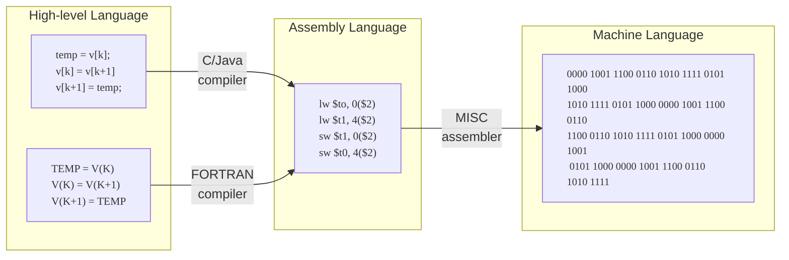

# Formati di istruzioni e indirizzamento

## Architettura CISC e RISC

L'architettura **CISC** (*Complex Instruction Set Computer*):

- Indica un'architettura per microprocessori formata da un set di istruzioni
  contenente, appunto, istruzioni in grado di eseguire operazioni complesse
  (es. lettura di un dato in memoria, modifica e salvataggio direttamente in
  memoria tramite una singola istruzione). Ne sono un esempio i processori
  dell'architettura x86 di Intel;
- Spesso traducono l'istruzione da CISC in un lotto di operazioni elaborate
  come RISC;
- Spesso sono microprogrammate: all'interno della CPU stessa è presente un
  programma che traduce le istruzioni in fase di decodifica;
- I vantaggi sono che avvicinano il linguaggio macchina ai linguaggi di alto
  livello

L'architettura **RISC** (*Reduced Instruction Set Computer*):

- Indica un'architettura per microprocessori che sceglie un set di istruzioni
  più semplice e lineare;
- I vantaggi sono che eseguono le operazioni in maniera più veloce rispetto alla
  CISC.

## Tipi di istruzioni

Ve ne sono molteplici.

### Istruzioni di trasferimento dati

Poter copiare dati da una locazione all'altra è fondamentale. Un esempio pratico
sono le istruzioni di assegnamento (es. `A = B` copia in `A` i bit contenuti
nella locazione di `B`).

I dati possono avere due sorgenti: la memoria o i registri, ergo ci sono quattro
tipi di trasferimento possibili. Alcune architetture usano un'unica istruzione
per tutte le tipologie, altre ad esempio utilizzano le seguenti istruzioni:

- `LOAD`: copia dalla memoria ai registri;
- `STORE`: copia dai registri alla memoria
- `MOVE`: copia dai registri ai registri;
- Generalmente non è prevista un'istruzione per copiare dalla memoria alla memoria.

### Operazioni binarie

Producono un risultato dalla combinazione di due operandi. Tutti gli ISA
(*Instruction Set Architecture*), ad esempio posseggono operazioni per somma e
sottrazione tra interi.

Tra le operazioni binarie vi sono anche le operazioni booleane. In genere sono
disponibili le operazioni AND, OR (e NOT, che è unario) e a volte si trovano
anche XOR, NOR e NAND. Queste ultime operazioni sono bitwise: effettuano il
calcolo bit a bit.

Per ottenere tutte le operazioni booleane è sufficiente avere a disposizione il
NOT e un'operazione tra AND e OR:

- Tramite i teoremi di De Morgan è possibile ricavare l'OR dall'AND e viceversa;
- Si utilizzano NOT, OR e AND per generare le altre funzioni booleane mediante
  le equivalenze logiche (ad esempio \(A \lxor B = A\bar{B} + \bar{A}B\))[^1];
- Si utilizzano le Mappe di Karnaugh o un sistema equivalente per esprimere la
  funzione booleana.

[^1]:
    Come è possibile confermare [qui](https://it.wikipedia.org/wiki/Simboli_logici)
    il simbolo \(\lxor\) rappresenta lo XOR logico. \(\)

Un uso importante dell'AND è l'estrazione della parola. Ciò avviene mediante
l'utilizzo di un AND tra il dato originale e una costante, detta **maschera**,
che identifica la parola da estrarre:

\[
    \begin{array}{ r|cccc }
        A                & 11011101 & 01101011 & 00101101 & 10111011 \\ \hline
        B\;(\text{mask}) & 00000000 & 11111111 & 00000000 & 00000000 \\ \hline
        A \land B        & 00000000 & 01101011 & 00000000 & 00000000 \\
    \end{array}
\]

La maschera si comporrà di \(1\) dove vi sono i bit da estrarre e di \(0\) negli
altri bit. Il risultato verrà infine fatto scorrere in modo da isolare a destra
il risultato (nell'esempio sopra: di \(16 \bbit\)).

L'uso dell'OR è quello di impacchettare bit in una parola, ovvero l'operazione
complementare all'estrazione:

\[
    \begin{array}{ r|cccc }
        A        & 11011101 & 01101011 & 00101101 & 00000000 \\ \hline
        B        & 00000000 & 00000000 & 00000000 & 11011010 \\ \hline
        A \lor B & 11011101 & 01101011 & 00101101 & 11011010 \\
    \end{array}
\]

Per sostituire una parola (o dei bit) si utilizzano in sequenza estrazione ed
impacchettamento:

\[
    \begin{array}{ r|cccc }
        A                 & 11011101 & 01101011 & 00101101 & 11011010 \\ \hline
        B\; (\text{mask}) & 11111111 & 11111111 & 11111111 & 00000000 \\ \hline
        A \land B         & 11011101 & 01101011 & 00101101 & 00000000 \\ \hline
        C                 & 00000000 & 00000000 & 00000000 & 01101011 \\ \hline
        A \land B \lor C  & 11011101 & 01101011 & 00101101 & 01101011
    \end{array}
\]

La sequenza \(B\) viene utilizzata come maschera per cancellare i bit da sostituire
(\(A \land B\) – estrazione dei bit da preservare), i nuovi bit vengono aggiunti
tramite \(C\) (impacchettamento mediante OR \(C\)).

### Operazioni unarie

Tra le operazioni unarie si trova il NOT che calcola il complemento binario (gli
\(0\) diventano \(1\) e viceversa) e il NEG che calcola l'inverso del valore
numerico (es \(5\) diventa \(–5\)). Le due operazioni, nel caso in cui i numeri
siano rappresentati in complemento a uno, coincidono. In tutti gli altri casi il
NEG dipende ovviamente dall'implementazione dei numeri.

Tra le operazioni unarie si trovano anche lo scorrimento (*shift*) e la rotazione:

\[
    \begin{array}{ r|c }
        A                      & 0100\; 0000\; 0101\; 01{\color{teal}10} \\ \hline
        \to 2\bit              & {\color{red}00}01\;  0000\; 0001\; 0101 \\ \hline
        \curvearrowright 2\bit & {\color{teal}10}01\; 0000\; 0001\; 0101 \\
    \end{array}
\]

Nello shifting, i bit che fuoriescono dalla parola si perdono e gli spazi vuoti
che si generano nella direzione opposta allo shifting vengono riempiti con zeri.

Sono possibili anche shift e rotazioni (verso destra) con l'estensione del segno:
in tal caso le posizioni vuote che si generano sulla sinistra vengono riempite
con il bit del segno originale.
Le moltiplicazioni e le divisioni per \(2^k\) sono un'applicazione importante
dello shifting (nei numeri positivi).
Le operazioni di rotazione sono generalmente utilizzate insieme alle già citate
operazioni di estrazione e impacchettamento per lo spostamento dei bit. Le operazioni
di rotazione non comportano perdita di informazione a differenza delle operazioni
di shifting.
Tipi di istruzioni

### Istruzioni di confronto

Tra queste:

- Uguaglianza tra parole;
- Verificare se una certa parola è zero (molto usata);
- Confronto di maggioranza o minoranza tra numeri (dipende dall'implementazione
  del numero).

### Istruzioni di input/output

Interagiscono con i dispositivi di I/O e sono di tre tipologie:

- I/O programmato con attesa attiva;
- I/O interrupt driven, che viene innescato dagli interrupt;
- I/O con DMA, ovvero l'I/O programmato ma viene aggiunto il componente chip
  Direct Memory Access che ha accesso diretto al bus.

### Istruzioni di salto (JUMP)

Il codice è scritto mediante l'ausilio di etichette, che definiscono "sezioni"
del programma. Le istruzioni di salto consentono al programma di passare da una
sezione all'altra. Si dividono in:

- **Salti incondizionati**: (`GOTO`) si passa direttamente ad un'altra sezione
  del programma;
- **Salti condizionati**: si verifica una condizione e si passa ad un'altra
  sezione del programma a seconda del risultato della verifica (es. pratico è
  l'`if`). Viene generalmente implementato mediante il calcolo della condizione
  e la memorizzazione del risultato in un registro, successivamente viene effettuato
  il salto condizionato se il valore del registro è \(0\) o \(1\).

Le istruzioni di ciclo vengono convertite in salti condizionati.

#### Spaghetti code

Spaghetti code è un termine dispregiativo per il codice sorgente di quei
programmi per computer che hanno una struttura di controllo del flusso complessa
e/o incomprensibile, con uso esagerato ed errato di `GOTO`, eccezioni, thread e
altri costrutti di branching (diramazione del controllo) non strutturati.

Il suo nome deriva dal fatto che questi tipi di codice tendono a assomigliare a
un piatto di spaghetti, ovvero un mucchio di fili intrecciati ed
annodati.^[\(\dagger\)](https://it.wikipedia.org/wiki/Spaghetti_code)^

### Chiamata a funzione

Quando una funzione termina la propria esecuzione, il programma deve riprendere
dall'istruzione successiva alla chiamata a funzione. Dunque l'indirizzo di
ritorno deve essere memorizzato oppure passato alla funzione chiamata.

Il meccanismo così espresso può essere fallace nei casi di funzione che chiama
funzione oppure di ricorsione (ovvero una funzione che invoca sé stessa), in
quanto potrebbe essere sovrascritto l'indirizzo di ritorno. È pertanto necessario
che l'indirizzo di ritorno venga memorizzato ogni volta in una locazione differente.
Si utilizza infatti lo **stack dei record di attivazione** (detto anche *stack di
attivazione* oppure, *record di attivazione*).

#### Stack di attivazione: fattoriale ricorsivo

<!-- TODO: aggiungere immagine dello stack o trovare rappresentazione valida -->

main
main
fatt(2)
main
fatt(2)
fatt(1)
main
fatt(2)
main

1. Il main invoca la funzione ricorsiva fattoriale (fatt) con argomento n=2;
2. La funzione fatt invoca sé stessa con n=1 e viene generato un nuovo record;
3. fatt(1) restituisce il valore 1 e il Program Counter si sposta all'indirizzo
   di ritorno – viene rimosso il record di fatt(1);
4. fatt(2) riceve il valore di output di fatt(1) e produce il proprio output –
   si torna al main tramite il suo indirizzo di ritorno e viene rimosso il record
   di fatt(2);
5. Il main riceve il valore di output di fatt(2) e riprende la sua normale
   esecuzione;

## Formati di istruzione e indirizzamento

<!-- markdownlint-disable MD013 -->

<!-- markdownlint-enable MD013 -->

Un'istruzione si compone di:

- Un OPCODE, che identifica l'istruzione da eseguire;
- Altre informazioni quali la provenienza degli operandi e la destinazione dei
  risultati.

L'argomento che tratta la provenienza degli operandi, ovvero la loro residenza
in memoria, prende il nome di **indirizzamento**.

Un esempio in MIPS assembler è il seguente:

<!-- markdownlint-disable MD013 -->
| Label  | OPCODE           | Destinazione  | \(\rm OP_1\)   | \(\rm OP_1\) | Commento                                     |
| ------ | ---------------- | ------------- | -------------- | ------------ | -------------------------------------------- |
|        | `#!nasm move`    | `#!nasm $a0,` | `#!nasm $0`    |              | `#!nasm # $a0 = 0`                           |
|        | `#!nasm li`      | `#!nasm $t0,` | `#!nasm 99`    |              | `#!nasm # $t0 = 99`                          |
| ciclo: |                  |               |                |              | `#!nasm # definisce un punto chiamato ciclo` |
|        | `#!nasm add`     | `#!nasm $a0,` | `#!nasm $a0,`  | `#!nasm $t0` | `#!nasm # $a0 = $a0 + $t0`                   |
|        | `#!nasm addi`    | `#!nasm $t0,` | `#!nasm $t0,`  | `#!nasm -1`  | `#!nasm # $t0 = $t0 – 1`                     |
|        | `#!nasm bnez`    | `#!nasm $t0,` | `#!nasm ciclo` |              | `#!nasm # if ($t0 != zero) vai a ciclo`      |
|        | `#!nasm li`      | `#!nasm $v0,` | `#!nasm 1`     |              | `#!nasm # stampa il valore in $a0`           |
|        | `#!nasm syscall` |               |                |              |                                              |
|        | `#!nasm li`      | `#!nasm $v0,` | `#!nasm 10`    |              | `#!nasm # termina il programma`              |
|        | `#!nasm syscall` |               |                |              |                                              |

<!-- markdownlint-enable MD013 -->

## Formati di istruzione

Un esempio di quattro diversi formati di istruzioni (si consideri a parità di
dimensione):

\[
    \begin{array}{ r l }
        A &
            \begin{array}{ |c| } \hline
                \hspace{2.5cm}\text{OPCODE}\hspace{2.3cm}                    \\ \hline
            \end{array} \\
        B &
            \begin{array}{ |c|c| } \hline
                \text{OPCODE} & \hspace{1.6cm} \text{IND}_1 \hspace{1.6cm}   \\ \hline
            \end{array} \\
        C &
            \begin{array}{ |c|c|c| } \hline
                \text{OPCODE} & ~~~ \text{IND}_1 ~~~~ & ~~~ \text{IND}_2 ~~~ \\ \hline
            \end{array} \\
        D &
            \begin{array}{ |c|c|c|c| } \hline
                \text{OPCODE} & \text{IND}_1 & \text{IND}_2 & \text{IND}_3   \\ \hline
            \end{array}
    \end{array}
\]

Rispettivamente:

- A. Istruzione senza indirizzi
- B. Istruzione con un solo operando
- C. Istruzione con due operandi
- D. Istruzione con tre operandi

## Alcuni criteri progettuali

A parità di progetto, istruzioni più corte sono preferibili:

- Un programma con istruzioni a \(32 \bit\) occupa il doppio dello spazio in
  memoria dello stesso programma con istruzioni a \(16 \bit\);
- Tuttavia tale fattore potrebbe risultare sempre meno preminente in futuro, in
  quanto il costo della memoria va sempre più diminuendosi. Dall'altro lato, le
  dimensioni dei software aumentano. Altro fattore da tenere in considerazione,
  però, è l'ampiezza delle bande di memoria che trasferiscono i dati.
- Le istruzioni più corte sono elaborate più velocemente.

È necessario prevedere spazio sufficiente per rappresentare tutte le istruzioni
desiderate:

- Se si richiedono \(2^n\) possibili operazioni differenti, vanno rappresentate
  con almeno \(n\) bit destinati all'OPCODE;
- È necessario considerare degli OPCODE in eccedenza per eventuali evoluzioni
  del progetto.

Dimensione degli indirizzi:

- La dimensione degli indirizzi dipende dalla dimensione delle parole in memoria.
  Siano \(\xi\) un indirizzo, \(m\) la memoria e \(w\) una parola, si ha:

    \[
        n_\xi = \frac{\dim m}{\dim w}
        \qquad
        \dim \xi = \ceil{\log_2 n_\xi}
    \]

- Scegliere la dimensione delle parole tra più o meno bit comporta vantaggi e
  svantaggi in entrambe le scelte, nei quali però questo corso non entra nel
  dettaglio.

Si consideri un'istruzione lunga \(n + k \bbit\), dove \(n\) è il numero di bit
destinati all'OPCODE e \(k\) il numero di bit destinati a un operando:

- Si hanno a disposizione \(2^n\) istruzioni;
- Si hanno a disposizione \(2^k\) parole in memoria da indirizzare.

Lo stesso spazio potrebbe essere diviso in \((n − 1) \bbit\) dedicati all'OPCODE
e \((k + 1) \bbit\) dedicati all'operando, dimezzando il set di istruzioni ma
raddoppiando la memoria raggiungibile.

Allo stesso modo, si potrebbe dividere in \((n + 1) \bbit\) dedicati all'OPCODE e
\((k - 1) \bbit\) dedicati all'operando, raddoppiando il set di istruzioni ma
dimezzando la memoria raggiungibile.

## Codice operativo espandibile

Con questo schema è possibile rappresentare \(24\) istruzioni che operano con
fino a tre operandi in memoria.

\[
    \begin{array}{ |c|c|c|c| } \hline
        \begin{array}{ c|c|c|c }   15 &  14  &  13  & 12  \end{array}
        & \begin{array}{ c|c|c|c } 11 &  10  &   9~ &  8~ \end{array}
        & \begin{array}{ c|c|c|c }  7 & ~ 6~ & ~ 5~ &  4  \end{array}
        & \begin{array}{ c|c|c|c }  3 & ~ 2~ & ~ 1~ &  0  \end{array}       \\ \hline
%
        \begin{array}{ c|c|c|c }     ~~ & ~~~~ & ~~~~ & ~~   \end{array}
        & \begin{array}{ c|c|c|c } ~~~~ & ~~~~ &  ~~~ & ~~~  \end{array}
        & \begin{array}{ c|c|c|c } ~~~~ & ~~~~ & ~~~~ & ~~~~ \end{array}
        & \begin{array}{ c|c|c|c } ~~~~ & ~~~~ & ~~~~ & ~~~~ \end{array}    \\ \hline
%
        \text{OPCODE} & \text{IND}_1 & \text{IND}_2 & \text{IND}_3          \\ \hline
    \end{array}
\]

Per aumentare il lotto di istruzioni è necessario aumentare i bit destinati all'OPCODE,
ma le operazioni che necessitano di meno operandi comportano uno spreco dello
spazio destinato agli altri operandi.
La soluzione sta nell'utilizzare il **codice operativo espandibile**, ovvero il
codice operativo si espande utilizzando i bit degli operandi.

\[
    \begin{array}{ |c|c|c|c| } \hline
        \begin{array}{ c|c|c|c }   15 &  14  &  13  & 12  \end{array}
        & \begin{array}{ c|c|c|c } 11 &  10  &   9~ &  8~ \end{array}
        & \begin{array}{ c|c|c|c }  7 & ~ 6~ & ~ 5~ &  4  \end{array}
        & \begin{array}{ c|c|c|c }  3 & ~ 2~ & ~ 1~ &  0  \end{array}        \\ \hline
%
        \begin{array}{ c|c|c|c }     ~~ & ~~~~ & ~~~~ & ~~   \end{array}
        & \begin{array}{ c|c|c|c } ~~~~ & ~~~~ &  ~~~ & ~~~  \end{array}
        & \begin{array}{ c|c|c|c } ~~~~ & ~~~~ & ~~~~ & ~~~~ \end{array}
        & \begin{array}{ c|c|c|c } ~~~~ & ~~~~ & ~~~~ & ~~~~ \end{array}     \\ \hline
%
        \text{OPCODE (lotto 1)} & \text{IND}_1 & \text{IND}_2 & \text{IND}_3 \\ \hline
    \end{array}
\]

La configurazione \(1111\) nei bit destinati all'OPCODE indica che l'istruzione
è nel formato OPCODE + due operandi:

\[
    \begin{array}{ |c|c|c|c| } \hline
        \begin{array}{ c|c|c|c }   15 &  14  &  13  & 12  \end{array}
        & \begin{array}{ c|c|c|c } 11 &  10  &   9~ &  8~ \end{array}
        & \begin{array}{ c|c|c|c }  7 & ~ 6~ & ~ 5~ &  4  \end{array}
        & \begin{array}{ c|c|c|c }  3 & ~ 2~ & ~ 1~ &  0  \end{array}       \\ \hline
%
        \begin{array}{ c|c|c|c }      1 & ~ 1~ & ~ 1~ &  1   \end{array}
        & \begin{array}{ c|c|c|c } ~~~~ & ~~~~ &  ~~~ & ~~~  \end{array}
        & \begin{array}{ c|c|c|c } ~~~~ & ~~~~ & ~~~~ & ~~~~ \end{array}
        & \begin{array}{ c|c|c|c } ~~~~ & ~~~~ & ~~~~ & ~~~~ \end{array}    \\ \hline
%
        \text{conf. riservata}
            & \text{OPCODE (lotto 2)} & \text{IND}_1 & \text{IND}_2         \\ \hline
    \end{array}
\]

Di fatto l'OPCODE passa a \(8 \bbit\) \((\bin{1111\text{xxxx}})\) nel secondo
lotto di istruzioni. Utilizzando questo meccanismo il set delle istruzioni a viene
espanso a:

- \(2^4 − 1\) istruzioni con tre operandi e
- \(2^4\) istruzioni con due operandi;

Il meccanismo può essere ovviamente reiterato, ottenendo, ad esempio, con \(16 \bbit\)
di istruzione e indirizzi a \(4 \bbit\).

Si ottengono \(2^4 - 1\) istruzioni a tre operandi:

\[
    \begin{array}{ |c|c|c|c| } \hline
        \begin{array}{ c|c|c|c }   15 &  14  &  13  & 12  \end{array}
        & \begin{array}{ c|c|c|c } 11 &  10  &   9~ &  8~ \end{array}
        & \begin{array}{ c|c|c|c }  7 & ~ 6~ & ~ 5~ &  4  \end{array}
        & \begin{array}{ c|c|c|c }  3 & ~ 2~ & ~ 1~ &  0  \end{array}       \\ \hline
%
        \begin{array}{ c|c|c|c }     ~~ & ~~~~ & ~~~~ & ~~   \end{array}
        & \begin{array}{ c|c|c|c } ~~~~ & ~~~~ &  ~~~ & ~~~  \end{array}
        & \begin{array}{ c|c|c|c } ~~~~ & ~~~~ & ~~~~ & ~~~~ \end{array}
        & \begin{array}{ c|c|c|c } ~~~~ & ~~~~ & ~~~~ & ~~~~ \end{array}    \\ \hline
%
        \text{OPCODE} & \text{IND}_1 & \text{IND}_2 & \text{IND}_3          \\ \hline
    \end{array}
\]

\(2^4 - 1\) istruzioni a due operandi:

\[
    \begin{array}{ |c|c|c|c| } \hline
        \begin{array}{ c|c|c|c }   15 &  14  &  13  & 12  \end{array}
        & \begin{array}{ c|c|c|c } 11 &  10  &   9~ &  8~ \end{array}
        & \begin{array}{ c|c|c|c }  7 & ~ 6~ & ~ 5~ &  4  \end{array}
        & \begin{array}{ c|c|c|c }  3 & ~ 2~ & ~ 1~ &  0  \end{array}       \\ \hline
%
        \begin{array}{ c|c|c|c }      1 & ~ 1~ & ~ 1~ &    1 \end{array}
        & \begin{array}{ c|c|c|c } ~~~~ & ~~~~ &  ~~~ & ~~~  \end{array}
        & \begin{array}{ c|c|c|c } ~~~~ & ~~~~ & ~~~~ & ~~~~ \end{array}
        & \begin{array}{ c|c|c|c } ~~~~ & ~~~~ & ~~~~ & ~~~~ \end{array}    \\ \hline
%
        \text{riservato} & \text{OPCODE} & \text{IND}_1 & \text{IND}_2      \\ \hline
    \end{array}
\]

\(2^4 - 1\) istruzioni a un operando:

\[
    \begin{array}{ |c|c|c|c| } \hline
        \begin{array}{ c|c|c|c }   15 &  14  &  13  & 12  \end{array}
        & \begin{array}{ c|c|c|c } 11 &  10  &   9~ &  8~ \end{array}
        & \begin{array}{ c|c|c|c }  7 & ~ 6~ & ~ 5~ &  4  \end{array}
        & \begin{array}{ c|c|c|c }  3 & ~ 2~ & ~ 1~ &  0  \end{array}       \\ \hline
%
        \begin{array}{ c|c|c|c }      1 & ~ 1~ & ~ 1~ &   1  \end{array}
        & \begin{array}{ c|c|c|c } ~~ 1 & ~ 1~ & ~ 1  &   1~  \end{array}
        & \begin{array}{ c|c|c|c } ~~~~ & ~~~~ & ~~~~ & ~~~~ \end{array}
        & \begin{array}{ c|c|c|c } ~~~~ & ~~~~ & ~~~~ & ~~~~ \end{array}    \\ \hline
%
        \text{riservato} & \text{riservato} & \text{OPCODE} & \text{IND}_1  \\ \hline
    \end{array}
\]

\(2^4\) istruzioni senza operandi:

\[
    \begin{array}{ |c|c|c|c| } \hline
        \begin{array}{ c|c|c|c }   15 &  14  &  13  & 12  \end{array}
        & \begin{array}{ c|c|c|c } 11 &  10  &   9~ &  8~ \end{array}
        & \begin{array}{ c|c|c|c }  7 & ~ 6~ & ~ 5~ &  4  \end{array}
        & \begin{array}{ c|c|c|c }  3 & ~ 2~ & ~ 1~ &  0  \end{array}       \\ \hline
%
        \begin{array}{ c|c|c|c }      1 & ~ 1~ & ~ 1~ &  1   \end{array}
        & \begin{array}{ c|c|c|c } ~~ 1 & ~ 1~ & ~ 1  &  1~  \end{array}
        & \begin{array}{ c|c|c|c }    1 & ~ 1~ & ~ 1~ &  1   \end{array}
        & \begin{array}{ c|c|c|c } ~~~~ & ~~~~ & ~~~~ & ~~~~ \end{array}    \\ \hline
%
        \text{riservato}
            & \text{riservato} & \text{riservato} & \text{OPCODE}           \\ \hline
    \end{array}
\]

La situazione precedentemente descritta è solo un esempio, in quanto si potrebbe
scegliere di gestire in maniera differente (in termini numerici) il meccanismo
di codice operativo espandibile.

Ad esempio, se si desiderano più istruzioni a due operandi e meno a tre operandi,
è possibile modificare così:

\[
    \begin{array}{ |c|c|c|c| } \hline
        \begin{array}{ c|c|c|c }   15 &  14  &  13  & 12  \end{array}
        & \begin{array}{ c|c|c|c } 11 &  10  &   9~ &  8~ \end{array}
        & \begin{array}{ c|c|c|c }  7 & ~ 6~ & ~ 5~ &  4  \end{array}
        & \begin{array}{ c|c|c|c }  3 & ~ 2~ & ~ 1~ &  0  \end{array}       \\ \hline
%
        \begin{array}{ c|c|c|c }     ~~ & ~~~~ & ~~~~ & ~~   \end{array}
        & \begin{array}{ c|c|c|c } ~~~~ & ~~~~ &  ~~~ & ~~~  \end{array}
        & \begin{array}{ c|c|c|c } ~~~~ & ~~~~ & ~~~~ & ~~~~ \end{array}
        & \begin{array}{ c|c|c|c } ~~~~ & ~~~~ & ~~~~ & ~~~~ \end{array}    \\ \hline
%
        \text{OPCODE} & \text{IND}_1 & \text{IND}_2 & \text{IND}_3          \\ \hline
    \end{array}
\]

\[
    \begin{array}{ |c|c|c|c| } \hline
        \begin{array}{ c|c|c }       15 &  14  &  13              \end{array}
        & \begin{array}{ c|c|c|c|c } 12 &  11  &  10  &  9~ &  8~ \end{array}
        & \begin{array}{ c|c|c|c }    7 & ~ 6~ & ~ 5~ &  4        \end{array}
        & \begin{array}{ c|c|c|c }    3 & ~ 2~ & ~ 1~ &  0        \end{array}
            \\ \hline
%
        \begin{array}{ c|c|c }      ~~ 1~ & ~ 1~ & ~~ 1~             \end{array}
        & \begin{array}{ c|c|c|c|c } ~~~~ & ~~~~ & ~~~~ &  ~~~ & ~~~ \end{array}
        & \begin{array}{ c|c|c|c }   ~~~~ & ~~~~ & ~~~~ & ~~~~       \end{array}
        & \begin{array}{ c|c|c|c }   ~~~~ & ~~~~ & ~~~~ & ~~~~       \end{array}
            \\ \hline
%
        \text{riservato} & \text{OPCODE} & \text{IND}_1 & \text{IND}_2    \\ \hline
    \end{array}
\]

Il set diventa composto da:

- \(2^4 − 2\) istruzioni a tre operandi (\(−2\) sono le configurazioni
  \(\bin{\underline{111}0}\) e \(\bin{\underline{111}1}\));
- \(2^5\) istruzioni con due operandi.

Questo a meno di ulteriori espansioni.

## Indirizzamento

Molte istruzioni contengono operandi, si pone quindi il problema di come
specificarne la posizione. Si parla dunque di indirizzamento, che può essere
delle seguenti tipologie:

- Immediato;
- Diretto;
- A registro;
- A registro indiretto;
- Indicizzato;
- Indicizzato esteso;
- A stack.

### Immediato

L'**indirizzamento immediato** prevede che sia specificato nel campo riservato
all'indirizzo, l'operando stesso. Ad esempio:

\[
    \begin{array}{ |c|c|c| } \hline
        \text{MOV} & \text{R}1 & 4 \\ \hline
    \end{array}
\]

ovvero, carica la costante \(4\) nel registo R1.

Ha il vantaggio di non richiedere un riferimento supplementare in memoria per
effettuare il fetch dell'operando. Naturalmente l'entità del valore è limitata
alla dimensione del campo dell'indirizzo, infatti viene utilizzato per piccole
costanti.

### Diretto

L'**indirizzamento diretto** utilizza come operando direttamente ciò che è
indicato nello spazio riservato all'indirizzo. Ha lo svantaggio di accedere sempre
alla medesima locazione, quindi il valore contenuto nella cella di memoria può
variare, ma non può cambiare la locazione referenziata.

È quindi necessario conoscere in ^^fase di compilazione^^ l'indirizzo che si dovrà
referenziare (e non può essere un indirizzo contenuto all'interno di una
procedura/funzione, in quanto l'allocazione avverrebbe durante l'invocazione della
funzione stessa) Viene dunque utilizzato unicamente in riferimento a variabili
globali.

### A registro

L'**indirizzamento a registro** funziona in maniera analoga all'indirizzamento
diretto, ma referenzia un registro anziché una locazione nello spazio di indirizzamento.
È nota anche semplicemente come **modalità a registro**.

Nelle architetture load/store (ovvero le architetture dove si può operare solo
tramite operandi su registri) tutte le istruzioni utilizzano questa modalità, a
meno delle istruzioni `LOAD` e `STORE` che caricano/scaricano dati in memoria
da/verso un registro.

### A registro indiretto

Nell'**indirizzamento a registro indiretto** l'operando proviene o è destinato
alla memoria, ma l'indirizzo non è contenuto all'interno dell'istruzione. Il campo
destinato all'operando contiene un registro che indica la locazione in memoria
dell'operando. Quando un indirizzo è utilizzato in questo modo, prende il nome
di puntatore.

Ha il grande vantaggio di non dover indicare in fase di compilazione la locazione
della parola in memoria (in quanto potrà essere caricato nel registro a runtime),
inoltre la stessa istruzione può essere utilizzata su diverse parole in memoria,
semplicemente variando il valore contenuto nel registro.

### Indicizzato

L'**indirizzamento indicizzato** consente di referenziare una parola in memoria che
si trova a un certo spiazzamento rispetto a un registro. L'indirizzamento si
ottiene dunque mediante:

- La specifica di un registro (in via esplicita o implicita);
- La specifica di uno spiazzamento ^^costante^^.

Tale meccanismo viene utilizzato in alcune occasioni nelle quali è nota a priori
la distanza tra una variabile e l'altra. Può essere utilizzato nel caso opposto:
mantenere un puntatore in memoria nell'istruzione e il piccolo offset in un registro.

### Indicizzato esteso

Contenuto in alcune macchine, l'**indirizzamento indicizzato esteso** consente
di referenziare un indirizzo in memoria ottenuto sommando tra loro il contenuto
di due registri, più un eventuale offset aggiuntivo.

Disporre di tale possibilità costituisce un grande vantaggio (si immaigni di
scrivere in linguaggio macchina un ciclo che opera su un vettore). Generalmente
le macchine che offrono tale possibilità forniscono anche un offset da \(8 \bbit\)
o \(16 \bbit\).

### A stack

Alcune istruzioni possono essere utilizzate in combinazione a una struttura stack.
Tale forma di indirizzamento prende il nome di **indirizzamento a stack**.

Uno degli esempi pratici di utilizzo è quello legato alla **notazione polacca
inversa**.

## Notazione polacca inversa

Nel mondo reale le operazioni algebriche vengono scritte mediante la notazione
infissa. Si parla di notazione infissa in quanto l'operatore è posto tra gli
operandi:

\[ A + B \]

Esistono, equivalentemente, la notazione prefissa e la notazione postfissa

- Notazione prefissa: \({+}\,AB\);
- Notazione postfissa: \(AB\,{+}\).

In tali casi l'operatore è posto prima/dopo gli operandi

La notazione postfissa prende anche il nome di **notazione polacca inversa**,
dal logico polacco J. Lukasiewicz (1958) che ne ha studiato le proprietà.

Presenta alcuni vantaggi rispetto alla notazione infissa:

- Ogni operazione può essere scritta correttamente senza parentesi;
- La valutazione delle formule in tale notazione si addice particolarmente ai
  compilatori con stack
- Gli operatori infissi possiedono un ordine di precedenza, che è arbitrario:
  ad esempio \(a + b \times c\) corrisponde a \(a + (b \times c)\) e non a
  \((a + b) \times c\) perché alla moltiplicazione è assegnato un ordine di
  priorità più alto.

Alcuni esempi di notazione polacca inversa:

<!-- markdownlint-disable MD013 -->
| Infissa                                | Polacca inversa                                             |
| -------------------------------------- | ----------------------------------------------------------- |
| \(A \times B + C\)                     | \(AB\,{\times}\; C\,{+}\)                                   |
| \(A + B \times C\)                     | \(A\; BC\,{\times}\; {+}\)                                  |
| \(A \times B + C \times D\)            | \(AB\,{\times}\; CD\,{\times}\; {+}\)                       |
| \((A + B)/(C + D)\)                    | \(AB\,{+}\; CD\,{-}\; {/}\)                                 |
| \(((A + B) \times C + D)/(E + F + G)\) | \(AB\,{+}\; C\,{\times}\; D\,{+}\; EF\,{+}\; G\,{+}\; {/}\) |
<!-- markdownlint-enable MD013 -->

(nella parte relativa alla notazione infissa si considera, ovviamente, la
moltiplicazione prioritaria rispetto ad addizione e sottrazione).

Come si valuta una formula in notazione polacca inversa?

- Quando trovo un valore, lo aggiungo in cima allo stack
- Quando trovo un operando, prendo i due valori in cima allo stack, effettuo
  l'operazione tra questi due ed inserisco il risultato in cima allo stack.

\[
    \begin{align}
        \underbrace{5\,6\,{\times}}_{30}\; 3\,6\,{\times}\; -
            &\implies 30\; \underbrace{3\,6\,{\times}}_{18}\; - \\
            &\implies 30\,18\,{-}                               \\
            &\implies 12
    \end{align}
\]

Un esempio più complesso che mostra i vantaggi per l'elaboratore:

\[ (8 + 2 \times 5)/(1 + 3 \times 2 − 4) \]

<!-- markdownlint-disable MD013 -->
| Stringa rimanente                                                    | Istruzione   | Stack           |
| --                                                                   | --           | --              |
| \(8\; 2\,5\,{\times}\,{+}\; 1\; 3\,2\,{\times}\,{+}\; 4\,{−}\; {/}\) | BIPUSH \(8\) | \(8\)           |
| \(2\,5\,{\times}\,{+}\; 1\; 3\,2\,{\times}\, {+}\; 4\,{−}\; {/}\)    | BIPUSH \(2\) | \(8, 2\)        |
| \(5\,{\times}\,{+}\; 1\; 3\,2\,{\times}\, {+}\; 4\,{−}\; {/}\)       | BIPUSH \(5\) | \(8, 2, 5\)     |
| \({\times}\,{+}\; 1\; 3\,2\,{\times}\, {+}\; 4\,{−}\; {/}\)          | IMUL         | \(8, 10\)       |
| \({+}\; 1\; 3\,2\,{\times}\, {+}\; 4\,{−}\; {/}\)                    | IADD         | \(18\)          |
| \(1\; 3\,2\,{\times}\, {+}\; 4\,{−}\; {/}\)                          | BIPUSH \(1\) | \(18, 1\)       |
| \(3\,2\,{\times}\, {+}\; 4\,{−}\; {/}\)                              | BIPUSH \(3\) | \(18, 1, 3\)    |
| \(2\,{\times}\, {+}\; 4\,{−}\; {/}\)                                 | BIPUSH \(2\) | \(18, 1, 3, 2\) |
| \({\times}\; {+}\; 4\,{-}\; {/}\)                                    | IMUL         | \(18, 1, 6\)    |
| \({+}\; 4\,{-}\; {/}\)                                               | IADD         | \(18, 7\)       |
| \(4\,{-}\; {/}\)                                                     | BIPUSH \(4\) | \(18, 7, 4\)    |
| \({-}\; {/}\)                                                        | ISUB         | \(18, 3\)       |
| \({/}\)                                                              | IDIV         | \(6\)           |
<!-- markdownlint-enable MD013 -->

Per passare dalla notazione infissa alla notazione polacca inversa si usa
l'**algoritmo di scalo di manovra** (*Shunting-yard algorithm*), detto anche
algoritmo di smistamento, inventato dal noto informatico olandese Edsger Dijkstra.
L'algoritmo consiste nell'analizzare l'espressione e trasferire gli operatori in
uno stack apposito, che seleziona se inserire l'operatore o tenerlo in memoria
sulla base della priorità dell'operazione.
