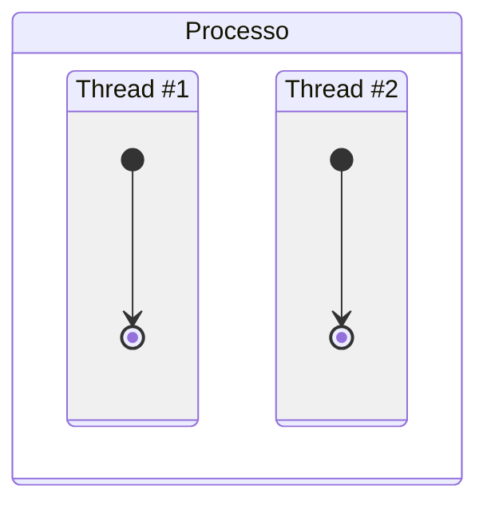
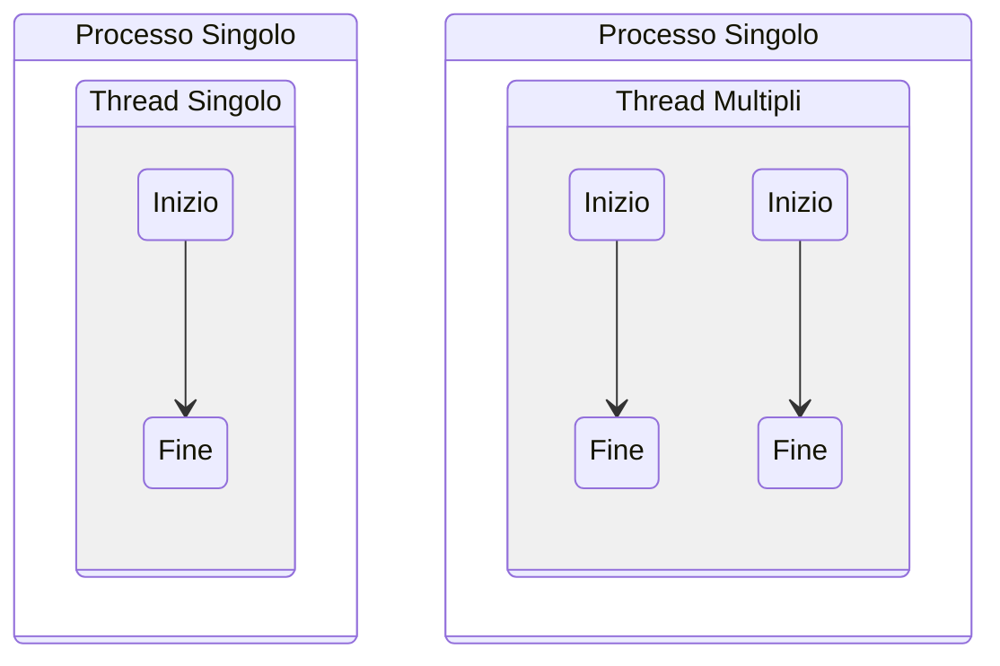
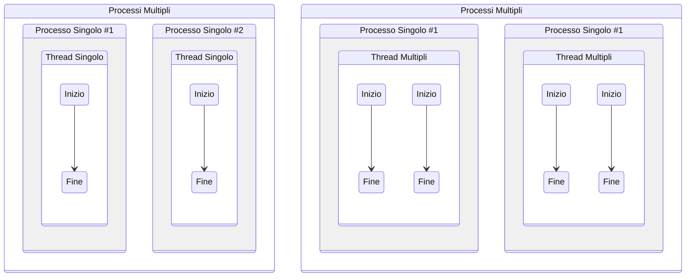

```mermaid
gantt
  title RCP utilizzando un Thread singolo
  dateFormat  ss
  axisFormat  %L
  section Process 1
    RCP req.        :milestone, m1, after run, 0ms
    Running         :run, 0, 1ms
    Blocked         :crit, block, after run, 2ms

    RCP req. start  :milestone, m1, after run1, 0s
    Running         :run1, after block, 1ms
    Blocked         :crit, block1, after run1, 2ms

    Running         :run2, after block1, 3ms
```

# Thread, SMP e Microkernel

## Thread

Un thread è un **flusso di esecuzione indipendente** (traccia) all'interno di
un processo. Un processo può essere diviso in più thread per:

- Ottenere un parallelismo dei flussi di esecuzione all'interno del processo;
- Gestire chiamate bloccanti o situazioni di risposta asincrona.

<!-- markdownlint-disable MD046 -->


!!! example "Esempio"

    Si desidera implementare un web server.
    Se lo si implementasse come un processo mono-thread, potrebbe gestire solamente
    un client alla volta. Le altre richieste verrebbero completamente ignorate,
    neanche poste in coda.

    Se il server venisse implementato come un processo che resta in attesa delle
    richieste, vi sono due possibili soluzioni:

    - Avviare un nuovo processo che processi la singola richiesta;
    - Avviare un nuovo thread che processi la singola richiesta.

<!-- markdownlint-enable MD046 -->

Avviare un nuovo processo è molto più oneroso rispetto all'avviare un nuovo thread.
Allo stesso modo, effettuare il context-switch di un processo è molto più oneroso
rispetto a quello di un thread.

## Multithreading

Il **multithreading** è la capacità di un sistema operativo di supportare più
thread per ogni processo.

<!-- markdownlint-disable MD046 -->



<!-- markdownlint-enable MD046 -->

Un sistema operativo con singolo processo a singolo thread è ad esempio MS-DOS,
il thread esiste all'interno nel processo.

Un sistema operativo con processi multipli a singolo thread è lo UNIX.

Sistemi operativi Multithread sono ad esempio:

- Windows
- Solaris
- MAC
- OS/2

<!-- markdownlint-disable MD046 -->
=== "Processo"

    Un processo possiede delle risorse, dunque ha uno spazio di indirizzamento
    virtuale che contiene l'immagine del processo. Può inoltre chiedere:

    - ulteriore memoria;
    - il controllo di canali di I/O;
    - il controllo di dispositivi;
    - files.

    Possiede inoltre: uno stato (*Ready*, *Running*, *Blocked*, *Suspended*) e
    una priorità. Deve essere schedulato.

    Le informazioni del processo sono contenute nel **Process Control Block**
    (PCB).

=== "Thread"

    Un thread non possiede risorse in quanto utilizza quelle del processo.
    Viene anche chiamato *Light Weight Process* (LWP).

    Il thread possiede un proprio stato, una propria priorità e deve essere
    schedulato tra gli stessi thread, sottostando però alla schedulazione del
    processo.
    I thread inoltre:

    - Condividono lo stato e le risorse del processo a cui appartengono;
    - Risiedono nello stesso spazio di indirizzamento;
    - Hanno accesso agli stessi dati.

    Le informazioni del thread sono contenute nel **Thread Control Block** (TCB).
<!-- markdownlint-enable MD046 -->

Dunque è più facile condividere le informazioni tra i thread.

### Vantaggi dei thread

I thread posseggono vari vantaggi rispetto ai processi:

- il tempo di creazione di un nuovo thread è minore di quello di creazione di
  un nuovo processo;
- il tempo di terminazione di un thread è minore di quello di terminazione di
  un processo;
- il tempo necessario allo switch tra threads all'interno dello stesso processo
  è minore rispetto al tempo di switch tra processi;

I threads all'interno di uno stesso processo condividono sia memoria che files:
lo scambio dei dati avviene senza la richiesta di intervento del kernel. Vi è però
la necessità di sincronizzare le atività dei threads.

Alcuni esempi:

- l'esecuzione foreground e backgroud, es. il foglio di calcolo: un thread
  gestisce il menù e legge i comandi, un altro li esegue e aggiorna il foglio;
- l'elaborazione asincrona, es. elaboratore di testo: un thread di scarico su
  disco ad ogni minuto evita delle perdite per cadute di tensione;
- la velocità di esecuzione: la lettura e il calcolo effettuati da thread
  diversi aumentano la velocità.

### Svantaggi dei thread

I thread presentano due svantaggi principali:

- la sospensione di un processo richiede la sospensione contemporanea di tutti
  i thread contenuti nello stesso. Questo poiché bisogna liberare lo spazio
  in memoria e i thread utilizzano lo stesso spazio di memoria condivisa;
- la terminazione di un processo richiede che tutti i threads siano terminati.

### Stati dei thread

Posseggono tre stati: *Ready*, *Running* e *Blocked*.

Lo stato *Suspended* non è presente poiché non ha senso per un thread, è già
presente a livello di processo. Se un processo viene swappato, lo stesso avviene
per tutti i suoi thread.

### Operazioni di base

Un thread ha quattro operazioni di base:

1. **creazione**:
    - creazione di un processo --> creazione di un thread;
    - un thread può creare altri thread.
2. **Blocco** (attesa di un evento):
    - salvataggio del contesto per il thread: PC, Stack pointer, registri CPU
3. **Sblocco**:
    - lo stato nelTCB viene modificato (Blocked -> Ready)
    - il thread viene accodato a quelli in attesa di processore
4. **Terminazione**:
    - deallocazione del contesto registri, deallocazione stack

Il blocco di un thread blocca l'intero processo? no (?).

### Esempi di multithreading

Un esempio di multithreading è il **Remote Procedure Call** (RPC), ovvero la
chiamata da parte di un processo a una procedura attiva su un elaboratore
diverso dal chiamante. Vediamo il caso di due chiamate RPC diverse a diversi
host:



Il questo caso il processo in attesa di risposta del server.

```mermaid
gantt
  title RCP utilizzando un Thread per server
  dateFormat  ss
  axisFormat  %L
  section Thread A
    RCP request             :milestone, RCP1, after runA, 0ms
    Running                 :runA, 0ms, 1ms
    Blocked                 :crit, blockA, after runA, 2ms
    Running                 :runA1, after blockA, 2ms
    Wait for processor      :crit, blockA1, after runA1, 1ms
    Running                 :runA2, after blockA1, 2ms

  section Thread B
    RCP request       :milestone, RCP2, after runB, 0ms
    Running           :runB, after runA, 1ms
    Blocked           :crit, blockB, after runB, 2ms
    Running           :runB1, after blockB, 2ms
```

In questo caso, invece, quando viene effettuata una richiesta RPC, il processo
si sposta su un altro thread. In questo modo il tempo di attesa viene ridotto.

Un altro esempio di multithreading è un programma di video-scrittura, gestione
e pubblicazione di pagine su desktop. Questo possiede tre thread sempre attivi:

1. gestione degli eventi;
2. gestione dei servizi (stampa, lettura dati, disposizione testo, attivazione
   di altri thread);
3. disegno dello schermo.

Un altro esempio ancora è quello dello sorrimento pagina con barra laterale. In
questo caso il thread eventi controlla la barra di scorrimento, il thread di
ridisegno dello schermo ridisegna la pagina in base allo spostamento. Vi è
ovviamente la necessità di sincronizzare i due threads.

<!-- markdownlint-disable MD046 -->
!!! warning "Attenzione"

    Esistono delle attività che sono bloccanti per tutti i thread. Quando accade
    compare il cursore "busy".
<!-- markdownlint-enable MD046 -->

## Categorie di Thread

<!-- markdownlint-disable MD046 -->
=== "User Level Thread (ULT)"

    I thread a livello utente sono:

    - realizzati tramite librerie senza l'intervento del kernel (es. di librerie:
      Posix Pthread, Mach C-threads, UI-threads Solaris2);
    - trasparenti al Kernel.

    Lo svantaggio è che se il Kernel è a singolo thread il blocco del thread a
    livello utente blocca l'intero proesso (il sistema operativo continua a
    schedulare i processi).

=== "Kernel Level Thread (KLT)"

    Nei thread a livello di kernel:

    - lo stesso kernel si occupa della creazione, scheduling e gestione;
    - i thread possono essere eseguiti su diversi processori;
    - la gestione è però più lenta degli ULT.

<!-- markdownlint-enable MD046 -->

### User Level Thread (ULT)

Il lavoro di gestione dei threads è svolto dalla libreria utente. Per questo il
kernel ignora l'esistenza dei threads. Gli ULT utilizzano il modello ^^Molti a
Uno^^.

La libreria permette:

- Creazione e distruzione dei threads
- Scambio messaggi tra threads
- Schedulazione
- Salvataggio e caricamento dei contesti dei thread

Tali attività sono svolte all'interno del processo utente, pertanto il kernel
continua a schedulare i processi come unità a se stanti.

User Level Thread (ULT)
VANTAGGI:

- Risparmio di sovraccarico
- il cambio diThread avviene all'interno dello spazio di indirazzamento utente
- Non viene richiesto l'intervento del Kernel
- Schedulzione diversa per ogni applicazione
- Ottimizzazione in base al tipo di applicazione
- ULT eseguito da qualsiasi sistema operativo
- Libreria a livello utente condivisa dalle applicazioni

SVANTAGGI:

- La chiamata a sistema da parte di un thread blocca tutti i thread del processo
- Il kernel assegna un processo ad un singolo processore quindi non si può avere
  multiprocessing a livello di thread (thread dello stesso processo su più
  processori)
- Soluzioni Parziali
- Sviluppo dell'applicazione a livello di processi (addio vantaggi dei thread)
- jacketing: conversione di una chiamata bloccante in una non bloccante. Es.:
  Nel caso di I/O si invoca una procedura di jacketing che verifica se il
  dispositivo è occupato, in caso affermativo il thread passa in ready e un altro
  thread va in run.

### Kernel Level Thread (KLT) puro

Il lavoro di gestione dei threads è svolto dal Kernel: modello uno a uno. A livello
utente una API consente l'accesso alla parte del Kernel che gestisce.
I thread
Il kernel mantiene info su:

- Contesto del processo
- Contesto dei threads
- Scambio messaggi tra threads
Schedulazione effettuata a livello di thread
- se un thread di un P è bloccato, un altro thread dello stesso processo può
essere eseguito
- Thread di uno stesso P possono essere schedulati su diversi processori
SVANTAGGI:
Overhead: trasferimento del controllo da un thread ad un altro richiede
l'intervento del kernel

## Approcci misti

Modello molti a molti: più thread di livello utente sono in corrispondenza
con più thread di livello kernel
IThread sono creati nello spazio utente
Vari
thread
di
uno
stesso
processo
possono
essere
eseguiti
contemporaneamente su più processori
Una chiamata bloccante non blocca necessariamente l'intero processo
Necessità di comunicazione fra kernel e libreria di thread per mantenere un
appropriato numero di kernel thread allocati all'applicazione.
Light Weight Process (LWP) – struttura intermedia appare alla libreria dei
thread
utente
come
un
processore
virtuale
sul
quale
schedulare
l'esecuzione.
Es. Una applicazione CPU-bound su un sistema monoprocessore implica
che un solo thread per volta possa essere eseguito, quindi per essa sarà
sufficiente un unico LWP per thread.
Una applicazione I/O-bound tipicamente richiede un LWP per ciascuna
chiamata di sistema bloccante

Relazione tra Thread e Processi
Thread : Processi
Descrizione
Sistemi
1:1
Ogni thread di esecuzione è un
processo unico con il proprio spazio
di indirizzamento e le proprie risorse
Molte implementazioni di
UNIX
M:1
Ogni processo ha associato un
proprio spazio di indirizzamento e
delle risorse. In ogni processo si
possono creare ed eseguire molti
thread
Windows NT
Solaris
OS/2
OS/390
MACH
1:M
Un thread può spostarsi da un
processo all'altro: ciò permette di
spostare facilmente i thread tra
sistemi diversi
Ra(Clouds)
Emerald
M:M
Combina le proprietà degli approcci
M:1 e 1:M
TRIX
Ambienti
distribuiti:
thread possono
spostarsi tra più
calcolatori

Symmetric Multi Processing (SMP)
Un calcolatore con molti processori

- I processori condividono le stesse risorse
- Tutti i processori possono effettuare le stesse funzioni
- Ogni processore esegue una stessa copia del SO
- Ogni processore gestisce la schedulazione dei processi o
thread disponibili
Difficoltà:
- I processori non devono schedulare lo stesso processo
- Comunicazione
tra
processori:
memoria
condivisa
(possibilità di effettuare accessi simultanei alla memoria
– memoria multiporta)
- Coerenza della $: RAW, WAR, RAR, WAW (risolti a livello
hardware)

Symmetric Multi Processing (SMP)
Il multiprocessore deve essere trasparente all'utente: il programmatore deve operare
come se fosse in multiprogrammazione su monoprocessore
Punti critici della progettazione di un Sistema Operativo per SMP:

- Processi e Thread del Kernel concorrenti: l'esecuzione contemporanea su diversi
processori non deve compromettere le strutture di gestione del SO (tabelle, ecc.)
- Schedulazione: necessità di evitare conflitti
- Sincronizzazione: mutua esclusione e ordinamento degli eventi
- Gestione della memoria condivisa
- Tolleranza ai guasti: in caso di “perdita di un processore” devono essere aggiornate le
strutture di controllo del SO

Stati dei Thread in Windows

- Ready
- Standby: legato alla disponibilità del processore (SMP)
richiesto per il thread. Se la priorità è sufficientemente
alta il processo in running può essere interrotto.
- Running
- Waiting: I/O, attesa per sincronizzazione
- Transition: thread pronto per l'esecuzione ma le risorse
non sono disponibili (es. lo stack può essere stato
spostato su disco mentre era in waiting).
- Terminated
Supporto di SMP:
- I thread (inclusi quelli del kernel) possono essere eseguiti su ogni processore
- Il primo thread in ready viene assegnato al primo processore disponibile
- Thread appartenenti allo stesso processo possono essere eseguiti (contemporaneamente) su diversi processori
- Esecuzione di un thread sempre sullo stesso processore: dati ancora in cache..

MicroKernel
Piccolo Nucleo del SO
Contiene le funzioni essenziali del SO
Servizi tradizionalmente inclusi nel SO
sono
sottosistemi
esterni
al
microkernel ed eseguiti in modalità
utente:

- Device drivers
- File systems
- Virtual memory manager
- Windowing system
- Security services
Interazione solo tra strati adiacenti
La comunicazione avviene attraverso il
MicroKernel che ridireziona i messaggi

Vantaggi del MicroKernel

- Interfaccia uniforme: I moduli usano le stesse interfacce per le richieste al microKernel
- Estensibilità: introduzione di nuovi servizi o modifiche non richiedono modifiche del
microKernel
- Flessibilità: a seconda delle applicazioni certe caratteristiche possono essere ridotte o
potenziate per soddisfare al meglio le richieste dei clienti. Es. Windows home –
professional – ultimate
- Portabilità: Il cambio dell'hardware comporterà unicamente la modifica del
microkernel.
- Affidabilità: lo sviluppo di piccole porzioni di codice ne permette una migliore
ottimizzazione e test.
- Supporto ai sistemi distribuiti: ogni servizio è identificato da un numero nel
microkernel e una richiesta da client non è necessario che sappia dove si trova il server
in grado di soddisfare la stessa. Messaggistica gestita dal microkernel

Design del MicroKernel
Il microkernel deve contenere:

- Le funzioni che dipendono direttamente dall'hardware (gestione degli interrupt e I/O)
- Le funzioni per la comunicazione tra processi (IPC)
- Gestione primitiva della memoria
Problema delle prestazioni per sistemi microkernel:
Costruire, inviare, accettare, decodificare un messaggio costa più che una chiamata a SO
Possibili soluzioni:
- Aggiungendo funzionalità al microkernel (MACH OS) si riduce il numero di
cambiamenti di stato (utente/kernel) - Riduzione di flessibilità, interfacce minime…
- Ulteriore riduzione del microkernel

Funzioni minime del MicroKernel
Gestione primitiva della memoria
Un modulo esterno al microkernel mappa pagine
virtuali in pagine fisiche.
Il mapping è conservato in memoria principale.

- Una applicazione che accede ad una pagina che
non si trova in memoria genera un page fault
- L'esecuzione passa al microkernel che invia un
msg al paginatore comunicando la pagina
richiesta
- La pagina viene caricata (paginatore e kernel
collaborano per il mapping memoria reale-
virtuale)
- Quando viene caricata la pagina il pager invia un
msg all'applicazione

Funzioni minime del MicroKernel
Comunicazione tra processi
Messaggio = (intestazione) + (corpo) + (puntatore+inform. di contr.)

- Intestazione (Mittente, Ricevente)
- Corpo (dati del messaggio)
- Puntatore (informazioni di controllo del processo, blocco dati)
Associata ad ogni processo c'è una PORTA: una capability list indica chi può inviare
messaggi
Tale porta è amministrata dal Kernel

Funzioni minime del MicroKernel
Gestione degli Interrupt e dell'I/O

- Il microkernel riconosce gli interrupt ma non li gestisce direttamente.
- Il microkernel trasforma l'interrupt in messaggio a livello utente, che invia al
processo che gestisce l'interrupt
driver thread:
do
wait(msg, mittente);
if mittente=mio_interrupt_hardware
then leggi/scrivi le porte di I/O;
azzera l'interrupt hardware
else….
Endif
enddo
