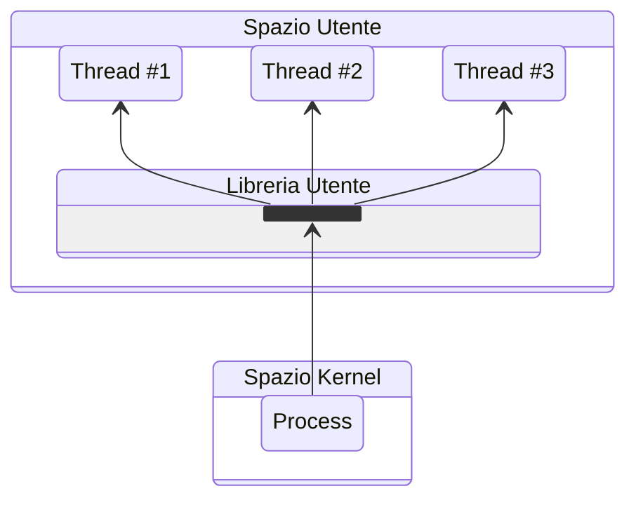
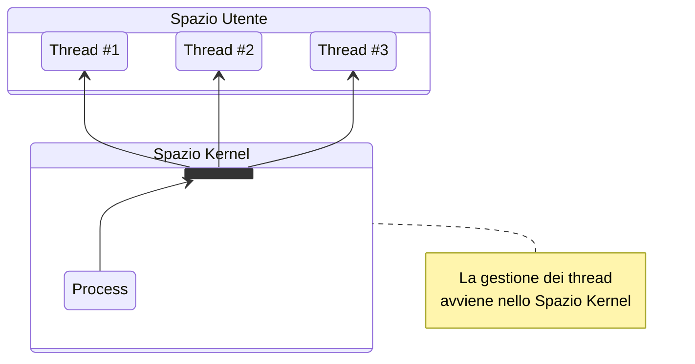
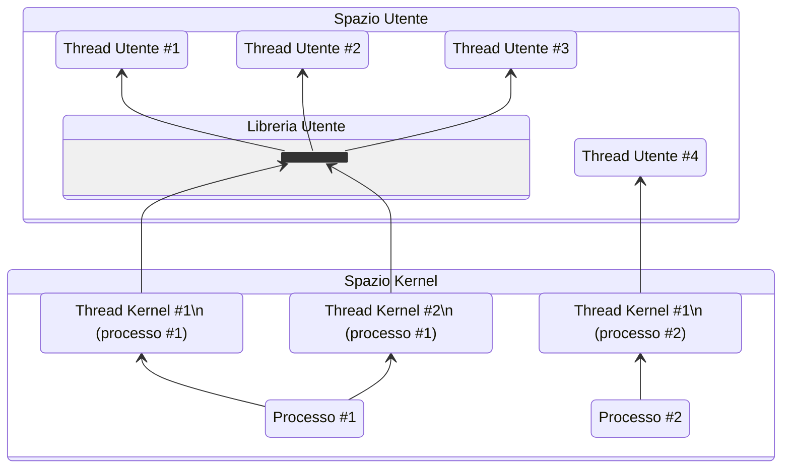
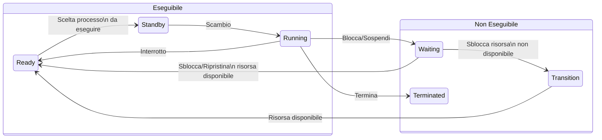

# Thread, SMP e Microkernel

## Thread

Un thread è un **flusso di esecuzione indipendente** (traccia) all'interno di
un processo. Un processo può essere diviso in più thread per:

- ottenere un parallelismo dei flussi di esecuzione all'interno del processo;
- gestire chiamate bloccanti o situazioni di risposta asincrona.

<!-- markdownlint-disable MD046 -->


!!! example "Esempio"

    Si desidera implementare un web server.
    Se lo si implementasse come un processo mono-thread, potrebbe gestire solamente
    un client alla volta. Le altre richieste verrebbero completamente ignorate,
    neanche poste in coda.

    Se il server venisse implementato come un processo che resta in attesa delle
    richieste, vi sono due possibili soluzioni:

    - Avviare un nuovo processo che processi la singola richiesta;
    - Avviare un nuovo thread che processi la singola richiesta.

<!-- markdownlint-enable MD046 -->

Avviare un nuovo processo è molto più oneroso rispetto all'avviare un nuovo thread.
Allo stesso modo, effettuare il context-switch di un processo è molto più oneroso
rispetto a quello di un thread.

## Multithreading

Il **multithreading** è la capacità di un sistema operativo di supportare più
thread per ogni processo.

<!-- markdownlint-disable MD046 -->


<!-- markdownlint-enable MD046 -->

Un sistema operativo con singolo processo a singolo thread è ad esempio MS-DOS,
il thread esiste all'interno nel processo.

Un sistema operativo con processi multipli a singolo thread è lo UNIX.

Sistemi operativi multithread sono ad esempio:

- Windows
- Solaris
- MAC
- OS/2

<!-- markdownlint-disable MD046 -->
=== "Processo"

    Un processo possiede delle risorse, dunque ha uno spazio di indirizzamento
    virtuale che contiene l'immagine del processo. Può inoltre chiedere:

    - ulteriore memoria;
    - il controllo di canali di I/O;
    - il controllo di dispositivi;
    - files.

    Possiede inoltre: uno stato (*Ready*, *Running*, *Blocked*, *Suspended*) e
    una priorità. Deve essere schedulato.

    Le informazioni del processo sono contenute nel **Process Control Block**
    (PCB).

=== "Thread"

    Un thread non possiede risorse in quanto utilizza quelle del processo.
    Viene anche chiamato *Light Weight Process*.

    Il thread possiede un proprio stato, una propria priorità e deve essere
    schedulato tra gli stessi thread, sottostando però alla schedulazione del
    processo.
    I thread inoltre:

    - Condividono lo stato e le risorse del processo a cui appartengono;
    - Risiedono nello stesso spazio di indirizzamento;
    - Hanno accesso agli stessi dati.

    Le informazioni del thread sono contenute nel **Thread Control Block**.

*[TCB]: Thread Control Block
<!-- markdownlint-enable MD046 -->

Dunque è più facile condividere le informazioni tra i thread.

### Vantaggi dei thread

I thread posseggono vari vantaggi rispetto ai processi:

- il tempo di creazione di un nuovo thread è minore di quello di creazione di
  un nuovo processo;
- il tempo di terminazione di un thread è minore di quello di terminazione di
  un processo;
- il tempo necessario allo switch tra threads all'interno dello stesso processo
  è minore rispetto al tempo di switch tra processi;

I thread all'interno di uno stesso processo condividono sia memoria che files:
lo scambio dei dati avviene senza la richiesta di intervento del kernel. Vi è però
la necessità di sincronizzare le atività dei threads.

Alcuni esempi:

- l'esecuzione foreground e backgroud, es. il foglio di calcolo: un thread
  gestisce il menù e legge i comandi, un altro li esegue e aggiorna il foglio;
- l'elaborazione asincrona, es. elaboratore di testo: un thread di scarico su
  disco ad ogni minuto evita delle perdite per cadute di tensione;
- la velocità di esecuzione: la lettura e il calcolo effettuati da thread
  diversi aumentano la velocità.

### Svantaggi dei thread

I thread presentano due svantaggi principali:

- la sospensione di un processo richiede la sospensione contemporanea di tutti
  i thread contenuti nello stesso. Questo poiché bisogna liberare lo spazio
  in memoria e i thread utilizzano lo stesso spazio di memoria condivisa;
- la terminazione di un processo richiede che tutti i threads siano terminati.

### Stati dei thread

Posseggono tre stati: *Ready*, *Running* e *Blocked*.

Lo stato *Suspended* non è presente poiché non ha senso per un thread, è già
presente a livello di processo. Se un processo viene swappato, lo stesso avviene
per tutti i suoi thread.

### Operazioni di base

Un thread ha quattro operazioni di base:

1. **creazione**:
    - la creazione di un processo implica la creazione di un thread;
    - un thread può creare altri thread.
2. **Blocco** (attesa di un evento):
    - salvataggio del contesto per il thread: PC, Stack pointer, registri CPU
3. **Sblocco**:
    - lo stato nelTCB viene modificato (Blocked -> Ready)
    - il thread viene accodato a quelli in attesa di processore
4. **Terminazione**:
    - deallocazione del contesto registri, deallocazione stack

*[PC]: Program Counter
*[CPU]: Central Processing Unit

Il blocco di un thread blocca l'intero processo? no (?).

### Esempi di multithreading

Un esempio di multithreading è il **Remote Procedure Call**, ovvero la chiamata
da parte di un processo a una procedura attiva su un elaboratore diverso dal
chiamante. Vediamo il caso di due chiamate RPC diverse a diversi host:


Il questo caso, dopo la RPC, il processo resta in attesa di risposta del server,
senza effettuare alcuna operazione.

```mermaid
gantt
  title RCP utilizzando un Thread per server
  dateFormat  ss
  axisFormat  %L
  section Thread A
    RCP request             :milestone, RCP1, after runA, 0ms
    Running                 :runA, 0, 1ms
    Blocked                 :crit, blockA, after runA, 2ms
    Running                 :runA1, after blockA, 2ms
    Wait for processor      :crit, blockA1, after runA1, 1ms
    Running                 :runA2, after blockA1, 2ms

  section Thread B
    RCP request       :milestone, RCP2, after runB, 0ms
    Running           :runB, after runA, 1ms
    Blocked           :crit, blockB, after runB, 2ms
    Running           :runB1, after blockB, 2ms
```



In questo caso, invece, quando viene effettuata una richiesta RPC, il processo
si sposta su un altro thread. In questo modo il tempo di attesa viene ridotto.

*[RPC]: Remote Procedure Call

Un altro esempio di multithreading è un programma di video-scrittura, gestione
e pubblicazione di pagine su desktop. Questo possiede tre thread sempre attivi:

1. gestione degli eventi;
2. gestione dei servizi (stampa, lettura dati, disposizione testo, attivazione
   di altri thread);
3. disegno dello schermo.

Un altro esempio ancora è quello dello sorrimento pagina con barra laterale. In
questo caso il thread eventi controlla la barra di scorrimento, il thread di
ridisegno dello schermo ridisegna la pagina in base allo spostamento. Vi è
ovviamente la necessità di sincronizzare i due threads.

<!-- markdownlint-disable MD046 -->
!!! warning "Attenzione"

    Esistono delle attività che sono bloccanti per tutti i thread. Quando accade
    compare il cursore "busy".
<!-- markdownlint-enable MD046 -->

## Categorie di Thread

<!-- markdownlint-disable MD046 -->
=== "User Level Thread"

    I thread a livello utente sono:

    - realizzati tramite librerie senza l'intervento del kernel (es. di librerie:
      Posix Pthread, Mach C-threads, UI-threads Solaris2);
    - trasparenti al Kernel.

    Lo svantaggio è che se il Kernel è a singolo thread il blocco del thread a
    livello utente blocca l'intero processo (il sistema operativo continua a
    schedulare i processi).

=== "Kernel Level Thread"

    Nei thread a livello di kernel:

    - lo stesso kernel si occupa della creazione, scheduling e gestione;
    - i thread possono essere eseguiti su diversi processori;
    - la gestione è però più lenta degli ULT.

<!-- markdownlint-enable MD046 -->

### User Level Thread



Il lavoro di gestione dei threads è svolto dalla libreria utente. Per questo il
kernel ignora l'esistenza dei threads. Gli ULT utilizzano il modello ^^molti a
uno^^.

*[ULT]: User Level Thread

La libreria permette di:

- creare e distruggere i threads;
- sbambiare messaggi tra threads;
- schedulare;
- salvare e caricare i contesti dei thread.

Tali attività sono svolte all'interno del processo utente, pertanto **il kernel
continua a schedulare i processi come unità a sè stanti**.

I **vantaggi** dell'ULT sono i seguenti:

- risparmio di sovraccarico, questo avviene perché iìcambio di thread avviene
  all'interno dello spazio di indirizzamento utente e non viene richiesto
  l'intervento del kernel;
- schedulazione differente per ogni applicazione, c'è un'ottimizzazione in base
  al tipo di applicazione;
- viene eseguito da qualsiasi sistema operativo, la libreria a livello utente
  è condivisa dalle applicazioni.

Gli **svantaggi** dell'ULT sono i seguenti:

- la chiamata a sistema da parte di un thread blocca tutti i thread del processo;
- il kernel assegna un processo a un singolo processore, quindi non è possibile
  avere multiprocessing a livello di thread (thread dello stesso processo su più
  processori);

Delle soluzioni parziali sono:

- sviluppare l'applicazione a livello di processi, andando a perdere i vantaggi
  dei threads;
- fare uso del **jacketing**, ovvero convertire una chiamata bloccante in una
  non bloccante. Nel caso di I/O si invoca una procedura di jacketing che
  verifica se iìdispositivo è occupato, se sì il thread passa in *Ready* e un
  altro thread va in *Running*.

### Kernel Level Thread puro



Il lavoro di gestione dei threads è svolto dal kernel e fa uso del ^^modello
uno a uno^^. A livello utente una API consente l'accesso alla parte del kernel
che gestisce.

*[API]: Application Program Interface

Il kernel mantiene informazioni su:

- contesto del processo;
- contesto dei threads;
- scambio messaggi tra threads.

**La schedulazione viene effettuata a livello di thread**:

- se un thread di un proceso è bloccato, una altro thread dello stesso processo
  puà essere eseguito;
- i thread di uno stesso processo possono essere schedulati su diversi processori.

Lo **svantaggio** del KLT è che il trasferimento del controllo da un thread a un
altro richiede l'intervento del kernel (overhead).

*[KLT]: Kernel Level Thread

### Approcci misti



Fa uso del ^^modello molti a molti^^, ovvero più thread di livello utente sono
in corrispondenza con più thread di livello kernel.

I thread sono creati nello spazio utente, vari thread di uno stesso processo
possono essere eseguiti contemporaneamente su più processori, inoltre una
chiamata bloccante non blocca necessariamente l'intero processo. Vi è la
necessità di comunicazione fra kernel e libreria di thread per mantenere un
appropriato numero di thread kernel allocati all'applicazione.

Con LWP si intende una struttura intermedia che appare alla libreria dei thread
utente come un processore virtuale sul quale schedulare l'esecuzione.
As esempio una applicazione CPU-bound su un sistema monoprocessore implica|
che un solo thread per volta possa essere eseguito, quindi per essa sarà
sufficiente un unico LWP per thread.

Una applicazione I/O-bound tipicamente richiede un LWP per ciascuna chiamata di
sistema bloccante.

*[LWP]: Light Weight Process

### Relazione tra Thread e Processi

<!-- markdownlint-disable MD013 MD033 -->
| Thread a processi | Descrizione                                                                                                                                          | Sistemi                              |
| :---------------- | :--------------------------------------------------------------------------------------------------------------------------------------------------- | :----------------------------------- |
| uno a uno         | Ogni thread di esecuzione è un<br>processo unico con il proprio spazio<br>di indirizzamento e le proprie risorse                                     | Molte implementazioni di UNIX        |
| molti a uno       | Ogni processo ha associato un proprio<br>spazio di indirizzamento e delle risorse.<br>In ogni processo si possono creare ed<br>eseguire molti thread | WindowsNT<br>Solaris<br>OS/2<br>MACH |
| uno a molti       | Un thread può spostarsi da un processo<br>all’altro: ciò permette di spostare<br>facilmente i thread tra sistemi diversi                             | Ra(clouds)<br>Emerald                |
| molti a molti     | Combina le proprietà degli approcci<br> molti a uno e uno a molti                                                                                    | TRIX                                 |
<!-- markdownlint-enable MD013 MD033 -->

Gli ultimi due punti (uno a molti e molti a molti), sono ambienti distribuiti:
i thread possono spostarsi tra più calcolatori.

## Symmetric Multi Processing

È un sistema multiprocessore con una memoria centralizzata condivisa chiamata
memoria principale, operante sotto un unico sistema operativo con due o più
processori omogenei. Nel SMP:

- i processori condividono le stesse risorse;
- tutti i processori possono effettuare le stesse funzioni;
- ogni processore esegue una stessa copia del sistema operativo;
- ogni processore gestisce la schedulazione dei processi o thread disponibili.

Le difficoltà del SMP sono le seguenti:

- i processori non devono schedulare lo stesso processo;
- la comunicazione tra processori: memoria condivisa (possibilità di effettuare
  accessi simultanei alla memoria – memoria multiporta);
- coerenza della cache: RAW, WAR, RAR, WAW (risolto a livello hardware).

il multiprocessore **deve essere trasparente all'utente**: il programmatore deve
operare come se fosse in multiprogrammazione su monoprocessore.

I punti critici della progettazione di un sistema operativo per SMP sono i
seguenti:

- processi e thread del Kernel concorrenti: l'esecuzione contemporanea su
  diversi processori non deve compromettere le strutture di gestione del sistema
  operativo (tabelle, etc);
- schedulazione: vi è necessità di evitare conflitti;
- sincronizzazione: mutua esclusione e ordinamento degli eventi;
- gestione della memoria condivisa;
- tolleranza ai guasti: in caso di "perdita di un processore" devono essere
  aggiornate le strutture di controllo del sistema operativo.

*[SMP]: Symmetric Multi Processing

## Stati dei Thread in Windows



Lo stato *Standby* è legato alla disponibilità del processore (SMP) richiesto
per il thread. Se la priorità è sufficientemente alta, il processo in *Running*
può essere interrotto. Lo stato di *Waiting* è legato all'I/O e all'attesa per
la sincronizzazione. Lo stato *Transition* si ha quando il thread è pronto per
l'esecuzione ma le risorse non sono disponibili (es. lo stack può essere stato
spostato su disco mentre era in waiting).

Supporto di SMP:

- i thread (inclusi quelli del kernel) possono essere eseguiti su ogni
  processore;
- il primo thread in *Ready* viene assegnato al primo processore disponibile;
- i thread appartenenti allo stesso processo possono essere eseguiti
  contemporaneamente) su diversi processori;
- l'esecuzione di un thread sempre sullo stesso processore porta ad avere i
  dati ancora in cache.

## MicroKernel

È un piccolo nucleo del sistema operativo e contiene le funzioni essenziali di
quest'ultimo. I servizi tradizionalmente inclusi nel sistema operativo sono
sottosistemi esterni al microkernel ed eseguiti in modalità utente, quali:

- device drivers
- file systems
- virtual memory manager
- windowing system
- security services

L'interazione in un Kernel a livelli avviene solo tra strati adiacenti, mentre
nel Microkernel la comunicazione avviene attraverso quest'ultimo, che
ridireziona i messaggi.

### Vantaggi del MicroKernel

I vantaggi del microKernel sono i seguenti:

- **interfaccia uniforme**: i moduli usano le stesse interfacce per le richieste
  al microKernel;
- **estensibilità**: l'introduzione di nuovi servizi o modifiche non richiede
  modifiche del microKernel;
- **flessibilità**: a seconda delle applicazioni certe caratteristiche possono
  essere ridotte o potenziate per soddisfare al meglio le richieste dei clienti
  (es. Windows Home/Professional/Ultimate);
- **portabilità**: il cambio dell'hardware comporterà unicamente la modifica del
  microkernel.
- **affidabilità**: lo sviluppo di piccole porzioni di codice ne permette una
  migliore ottimizzazione e test.
- **supporto ai sistemi distribuiti**: ogni servizio è identificato da un numero
  nel microkernel e una richiesta da client non è necessario che sappia dove si
  trova il server in grado di soddisfare la stessa. La messaggistica viene
  gestita dal microkernel.

### Design del MicroKernel

Il microKernel deve contenere:

- le funzioni che dipendono direttamente dall'hardware (gestione degli interrupt
  e I/O);
- le funzioni per la comunicazione tra processi (IPC);
- gestione primitiva della memoria;

I sistemi con microKernel presentano un problema a livello di prestazioni:
Costruire, inviare, accettare, decodificare un messaggio costa più che una
chiamata al sistema operativo. Le possibili soluzioni sono:

- aggiungere funzionalità al microkernel riduce il numero di cambiamenti di
  stato (utente/kernel). Vi è però una riduzione di flessibilità, interfacce
  minime, etc;
- ridurre ulteriormente il microkernel.

*[IPC]: InterProcess Communication

### Funzioni minime del MicroKernel

#### Gestione primitiva della memoria

Un modulo esterno al microkernel mappa pagine virtuali in pagine fisiche, il
mapping è conservato in memoria principale.

- un'applicazione che accede ad una pagina che non si trova in memoria genera
  un *page fault*;
- l'esecuzione passa al microKernel che invia un messagio al paginatore
  comunicando la pagina richiesta;
- la pagina viene caricata: il paginatore e il kernel collaborano per il mapping
  memoria reale-virtuale;
- quando viene caricata la pagina il pager invia un messaggio all'applicazione.

#### Comunicazione tra processi

Il messaggio è composto nel seguente modo:

\[ \bnf{messaggio} \Coloneqq \bnf{intestazione} + \bnf{corpo} + \bnf{puntatore} \]

dove l'intesazione è composta da mittente e ricevente, il corpo contiene i dati
del messaggio e il puntatiore contiene le informaizoni di controllo del processo
e il blocco dati.

Associata ad ogni processo c'è una **porta**: una *capability list* indica chi
può inviare messaggi. Tale porta è amministrata dal Kernel.

#### Gestione degli Interrupt e dell'I/O

Il microkernel riconosce gli interrupt ma non li gestisce direttamente,
**trasforma l'interrupt in messaggio a livello utente**, che invia al processo
che gestisce l'interrupt

```txt
driver thread:
ESEGUI
    wait(msg, mittente)
    SE (mittente = mio_interrupt_hardware)
        ALLORA
            leggi/scrivi le porte di I/O
            azzera l'output hardware
        ALTRIMENTI
            >> ....
    FINE
FINE
```
