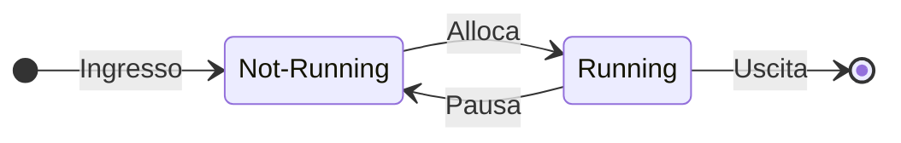
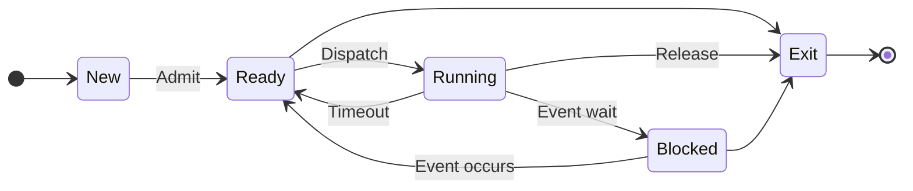
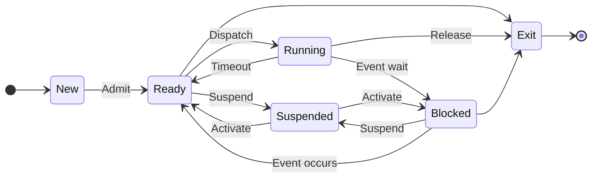
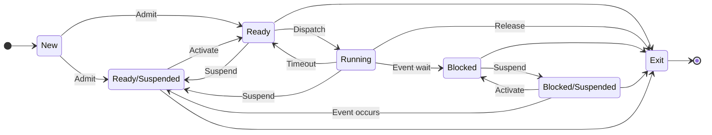
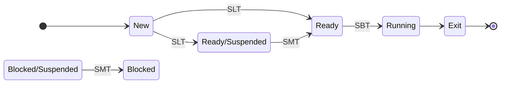
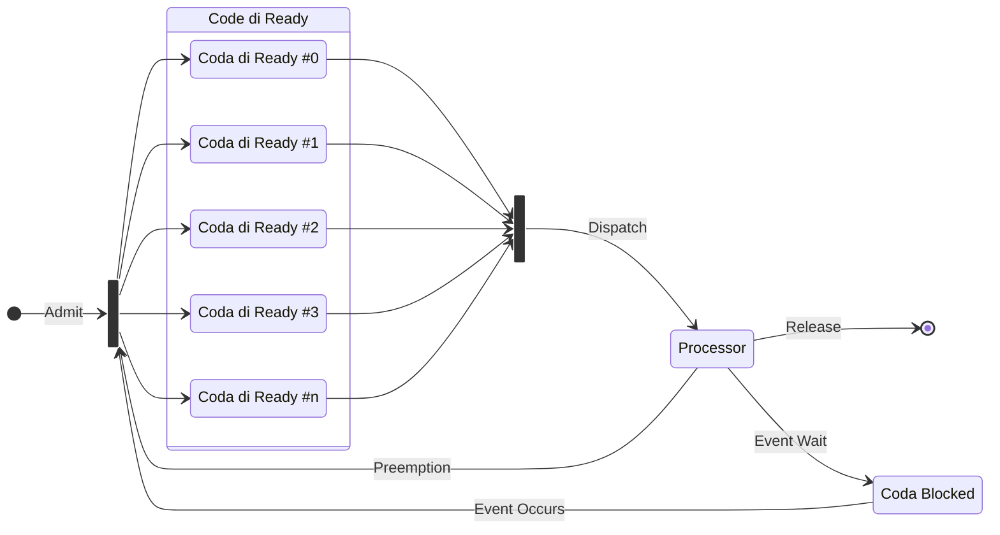
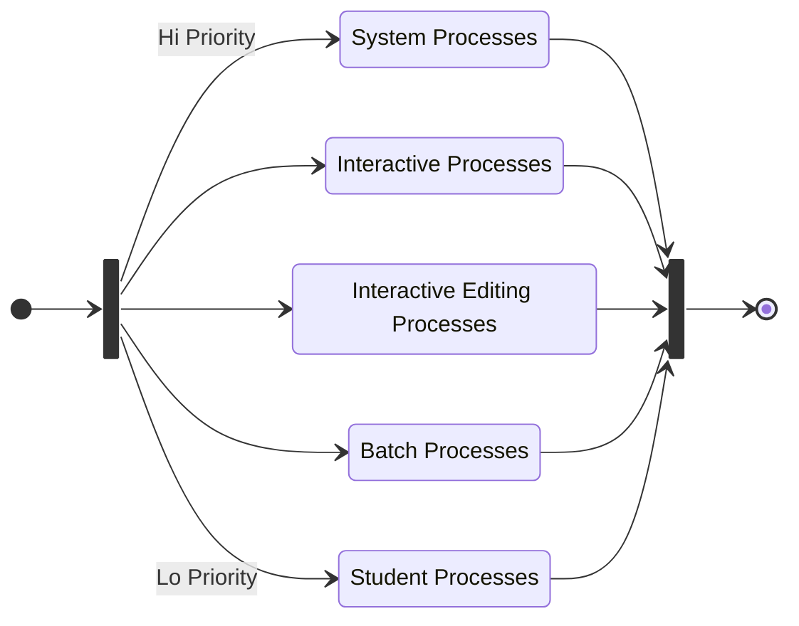
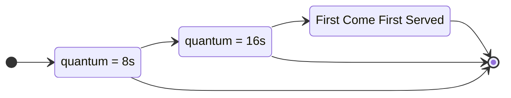

# Sistema operativo, gestione dei processi e scheduling

## Obiettivi di un sistema operativo

- **Convenienza** nell'uso del calcolatore rispetto ai potenziali utenti;
- **Efficienza** nell'utilizzo del calcolatore e delle sue parti costitutive;
- **Capacità di evolversi** rispetto a evoluzioni hardware, esigenze degli
  utenti e bug.

## sistema operativo come interfaccia

Il sistema operativo:

- Nasconde i dettagli hardware al programmatore;
- Fornisce un'**interfaccia** per utilizzare il sistema.

Il sistema operativo agisce quindi in maniera **trasparente**.

Un'**interfaccia** è un componente fisico o logico che permette a due o più
sistemi elettronici di comunicare e interagire.

TODO: aagiungere immagine (a scala).

## Servizi offerti dal sistema operativo

Il sistema operativo offre vari servizi:

- **Creazione dei programmi**: compilatore, debugger come utilità offerte al
  programmatore. Non sono parte del sistema operativo ma sono accessibili tramite
  esso;
- **Esecuzione dei programmi**: caricamento in memoria dei programmi,
  inizializzazione dei dispositividi I/O, ecc;
- **Accesso ai dispositivi di I/O**: l'utente/programmatore ignora il set di
  istruzioni e i segnali dei dispositivi;
- **Accesso controllato ai file**: comprensione del formato, meccanismi di
  protezione, associazione file indirizzi di memoria;
- **Accesso al sistema** (inteso in senso lato);
- **Rilevazione e correzione degli errori hardware** o generati da programmi in
  esecuzione;
- **Contabilità e statistiche d'uso delle risorse**, dei tempi di risposta (al
  fine di migliorare le prestazioni).

## sistema operativo come gestore delle risorse

TODO:aggiungere diagramma mermaid dispositivi I/O.

Il sistema operativo:

- Dirige la CPU nell'utilizzo delle altre risorse del sistema e nella
  temporizzazione dell'esecuzione dei programmi;
- Decide quando un programma in esecuzione può utilizzare una risorsa – il
  processore stesso è una risorsa.

Il **Kernel** è Parte del sistema operativo risiedente in memoria centrale,
contiene le funzioni del sistema operativo usate più frequentemente

## Batch multiprogrammati

Con **batch multiprogrammati** si intende sistemi dove è consentita la
multiprogrammazione, ovvero l'esecuzione di più programmi in contemporanea.

=== "Mono-programmazione"

    Ad esempio:

    - Lettura di un record: \(0.0015 \second\);
    - Esecuzione di \(100\) istruzioni: \(0.0001 \second\);
    - Scrittura di un record: \(0.0015 \second\);
    - Totale \(0.0031 \second\).

    Percentuale di utilizzo della CPU:

    \[ \frac{0.0001 \cancel{\second}}{0.0031 \cancel{\second}} = 0.032 = 3.2 \% \]

=== "Multi-programmazione"

    - Presenza di più programmi in memoria;
    - Obiettivo: limitare l'inattività del processore, quando un job effettua
      un'operazione di I/O la CPU può essere impegnata da un altro processo;
    - Elaborazione seriale dei task.

### Multi-programmazione

TODO: aggiungere immagine della multiprogrammazione.

Le difficoltà della multi-programmazione sono le seguenti:

- Gestione della memoria;
- Decidere quale Job mandare in esecuzione (*schedulazione*).

## Processo = Job = Task

!!! def
    Un'attività caratterizzata dall'esecuzione di una sequenza di istruzioni,
    uno stato corrente e un set di istruzioni di sistema

Componenti

- ^^Programma^^:
      - Codice eseguibile
- ^^Dati^^:
      - Variabili
      - Spazio di lavoro
      - Buffer
- ^^Contesto di esecuzione^^ (info necessarie al sistema operativo per gestire
  il processo):
      - Contenuto dei registri della CPU
      - Priorità
      - Stato di esecuzione
      - Stato di attesa su un dispositivo di I/O

### Implementazione di un processo

TODO: aggiungere immagine dell'implementazione di un processo.

### Gestione della memoria

Il sistema operativo deve assolvere 5 compiti

1. Isolamento dei processi;
2. Allocazione e gestione automatica della memoria: la gerarchia delle memorie
   deve essere trasparente all'utente;
3. Supporto alla programmazione modulare: variazione di dimensione dei programmi;
4. Protezione e controllo dell'accesso: gestione di aree di memoria condivise tra
   i processi;
5. Memorizzazione a lungo termine

Necessità soddisfatte da:

- **memoria virtuale**: i programmi indirizzano la memoria con riferimenti logici
  ignorando gli aspetti fisici, quando un programma è in esecuzione solo una sua
  parte risiede effettivamente in memoria centrale;
- **file system**: implementa la memorizzazione a lungo termine.

### Stati dei processi

Il compito principale di un sistema operativo è il controllo dell'esecuzione dei
processi. In particolare, è possibile classificare lo stato attuale di un processo
mediante, appunto, uno **stato**. Tale classificazione consente di gestire in
maniera differente processi in stato differente.

### Descrizione dei Processi

Il sistema operativo necessita di uno strumento per gestire i processi, che tenga
traccia di tutte le informazioni disponibili. Esso prende il nome di **Descrittore
di Processo**, oppure **Process Control Block** (*PCB*).

TODO: aggiungere immagine dei processi.

#### Process Control Block - PCB

È costituito da:

1. Identificatore del Processo: **Process IDentification** (*PID*), è un valore
   numerico;
2. Informazioni sullo stato del processore:
      - Registri dati visibili all'utente (i quali dipendono dall'architettura
        del calcolatore);
      - Registri di controllo e di stato:
           - *Program Counter*: indirizzo della prossima istruzione da eseguire;
           - *Registri di stato*: includono i flag per l'abilitazione degli
             interrupt;
           - *Registri* che contengono codici relativi alla condizione (segno,
             overflow, etc).
      - Puntatori allo stack, usati per procedure e funzioni.

3. Informazioni di controllo del processo:
      - Schedulazione e informazioni di stato:
          - Stato del processo (running, ready, etc.);
          - Priorità nelle code di scheduling;
          - Informazioni correlate alla schedulazione (tempo di attesa, tempo
            di esecuzione, etc);
          - Evento del quale è in attesa (se è in attesa).
      - Strutturazione dati:
          - Puntatori ad altri processi (figli/padre o per l'implementazione di
            code).
      - Comunicazione tra processi:
          - Flag, segnali e messaggi per la comunicazione.
      - Privilegi:
          - In relazione all'uso della memoria, dei dispositivi, etc.
      - Gestione della memoria:
          - Limiti di memoria: insieme degli indirizzi accessibili (base, limite).
      - Contabilizzazione delle risorse:
          - Risorse controllate dal processo (lista dei file aperti, lista dei
            dispositivi I/O) e la loro storia.

### Immagine dei processi in memoria

TODO: aggiungere immagine dei processi in mem.

Nell'esempio le immagini occupano locazioni contigue di memoria, in una
implementazione reale ciò può non essere vero. Dipende dalla politica di gestione
della memoria.

### Creazione e terminazione dei processi

Eventi che portano alla creazione dei processi:

1. Richiesta da terminale (un utente accede al sistema);
2. Il sistema operativo genera un processo sulla base della richiesta di un
   processo utente (es. stampa: il processo generatore continua la sua esecuzione);
3. Un processo utente genera un nuovo processo, processo padre e processo figlio
   (es. sfruttare il parallelismo: un processo server genera diverse istanze per
   gestire diverse richieste).

Eventi che portano alla terminazione dei processi:

1. Terminazione normale (end);
2. Uscita dell'utente dall'applicazione;
3. Superamento del tempo massimo;
4. Memoria non disponibile;
5. Violazione dei limiti di memoria;
6. Fallimento di un'operazione (aritmetica – I/O);
7. Terminazione del genitore;
8. Richiesta del genitore.

#### Modello a due stati

<!-- markdownlint-disable MD046 -->

<!-- markdownlint-enable MD046 -->

Nel modello a due stati, lo stato *Not-Running* include due possibilità:

1. Il processo è pronto per essere eseguito
2. Il processo è in attesa di un evento o di un dispositivo I/O

Il dispatcher (scheduler) non può semplicemente scegliere il processo da più
tempo in attesa, poiché esso potrebbe essere in attesa di un trasferimento I/O

Si giunge dunque al modello a cinque stati:

- Vengono introdotti gli stati *New* e *Exit* (*Terminated*);
- Lo stato di *Not-Running* viene diviso negli stati *Ready* (pronto all'esecuzione)
  e *Blocked* (in attesa di un evento, una risorsa, etc).

#### Modello a cinque stati

<!-- markdownlint-disable MD046 -->

<!-- markdownlint-enable MD046 -->

Le transizioni *Ready*-->*Exit* e *Blocked*-->*Exit* si hanno nel caso in cui un
processo genitore termina il processo figlio.

I nuovi stati *New* e *Exit*:

- **New**: il sistema operativo associa al processo il PID, alloca e costruisce
  le tabelle per la gestione del processo. Il processo ^^**non**^^ è caricato
  in memoria;
- **Exit**: rilascio delle risorse. Il sistema operativo può mantenere alcune
  informazioni (es. contabilità).

### Strategie di accodamento

TODO: aggiungere immagine delle strategie di accodamento (forse si può fare in
mermaid).

### Context Switch

Riguarda il passaggio della CPU ad un nuovo processo. Cause:

- Clock interrupt: il processo ha terminato il tempo a sua disposizione e dunque
  torna nella coda di ready;
- I/O interrupt: una operazione di I/O è terminata, il sistema operativo sposta
  il processo in attesa di tale evento da *Blocked* a *Ready* e decide se
  riprendere l'esecuzione del processo precedente.
- Memory fault: l'indirizzo di memoria generato è sul disco (memoria virtuale) e
  deve essere portato in RAM. Il sistema operativo carica il blocco, nel frattempo
  il processo che ha generato la richiesta è in *Blocked*, al termine del
  trasferimento andrà in *Ready*;
- Trap: errore di esecuzione (il processo potrebbe andare in *Exit*);
- Supervisor call (es. file open, il processo utente va in *Blocked*).

TODO: aggiungere diagramma del context switch.

Operazioni svolte dal sistema operativo in modalità supervisor al momento del
cambio di processo in stato di running:

- Salvataggio del contesto del processo che abbandona la CPU (valori dei registri
  della CPU: pc, psw, reg, ecc.);
- Cambio del valore di stato nel PCB (*Running*-->[*Ready*, *Blocked*, *Exit*]);
- Spostamento del PCB in nuova coda (*Ready* o *Blocked*) o deallocare le sue
  risorse (*Exit*);
- Aggiornamento delle strutture dati gestione memoria (area dello stack);
- Selezione di nuovo processo per lo stato running (dispatcher);
- Aggiornamento del suo stato nel PCB
- Ripristino del contesto

Context Switch

- Il context-switch time è **overhead**: il sistema non svolge nessun compito
  utile (all'utente);
- Il tempo dipende dalla complessità del sistema operativo e dall'hardware.

### Modalità di esecuzione dei processi

Modalità utente: esecuzione di processi utente
Modalità Sistema o Kernel o Controllo: esecuzione di istruzioni che hanno come scopo

- Gestione dei Processi
      - Creazione e terminazione
      - Schedulazione
      - Cambio di contesto
      - Sincronizzazione
      - PCB
- Gestione della memoria
      - Allocazione
      - Trasferimento disco/RAM e viceversa
      - Gestione della paginazione, segmentazione…
- Gestione I/O
      - Gestione buffer
      - Allocazione canali I/O
- Supporto
      - Gestione interruzioni
      - Contabilità

### Creazione dei Processi

1. Assegnare al processo un PID unico; aggiungere una entry level alla tabella
   dei processi;
2. Allocare lo spazio per il processo e per tutti gli elementi della sua immagine
   (PCB, User Stack, area di memoria dati e istruzioni, aree condivise);
3. Inizializzazione del PCB:
    - Stato del processore = 0
    - PC = prossima istruzione
    - Puntatori allo stack
    - Stato = ready
4. Inserimenti nella coda di ready;
5. Estende le strutture al fine della fatturazione o delle statistiche.

### Evoluzione del modello a cinque stati

- Nonostante la memoria virtuale, un programma per essere eseguito deve essere
  in RAM
- Con elevata probabilità tutti i processi in memoria restano in attesa di
  operazioni di I/O

Questo significa che il processore resta inattivo (poiché è molto più veloce di
I/O). Le soluzioni sono le seguenti:

- Espandere la memoria, è però costoso e poco efficiente (programmi sempre più
  grandi);
- Effettuare lo **swapping**: spostare un processo dalla RAM alla memoria
  secondaria: porta all'introduzione dello stato **Suspend**. Lo swapping è
  un'ulteriore operazione di I/O, ma in generale è la più rapida tra le queste.

#### Modello a sei stati

<!-- markdownlint-disable MD046 -->

<!-- markdownlint-enable MD046 -->

Con **swap out** si intende lo scaricamento del processo sul disco, ovvero la
transizione da blocked a suspended.
Invece con **swap in** si intende l'operazione inversa allo swap out.

Il modello a sei stati pone un problema analogo a quello a due stati: va quindi
scisso lo stato di *Suspended* in *Ready/Suspended* e *Blocked/Suspended*.

Ciò consente al sistema operativo di scegliere tra i processi in *New* e in
*Suspended*, per essere portati in *Ready*.

#### Modello a sette stati

<!-- markdownlint-disable MD046 -->

<!-- markdownlint-enable MD046 -->

Esiste uno schema di gestione della memoria noto come memoria virtuale, nel
quale un processo può trovarsi solo parzialmente in RAM. Quando si fa riferimento
a un indirizzo su disco questo viene caricato. Dunque gli stati di sospensione
in quel caso sono inutili.

La transizione da *Ready* a *Ready/Suspended* avviene laddove vi sia la necessità
di maggiore memoria per allocare un processo più grande o a maggiore priorità.

## Schedulazione

La schedulazione, ossia la scelta dell'ordine di esecuzione dei processi, e la
relativa politica di allocazione deve tenere in considerazione i seguenti fattori:

- **Equità**: tutti i processi appartengono a una stessa classe o con richieste
  simili o stesso costo. Devono avere la stessa possibilità di accesso alla
  risorsa;
- **Tempo di risposta differenziale**: il sistema operativo discrimina tra classi
  che hanno bisogno di risorse diverse e di tempi diversi, es. i processi
  I/O-bound (forte uso di I/O) vengono schedulati per primi.
- **Efficienza**: massimizzare il *throughput* (quantità di dati trasmessi),
  minimizzare il tempo di risposta.

Con scheduling si intende un insieme di tecniche e meccanismi interni del sistema
operativo che amministrano l'ordine in cui il lavoro viene svolto. L'obiettivo
primario dello scheduling è l'ottimizzazione delle prestazioni del sistema.

Il sistema operativo può prevedere fino a tre tipi di scheduler:

- Scheduler di lungo termine (*SLT*);
- Scheduler di medio termine (*SMT*);
- Scheduler di breve termine (*SBT*).

Gli scheduler intervengono secondo il seguente schema:

<!-- markdownlint-disable MD046 -->

<!-- markdownlint-enable MD046 -->

### Scheduler di lungo termine

Determina quali programmi sono ammessi nel sistema per essere processati
(*New*-->*Ready*, *New*-->*Ready/Suspended*). Controlla il grado di
multiprogrammazione (*New*-->*Ready*), avere più processi significa avere minor
tempo percentuale di esecuzione per ciascuno di questi.

Le stime effettuate dal programmatore o dal sistema forniscono informazioni sulle
risorse necessarie all'esecuzione, come le dimensioni della memoria, il tempo di
esecuzione totale, etc.

Il lavoro dello scheduler di lungo termine si basa quindi sulla stima del
comportamento globale dei job.

Le strategie principali sono:

1. fornire alla coda dei processi pronti (e quindi allo scheduler di breve termine)
   gruppi di processi che siano bilanciati tra loro nello sfruttamento della CPU
   e dell'I/O;
2. aumentare il numero di processi provenienti dalla coda batch, quando il carico
   della CPU diminuisce;
3. diminuire (fino anche a bloccare) i lavori provenienti dalla coda batch, quando
   il carico aumenta e/o i tempi di risposta del sistema diminuiscono.

La frequenza di chiamata dello Scheduler a Lungo Termine è bassa e consente di
implementare strategie anche complesse di selezione dei lavori e di dimensionamento
del carico dei processi da inviare alla coda pronti (*Ready*).

### Scheduler di medio termine

Si occupa di gestire la schedulazione delle transizioni:

- *Ready/Suspended*-->*Ready*;
- *Blocked/Suspended*-->*Blocked*.

Si bassa sulla necessità di gestire il livello di multiprogrammazione. La presenza
di molti processi sospesi in memoria riduce la disponibilità per nuovi processi
pronti. In questo caso lo scheduler di breve termine è obbligato a scegliere tra
i pochi processi pronti, dunque:

- utilizza le informazioni del Descrittore di Processo (*PCB*) per stabilire la
  richiesta di memoria del processo;
- tenta di allocare spazio in memoria centrale;
- riposiziona il processo in memoria nella coda dei pronti.

Viene attivato quando:

- si rende disponibile lo spazio in memoria;
- l'arrivo di processi pronti scende al di sotto di una soglia specificata.

### Scheduler di breve termine

Prende anche il nome di **dispatcher**. Si occupa di gestire la transizione
*Ready*-->*Run* e viene eseguito molto frequentemente. Invocato quando si
verifica un evento:

- Clock interrupts;
- I/O interrupts;
- Chiamate del sistema operativo;
- Signals.

La sua principale strategia è orientata alla massimizzazione delle prestazioni
del sistema secondo un specifico insieme di obiettivi.

### Scheduling della CPU nel Dispatcher

TODO: aggiungere immagine.

Esecuzione di un processo:

1. Ciclo di elaborazione (CPU);
2. Attesa di completamento di I/O.

Lo scheduling della CPU riguarda la distribuzione delle sequenze di elaborazione
della CPU.

Un processo si dice **I/O-bound** quando presenta molte operazioni di I/O, al
contrario si dice **CPU-bound** quando presenta poche operazioni di I/O.

## Algoritmi di schedulazione

Innanzitutto, siano:

- il **tempo di ricircolo** come il tempo trascorso tra l'avvio di un processo
  (la sua immissione nel sistema) e la terminazione dello stesso;
- il **tempo di attesa** come il tempo che un processo trascorre in attesa delle
  risorse a causa di conflitti con altri processi. Si può calcolare come la
  differenza   tra il tempo di ricircolo e il tempo di esecuzione. Sostanzialmente
  valuta la sorgente di inefficienza, essendo il prezzo da pagare per condividere
  delle risorse.

L'efficienza degli algoritmi di schedulazione è misurabile utilizzando i tempi
sopracitati. Un buon algoritmo di scheduling cerca di bilanciare l'esecuzione
dei processi al meglio, massimizzando l'uso del processore e riducendo i tempi
di attesa.

!!! tip "Decision mode"

    === "Non-Preemptive (non-interrompibile)"

        Un processo in running abbandonerà tale stato solo se termina l'esecuzione
        o si blocca per un'operazione di I/O.

    === "Preemptive (interrompibile)"

        Un processo in running può essere interrotto e spostato in *Ready* dal
        sistema operativo (ad esempio se giunge un processo "più importante" in
        *Ready*)

        - PRO: Nessun processo può monopolizzare il processore;
        - CONTRO: Crea problemi dove vi sono processi che condividono dati,
          richiedono meccanismi di sincronizzazione.

### First Come First Served (FCFS)

TODO: aggiungere immagine del FCFS.

Applica il principio della coda::

- Ogni processo entra in coda di *Ready*;
- Quando un processo abbandona lo stato di *running* si seleziona il processo
  che da più tempo è in stato di *Ready*.

Favorisce i processi CPU-bound. Un processo I/O-bound che richiede poco tempo di
esecuzione potrebbe attendere molto tempo prima che gli venga assegnata la CPU.
Genera l'effetto convoglio: tutti i processi in coda attendono che un processo
CPU-bound termini.
È senza prelazione ovvero con basso sfruttamento delle componenti e con un basso
lavoro utile del sistema.

Le prestazioni dipendono unicamente dall'ordine di arrivo dei Jobs. Ad esempio,
siano \(p_1\) e \(p_2\):

- \(p_1\) ha un tempo di esecuzione totale di \(20 \second\);
- \(p_2\) ha un tempo di esecuzione totale di \(2 \second\).

=== "\(p_1\) prima di \(p_2\)"

    ```mermaid
    stateDiagram-v2
        direction LR
        state Ordine {
            direction LR
            p2 --> p1
        }
        Ordine --> FCFS
    ```

    Tempi di riciclo:

    - \(p_1 = 20 \second\);
    - \(p_2 = 22 \second\);
    - \(t_{\rm medio} = 21 \second\).

    Tempo di attesa:

    - \(p_1 = 0 \second\);
    - \(p_2 = 20 \second\);
    - \(t_{\rm medio} = 10 \second\).

=== "\(p_2\) prima di \(p_1\)"

    ```mermaid
    stateDiagram-v2
        direction LR
        state Ordine {
            direction LR
            p1 --> p2
        }
        Ordine --> FCFS
    ```


    Tempi di riciclo:

    - \(p_1 = 2 \second\);
    - \(p_2 = 22 \second\);
    - \(t_{\rm medio} = 12 \second\).

    Tempo di attesa:

    - \(p_1 = 0 \second\);
    - \(p_2 = 2 \second\);
    - \(t_{\rm medio} = 1 \second\).

### Event Driven

<!-- markdownlint-disable MD046 -->

<!-- markdownlint-enable MD046 -->

Schema che ragiona secondo un **valore di priorità** assegnato a ciascun processo:
lo scheduler sceglierà sempre il processo pronto con priorità maggiore. La priorità
può essere assegnata dall'utente o dal sistema e può essere di tipo statico o
dinamico. La priorità dinamica varia in base a:

- Valore iniziale;
- Caratteristiche del processo;
- Richiesta di risorse;
- Comportamento durante l'esecuzione.

Tale modello è generalmente applicato nei sistemi dove il tempo di risposta,
soprattutto ad eventi esterni, è critico.

Il sistemista può influire sull'ordine in cui uno scheduler serve gli eventi
esterni modificando le priorità assegnate ai processi. Le prestazioni sono
dipendenti da una accurata pianificazione nell'assegnazione delle priorità.
Le priorità sono definite:

- Internamente al sistema operativo: utilizzando grandezze misurabili quali
  l'uso di memoria, file aperti, rapporto tra picchi medi di I/O e di CPU;
- Esternamente al sistema operativo: rilevanza del processo, criticità.

**PROBLEMA**: Non è in grado di garantire il completamento di un processo in un
intervallo di tempo finito dalla sua creazione, in quanto potrebbe essere
continuamente sorpassato da processi a priorità più alta. Tale situazione prende
il nome di starvation.

**SOLUZIONE**: Usare l'aging, ovvero al passare del tempo in stato di *Ready*
la priorità del processo aumenta.

### Round Robin (RR)

TODO: aggiungere immagine.

Utilizza come principio il **time slice**, ovvero una preemption basata sul
clock (clock interrupt). Ogni processo utilizza il processore per un dato
intervallo di tempo, i valori tipici sono: \(10\)-\(100 \millisecond\).

Al verificarsi dell'interrupt il processo in esecuzione viene portato nella coda
di *Ready* (gestita First In First Out, FIFO).

Con \(n\)  processi in ready e un time quantum \(q\), ogni processo ottiene
\(\ifrac{1}{n}\) del tempo di CPU in frazioni di tempo al più pari a \(q\).
Tempo massimo di attesa in ready: \((n − 1)q\). Prestazioni dipendenti dal
quanto di tempo:

- \(q\) troppo grande: degenera in First Come First Served;
- \(q\) troppo piccolo: incrementa il numero di context switch, consumando le
  risorse.

La schedulazione Round Robin fornisce una buona condivisione delle risorse del sistema:

- i processi più brevi possono completare l'operazione in un \(q\) (buon tempo
  di risposta);
- i processi più lunghi sono forzati a passare più volte per la coda dei processi
  pronti (tempo proporzionale alle loro richieste di risorse);
- per i processi interattivi lunghi, se l' esecuzione tra due fasi interattive
  riesce a completarsi in un \(q\), il tempo di risposta è buono.

La realizzazione di uno scheduler Round Robin richiede il supporto di un Timer
che invia un'interruzione alla scadenza di ogni \(q\), forzando lo scheduler a
sostituire il processo in esecuzione. Il timer viene riazzerato se un processo
cede il controllo al sistema operativo prima della scadenza del suo \(q\).

TODO: aggiungere immagine.

### Highest Response Ratio Next (HRRN)

Siano:

- \(w\) il tempo speso in coda di Ready (quindi in attesa della disponibilità
  del processore);
- \(s\) il tempo di servizio previsto.

Si definisce il Response Ratio come:

\[ RR = \frac{w + s}{s} \]

L'algoritmo Highest Response Ratio Next manda in esecuzione il processo con il
più alto valore di \(RR\). Osservazioni:

- Quando un processo entra in coda per la prima volta ha un \(RR = 1\);
- Tiene in considerazione l'età del processo, applica quindi un meccanismo di
  aging \((w)\).

### Shortest Process Next (SPN)

TODO: aggiungere immagine.

Il processo scelto dalla coda di ready è quello con il più breve tempo di
esecuzione stimato (più breve sequenza di operazioni svolte dal processore).

- **PRO**: il Shortest Process Next è ottimale nel senso che fornisce il tempo medio
  di attesa minimo per un dato set di processi;
- **CONTRO**: è difficile stimare la durata della prossima sequenza di CPU (oltre
  che oneroso), è possibile la starvation per processi fortemente CPU-bound.

Ha una versione preemptive: se arriva nuovo processo con una sequenza di CPU
minore del tempo necessario per la conclusione della sequenza di CPU del processo
attualmente in esecuzione, si ha il prerilascio della CPU a favore del processo
appena arrivato. Questo schema è anche noto come **Shortest Remaining Time First**
(SRTF) oppure **Shortest Remaining Time Next** (SRTN).

### Schedulazione a code multiple

<!-- markdownlint-disable MD046 -->

<!-- markdownlint-enable MD046 -->

La coda di *Ready* viene divisa in sotto-code:

- Foreground (processi interattivi)
- Background (processi batch)

Ogni coda ha un proprio algoritmo di Schedulazione (es. Foreground con Round Robin,
Background con First Come First Served). Vi è necessita di uno scheduling tra
le code:

- A priorità fissa e con prelazione (ad esempio serve prima dalla Foreground e
  poi dalla Background);
- Time slice – ad ogni coda è associato un certo ammontare di tempo di CPU (ad
  esempio 80% alla Foreground in RR, 20% alla Background in FCFS).

### Schedulazione a code multiple con feedback

<!-- markdownlint-disable MD046 -->

<!-- markdownlint-enable MD046 -->

Implementa l'aging: un processo può essere spostato da una coda all'altra.

Le code Multilevel-Feedback sono definite dai seguenti parametri:

- Numero di code;
- Algoritmo di scheduling per ogni coda;
- Metodi usati per l'upgrading e il downgrading di ogni processo.

!!! example "Esempio"

    Tre code:

    - \(Q_0\) con Round Robin con \(q = 8 \millisecond\);
    - \(Q_1\) con Round Robin con \(q = 16 \millisecond\);
    - \(Q_2\) con First Come First Served.

    Scheduling:

    - Un nuovo processo entra nella coda \(Q_0\)
    - Quando ottiene la CPU, la impegna per \(8 \millisecond\). Se non termina
      entro gli \(8 \millisecond\) viene spostato in \(Q_1\);
    - Il processo in \(Q_1\) viene nuovamente servito con politica Round Robin
      e riceve la CPU per ulteriori \(16 \millisecond\);
    - Se ancora non termina viene spostato in \(Q_2\) e servito con First Come
      First Served
