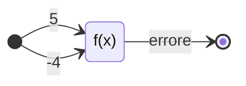
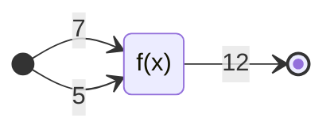
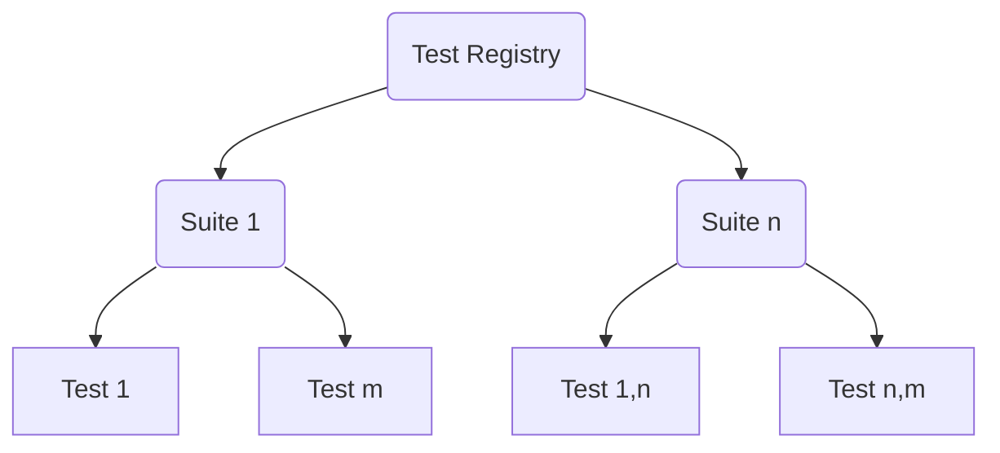

# Test e Debugging

??? def "Bug"
    Errore sintattico o semantico presente in un programma.

??? def "Debug"
    Processo di riconoscimento e rimozione dei bug.

??? warning "Attenzione"
    I bug sono molto frequenti, anche in programmi semplici.
    Il debug è un'attività difficile, che richiede un tempo imprevedibile e
    occorre adottare tutte le tecniche che riducano la presenza di bug e il
    tempo del debug.

Test e Debugging sono due attività diverse, la prima avviene dopo la scrittura
del codice, la seconda invece avviene durante la scrittura dello stesso.
Entrambe mirano a cercare errori nel codice.

Il debugging non viene effettuato sistematicamente, a differenza del testing.

Il testing può essere effettuato anche dopo la stesura di una funzione o altro,
non per forza va effettuato dopo la stesura dell'intero codice.

??? info "Origine della parola Bug"
    Il \(9\) settembre \(1947\) il tenente Grace Hopper ed il suo gruppo
    stavano cercando la causa del malfunzionamento di un computer Mark II
    quando, con stupore, si accorsero che una falena si era incastrata tra i
    circuiti. Dopo aver rimosso l'insetto (alle ore \(15\):\(45\), il tenente
    incollò la falena rimossa sul registro del computer e annotò:
    "\(1545\). Relay \(\#70\) Panel F (moth) in relay. First actual case of
    bug being found".
    Questo registro è conservato presso lo Smithsonian National Museum of
    American History^[\(\dagger\)](https://it.wikipedia.org/wiki/Bug#Storia)^.

Il testing è una fase di verifica sistematica della correttezza di un software.
È una stima della correttezza ed è parte integrante dei processi di sviluppo
del software.
Il testing è parte prevalente nelle metodologie agili.

Il debugging è un processo atto a scovare la causa di un errore.

!!! quote "E. Dijkstra"
    Il testing può solo dimostrare la presenza di bug, ma non la loro assenza.

## Verifica delle condizioni limite

La maggior parte dei bug si verificano in corrispondenza dei limiti:

- Cicli: cosa succede se il numero di cicli è \(0\)?
- Array: cosa succede se si tenta di colmare un array?
- Input: cosa succede se l'input acquisito è nullo?
- Stream: cosa succede se si accede a un file inesistente, un disco pieno,
  una connessione interrotta, etc?

Approccio: ogni volta che si scrive un blocco di codice significativo (ciclo,
condizione, input), è necessario testarne le condizioni limite.

Occorre immaginare tutte le possibili condizioni limite e documentarle.

### Esempio

Il seguente programma tenta di leggere una sequenza di caratteri da un file e
li memorizza in un array fino a quando viene letta una newline o si raggiunge
la dimensione massima `#!c MAX` maggiore di zero:

```c
int i = 0;
char c[MAX];
while ((c[i] = fgetc(file)) != '\n' && (i < MAX - 1)) {
  i = i + 1;
}
c[--i] = '\0';
```

Quali sono le condizioni limite?

1. l'input è vuoto (`#!c '\n'`);
2. `#!c MAX == 1`;
3. l'input ha una lunghezza pari a `#!c MAX`;
4. l'input ha una lunghezza maggiore di `#!c MAX`;
5. l'input non contiene una newline (se possibile).

Riscrivendo il codice usando uno stile più leggibile, si eviterebbe l'errore
del codice precedente:

```c
int i = 0;
char c[MAX];
int stop = 0;
while (!stop && i < MAX) {
  c[i] = fgetc(file);
  stop = (c[i] == '\n');
  i = i + 1;
}
c[--i] = '\0';
```

Esercizio (?)

```c
/**
 * @brief Restituisce la media aritmetica di una lista di numeri.
 *
 * @param a la lista di numeri di cui calcolare la media.
 * @param len_a la lunghezza della lista di numeri.
 * @return la media aritmetica.
 */
double avg(double a[], int len_a) {
  int i;
  double sum = 0.0;
  for (i = 0; i < len_a; i++) {
    sum += a[i];
  }
  return sum / len_a;
}
```

## Programmazione difensiva

Si tratta dell'aggiunta di codice per casi "impossibili":

```c
if (age < 0 || age > MAX_AGE) {
  range = "???";
} else if (age <= 18) {
  range = "Teenager";
} // ...
```

Non si può assumere che i dati ricevuti in input dal programma siano corretti,
il più delle volte non lo sono. in questo modo, il programmatore si cautela da
qualsiasi input venga inserito.

## Controllo dei valori di errore restituiti

Se una funzione restituisce dei valori di errore questi vanno verificati dal
chiamante:

```c

range = num_to_range(age);
if (strcmp(range, "???") == 0) {
  /* errore */
  // ...
} else {
  // ...
}
```

La funzione non deve preoccuparsi di scrivere all'utente che sia sbagliato,
etc, essa riceve un numero e trova la sua categoria. Il resto lo gestisce la
funzione chiamante, altrimenti la funzione chiamante farà il suo normale
lavoro.

È possibile che la funzione chiamante non gestisca direttamente l'errore ma
restituisce un valore specifico e lo gestirà un'altra funzione ancora.

Una funzione dovrebbe avere un solo compito e un solo output, così se sbaglia
è più facile capire chi ha sbagliato e dove, rispetto all'avere più compiti
per la stessa funzione.

## Testing sistematico

### Verifica incrementale

In questa modalità il testing va di pari passo con l'implementazione. Il test
viene effetuato su unità elementari, ovvero:

- una procedura o funzione;
- un blocco significativo di procedura.

### Verifica bottom-up

si tratta di testare prima le parti:

- (componenti/casi) più semplici
- più frequentemente utilizzate

!!! example "Ricerca binaria"
    - in un array vuoto;
    - in un array con un solo elemento;
    - di un elemento minore di quello presente;
    - di un elemento uguale a quello presente;
    - di un elemento maggiore di quello presente:
    - in un array con due elementi:
        - \(5\) combinazioni possibili.
    - in presenza di elementi ripetuti;
    - in presenza di elementi contigui e non contigui.

### Verifica dei risultati attesi

Non è prevista la conoscenza dell'algoritmo.

Per ogni test, occorre conoscere il risultato atteso. Questo è ovvio per molti
casi, ma non per tutti.

Ad esempio, per testare un compilatore si può compilare uno o più programmi
formalmente corretti e testarli.

Per testare un programma di calcolo numerico, è possibile

- verificare i limiti dell'algoritmo;
- verificare proprietà note;
- testare problemi con risultati già noti;
- analisi statistiche.

Mentre per testare un programma grafico/multimediale:

- uso di strumenti di image editing;
- analisi statistiche.

Un esempio di testing di una funzione è il seguente:



oppure



### Verificare la copertura dei test

Il test di copertura è un po' più complicato poiché non si basa più soltanto
sulla conoscienza dei dati di input.

I test devono garantire che ogni istruzione sia eseguita almeno una volta,
questo equivale a testare:

- i tami `then..else`
- tutti i case di una `#!c switch`
- che l'esecuzione dei cicli avvenga:
      - \(0\), \(1\), \(n\), \(n - 1\) volte, con \(n\) massimo.

Nel caso di `#!c if` i rami sono due, all'aggiunta di un altro `#!c if`,
raddoppiano. Nel caso di un ciclo aumentano di molto.

Classi di equivalenza, ad esempio, se \(n \in ]\min,\; \max[\) allora bisogna
verificare cosa sucede nei seguenti casi

\[ n < \min, \qquad n > \max, \qquad n = \min, \qquad n = \max \]

L'analisi del codice può aiutare a individuare gli input che consentono di
coprire tutto il codice. La scelta deve essere tale da far attraversare al
dato un ramo specifico, in modo tale da verificare ogni possibilità.

Non è inoltre detto che ogni funzione debba essere testata con ogni tipo di
test. Ad esempio, se non è presente molta elaborazione sarebbe meglio utilizzare
il test di copertura. Raramente si hanno funzioni con sia molti input che
molta elaborazione.

## Procedure e Funzioni in C

Sono istruzioni non primitive per risolvere parti specifiche di un problema:
i sottoprogrammi (o metodi). Sono realizzate mediante la definizione di
unità di programma (sottoprogrammi) distinte dal programma principale (`main`).
Rappresentano nuove istruzioni/operatori che agiscono sui dati utilizzati dal
programma. Sono definite a partire da una sequenza di istruzioni primitive e
altre procedure/funzioni.

Tutti i linguaggi di alto livello offrono le possibilità di utilizzare
funzioni e procedure mediante:

- costrutti per la definizione di sottoprogrammi;
- meccanismi per la chiamata a sottoprogrammi.

Nei linguaggi ad alto livello funzioni e procedure sono molto utili per
raggiungere:

- Astrazione;
- Riusabilità;
- Modularità (strutturazione);
- Leggibilità.

Nella fase di definizione di una funzione o procedura si stabilisce:

- un identificatore del sottoprogramma (cioè il nome da usare per
  chiamare/invocare lo stesso);
- un corpo del sottoprogramma (cioè, l'insieme di istruzioni che sarà eseguito
  ogni volta che il sottoprogramma sarà chiamato);
- una lista di parametri formali (cioè come avviene la comunicazione tra l'unità
  di programma che usa il sottoprogramma ed il sottoprogramma stesso).

=== "funzione"
    ```c
    // prototipo
    int sum(int a, int b);

    // dichiarazione
    int sum(int a, int b) {
      int c = a + b;
      return c;
    }

    // chiamata
    int main(void) {
      int op1, op2, result;
      // ...
      result = sum(op1, op2);
      return 0;
    }
    ```

    - operatore non primitivo;
    - permette di definire nuovi operatori complessi da affiancare a quelli
      primitivi;
    - restituisce un valore di ritorno (mediante `#!c return`).

=== "procedura"
    ```c
    // prototipo
    void print(int a);

    // dichiarazione
    void print(int a) { printf("%d", a); }

    // chiamata
    int main(void) {
      int value;
      // ..
      print(value);
    }
    ```

    - istruzione non primitiva;
    - è attivabile in un qualunque punto del programma in cui può comparire
      un'istruzione;
    - non restituisce un valore di ritorno (mediante return).

I parametri costituiscono il mezzo di comunicazione tra unità chiamante e unità
chiamata, supportano lo scambio di informazioni tra chiamante e sottoprogramma.

Si differenziano in:

- Parametri formali (specificati nella definizione);
- Parametri attuali (specificati nella chiamata).

Parametri attuali e formali devono corrispondersi in numero, posizione e tipo.

=== "parametri formali"
    Sono quelli specificati nella definizione del sottoprogramma. Sono in
    numero prefissato e a ognuno di essi viene associato un tipo. Le istruzioni
    del corpo del sottoprogramma utilizzano i parametri formali.

=== "parametri attuali"
    Sono i valori effettivamente forniti dall'unità chiamante al sottoprogramma
    all'atto della invocazione.

Il passaggio di parametri può avvenire in due modi:

- per valore;
- per indirizzo (o riferimento).

Il C di default adotta il passaggio per valore:

- il valore dei parametri è copiato nello stack;
- il passaggio per riferimento si ottiene memorizzando nello stack l'indirizzo
  (puntatore) in cui è allocata una variabile;
- il passaggio per valore è anche più "sicuro".

## Unit test

È una tecnica di progetto e sviluppo del software e serve a ottenere evidenza
che le singole unità software sviluppate siano corrette e pronte all'uso.
In un linguaggio procedurale come il C una unità può essere un programma, una
funzione, ecc.

Per effettuarlo si scrivono degli unit test (o casi di test) rappresentanti
una sorta di "contratto scritto" che la porzione di codice testata deve
soddisfare.

### xUnit test framework

In principio è stato creato JUnit per Java, da Kent Beck e Erich Gamma.

!!! quote "M. Fowler"
    Never in the field of software development have so many owed so much to so
    few lines of code.

È stato portato verso innumerevoli altri linguaggi (C/C++, C#, PHP, Python,
JavaScript, Ruby, etc) dando vita all'ecosistema dei framework di tipo xUnit

Ha dato vita al Test-Driven Development (TDD, *sviluppo guidato dal test*).

### CUnit

È un framework di unit test per il linguaggio C la cui home page è la seguente
<http://cunit.sourceforge.net/index.html>.

È una libreria che va inclusa in ogni progetto Eclipse CDT che intende
avvalersene. La guida di installazione è disponibile qui:
<http://collab.di.uniba.it/fabio/guide/>

#### Struttura del framework

Il framework esegue automaticamente tutte le test suite inserite nel test
registry. Ogni test suite è composta da uno o più test method logicamente
correlati (es. suite per testare tutti i metodi di un particolare modulo).



### Method under test

Il programma da testare è costituito da diversi file `.c` (detti moduli)
contenenti diverse funzioni e/o procedure (es. `#!c func_1()`, `#!c func_n()`o
`#!c proc_n()`, `#!c proc_m()`). Queste funzioni e procedure sono detti
**methods under test**. Per ciascun metodo da testare occorre scrivere almeno
un test method. Ciascun metodo di test va chiamato `#!c test_xyz()` (es
`#!c test_funz_1()`, `#!c test_funz_n()`, o `#!c test_proc_1()`,
`#!c test_proc_m()`).

Un metodo di test verifica la presenza di errori nel corrispettivo metodo
sotto test. Con errore si intende un comportamento diverso da quello atteso.

!!! warning "Attenzione"
    L'ordine di inserimento ha importanza! Le test suite sono eseguite nello
    stesso ordine di inserimento nel registry mentre i  test method sono
    eseguiti nello stesso ordine di inserimento nella suite.

### Ciclo di unit test

Sequenza tipica di uso di un framework di unit test, incluso CUnit:

1. Scrivi tutti i test method necessari;
2. Crea il test registry;
3. Crea la test suite e aggiungila al test registry;
4. Aggiungi i test method alle test suite definite;
5. Se necessario, ripeti i passi 3-4 per un'altra suite;
6. Esegui il test registry;
7. Pulisci il test registry.

### Aggiungere le librerie CUnit a un progetto

Guida di installazione e configurazione disponibile alla sezione dispense sul
sito del corso: <http://collab.di.uniba.it/fabio/guide/>.

Quando si prepara il modulo con i metodi di test ricordate di includere i file
header in questo modo:

```c
#include "CUnit/Basic.h"
#include <stdio.h>
#include <stdlib.h>
```

#### Scrivere un test method

Un metodo di test in CUnit si presenta sempre nella forma di procedura senza
parametri.
◆ void test_xyz(void)
➔ Un metodo di test è un contratto che stabilisce i vincoli
che devono essere soddisfatti dal software
◆ I vincoli sono stabiliti attraverso delle asserzioni
◆ Un'asserzione in un linguaggio di programmazione è
una funzione che verifica una condizione logica e
restituisce:
● Vero, se l'asserzione è rispettata
● Falso, altrimenti

Asserzioni di base (CUnit)
Asserzione
Significato
CU_ASSERT(int espressione)
CU_TEST(int espressione)
Asserisce che espressione è TRUE (diverso da 0)
CU_ASSERT_TRUE(valore)
Asserisce che valore è TRUE (diverso da 0)
CU_ASSERT_FALSE(valore)
Asserisce che valore è FALSE (uguale a 0)
CU_ASSERT_EQUAL(reale, atteso)
Asserisce che reale == atteso
CU_ASSERT_NOT_EQUAL(reale, atteso)
Asserisce che reale != atteso
CU_ASSERT_STRING_EQUAL(reale, atteso)
Asserisce che le stringhe reale e atteso coincidono
CU_ASSERT_STRING_NOT_EQUAL(reale,
atteso)
Asserisce che le stringhe reale e atteso
differiscono

void test_max(void) {
CU_ASSERT_EQUAL(max(0,2), 2);
CU_ASSERT_TRUE(max(0,-2) == 0);
CU_TEST(max(2,2) == 2);
// questa asserzione è sbagliata e fallisce
CU_ASSERT_TRUE(max(5,6) == 2);
}
Esempio di test method per
la funzione max(a,b)

void test_factorial(void) {
// fallisce
CU_ASSERT_EQUAL(factorial(4), 12 );
CU_ASSERT(factorial(3) == 6);
CU_TEST(factorial(6) == 720);
}
Esempio di metodo di test
per la funzione factorial(x)
1
se n = 0
n! =
n(n-1)!
se n > 1

Ciclo di Unit Test
1.Scrivi tutti i test method necessari
2.Crea il test registry
3.Crea la test suite e aggiungila al test registry
4.Aggiungi i test method alle test suite definite
5.Se necessario, ripeti i passi 3-4 per un'altra suite
6.Esegui il test registry
7.Pulisci il test registry

Il Test Registry
➔Raccoglie tutte le test suite
➔Quando si esegue un Test Registry si
eseguono tutte le suite al suo interno e, di
conseguenza, tutti i test method all'interno
delle suite

Inizializzazione del
Test Registry
46
L'inizializzazione del test registry è la prima
operazione da effettuare

47
Ciclo di Unit Test
1.Scrivi tutti i test method necessari
2.Crea il test registry
3.Crea la test suite e aggiungila al test registry
4.Aggiungi i test method alle test suite definite
5.Se necessario, ripeti i passi 3-4 per un'altra suite
6.Esegui il test registry
7.Pulisci il test registry

Test Suite
48
➔Una test suite è definita da:
◆ Una descrizione testuale
◆ Una procedura di inizializzazione (init)
◆ Una procedura di pulitura (clean)
➔Le test suite definite vengono aggiunte al
test registry (l'ordine è rilevante!)
➔
Di default inizializzazione e pulitura sono procedure vuote.

Inizializzazione e pulizia
delle suite
➔Le test suite devono essere inizializzate e
ripulite prima e dopo l'uso
◆ I metodi non sono forniti da CUnit ma devono essere
scritti dal programmatore
➔Perché?
◆ Perché devono liberare le risorse allocate
specificatamente per eseguire il caso di test
●
Es. file, connessioni, etc.
49

Inizializzazione e pulizia
// Alloca tutte le risorse necessarie all'esecuzione
// dei test
int init_suite_default(void) {
return 0; // tutto ok
}
// dealloca tutte le risorse allocate all'inizializzazione
int clean_suite_default(void) {
return 0; // tutto ok
}
50

51
Ciclo di Unit Test
1.Scrivi tutti i test method necessari
2.Crea il test registry
3.Crea la test suite e aggiungila al test registry
4.Aggiungi i test method alle test suite definite
5.Se necessario, ripeti i passi 3-4 per un'altra suite
6.Esegui il test registry
7.Pulisci il test registry

Test method e test suite
52
➔
Un test method viene aggiunto ad una
test suite specificando:
◆
il puntatore alla suite
◆
una descrizione testuale del test
◆
il puntatore al test method
L'ordine dei test nelle suite è rilevante!

53
Ciclo di Unit Test
1.Scrivi tutti i test method necessari
2.Crea il test registry
3.Crea la test suite e aggiungila al test registry
4.Aggiungi i test method alle test suite definite
5.Se necessario, ripeti i passi 3-4 per un'altra suite
6.Esegui il test registry
7.Pulisci il test registry

Registrazione ed
esecuzione dei test
54
➔La procedura CU_basic_run_tests esegue tutte
le suite del registry e mostra i risultati
È possibile impostare il livello di "verbosità"
dell'output

1.Scrivi tutti i test method necessari
2.Crea il test registry
3.Crea la test suite e aggiungila al test registry
4.Aggiungi i test method alle test suite definite
5.Se necessario, ripeti i passi 3-4 per un'altra suite
6.Esegui il test registry
7.Pulisci il test registry
55
Ciclo di Unit Test

56
Pulire il registry
➔Pulizia – dopo aver eseguito tutti i test nel
registro
◆ Procedura void CU_cleanup_registry(void)
➔
Il main() termina con la return dell'eventuale codice di errore di CUnit

Esercitazione 1
CUnit
Link all'esercitazione
<http://goo.gl/VYfhsN>
Implementazione di una serie di funzioni e
testing di queste con l'utilizzo di CUnit
template di CUnit disponibile a
<http://goo.gl/uevMHu>
57

58
Debugging

59
Ariane 5 Flight 501

testing vs. debugging
➔Il testing è una fase di verifica sistematica
della correttezza di un software.
➔Il debugging è un processo atto a
scovare la causa di un errore.
◆ è un processo costoso, dai tempi non prevedibili
◆ l'esperienza è importante
◆ gli strumenti possono velocizzare il debugging
60

Supporto del compilatore
➔Molti compilatori emettono dei "warning",
cioé dei messaggi di avvertimento
◆ if (a=0) …
◆ x = x
◆ nessun return
◆ codice orfano
◆ condizioni tautologiche
◆ ...
61

Backward reasoning
➔Quando si scopre un bug, occorre "pensare
al contrario"
◆ Partendo dal risultato, occorre risalire alla catena
delle cause che lo hanno portato.
◆ Una delle cause della catena sarà errata
➔Scrivere codice leggibile aiuta al backward
reasoning e, quindi, a localizzare i bug
62

Pattern familiari
➔Riconoscere variazioni rispetto a "modelli"
(pattern) di codice familiari
➔L'uso di un corretto stile di programmazione
aiuta a ridurre la presenza di bug
63
int n;
scanf("%d", n);
int n;
scanf("%d", &n);

Sviluppo incrementale
➔Testare le procedure man mano che
vengono sviluppate
◆ Se i test all'istante t hanno successo ma falliscono
all'istante t+1, allora molto probabilmente i big si
annidano nel codice sviluppato tra t e t+1
➔La progettazione modulare del codice aiuta a
individuare meglio la posizione dei bug
64

Esaminare codice simile
➔Se un bug è presente in una porzione di
codice, allora è probabile che se ne annidi
un altro in un codice simile
◆ problema del "copy-and-paste"
➔Una buona progettazione del codice riduce
la ridondanza e, quindi, la possibilità di bug
duplicati
65

Non rimandare il debugging
➔Se un bug è individuato, va eliminato subito
◆ Il trasferimento di un bug nei passi successivi del
ciclo di sviluppo di un software fa crescere il costo
del debugging in termini esponenziali.
66
"The Mars Pathfinder mission was widely
proclaimed as "flawless" in the early days after its
July 4th, 1997 landing on the Martian surface. [...]
But a few days into the mission, not long after
Pathfinder started gathering meteorological data,
the spacecraft began experiencing total system
resets, each resulting in losses of data."
(D. Wilner, 1997 IEEE Real-Time Systems Symposium)

Leggere e spiegare il codice
➔Leggere il codice e comprenderne il
significato
◆ Il codice è un pezzo di conoscenza che deve essere
compreso dalla macchina e da chi la programma
◆ La leggibilità del codice è fondamentale
➔Spiegare ad altri il codice aiuta a ridurre
"bias" cognitivi
67

Rendere riproducibile un
bug
➔Individuare tutte le condizioni che portano
alla manifestazione di un bug
◆ Input e altri parametri
◆ Condizioni della macchina
◆ Seed di numeri casuali
◆ ...
68

Divide et impera
➔Individuare le condizioni minimali che
rendono manifesto un bug
◆ es. il più piccolo array, la stringa più breve
●
Test dei casi limite è fondamentale
◆ Le condizioni minimali possono facilitare la
localizzazione di un bug
◆ Se il bug non si manifesta in un caso limite, provare
mediante dimezzamenti successivi dell'input
●
Ricerca binaria sulla lunghezza dell'input
69

Ricerca di regolarità
➔Alcuni bug si presentano con regolarità, ma
non sempre
➔In questo caso, occorre capire il modello
("pattern") che genera la regolarità
◆ Es. Un editor di testi salta la visualizzazione di alcuni
caratteri
◆ L'analisi del testo mostra che i caratteri saltati sono
sempre intervallati da 1023 caratteri stampati
●
Regolarità: 1 carattere saltato ogni 1023
◆ L'analisi del codice rivela che gli array che
memorizzano le stringhe sono da 1024 byte
●
1023 caratteri + ‘\0' → BUG
70

Stampe ausiliarie
➔Per seguire l'esecuzione di un programma
può essere utile introdurre stampe ausiliarie
◆ Valido soprattutto per situazioni che non possono
essere tracciate da un debugger
●
es. sistemi distribuiti, programmi paralleli, etc.
➔Le stampe ausiliarie devono
necessariamente essere eliminate dopo aver
scovato il bug
◆ Rischio di violazione delle specifiche
◆ Possono essere commentate anziché eliminate
➔Per situazioni complesse, si possono usare
strumenti di logging
71

Altre tecniche
➔Visualizzazioni grafiche
➔Test statistici
➔Strumenti di analisi di testo
◆ grep
◆ diff
◆ ...
72

Debugger
➔Un debugger guarda "dentro" il programma
durante l'esecuzione
◆ Tracing del programma
◆ Visualizzazione del contenuto delle variabili
◆ Valutazione dinamica di espressioni
◆ Breakpoint, anche condizionali
◆ Stack trace
◆ …
➔Sono strumenti molto sofisticati, abituarsi al
loro uso può migliorare significativamente la
produttività nella programmazione.
73

Compilazione per il debug
➔Un debugger ha bisogno di informazioni
aggiuntive nel codice compilato
◆ link tra il codice compilato e il codice sorgente
➔Per stabilire la corrispondenza tra codice
compilato e codice sorgente, la compilazione
per il debug non deve essere ottimizzata
➔Due modalità di compilazione
◆ Debug
●
Meno efficiente, per il debug
◆ Release
●
Ottimizzata
74

la debug perspective in Eclipse
75

Esecuzione passo-passo
➔Il debugger consente di eseguire il
programma una istruzione alla volta
◆ Al termine dell'esecuzione di una istruzione, il
controllo passa al debugger, che può visualizzare lo
stato della macchina (variabili, stack, etc.)
➔Per velocizzare il processo di debugging, si
può optare per eseguire il programma fino a
un'istruzione specifica, segnalata da un
breakpoint.
76

Esecuzione passo-passo
77
Step into
Esegue l'istruzione
corrente, e procede
all'istruzione
successiva che sarà
effettivamente eseguita
Step over
Esegue l'istruzione
corrente, trattando le
routine come istruzioni
primitive.
Step return
continua l'esecuzione
fino al termine della
procedura.

Step Into
78

Step over
79

Step return
80

Informazioni di debug:
variabili
➔Le variabili visibili
nell'ambito
dell'istruzione
corrente sono
visualizzate
◆ Nome, tipo, valore
➔Le variabili che
cambiano valore
sono evidenziate
81

Informazioni di debug:
espressioni
➔Un'espressione è un
pezzo ben formato
di codice (snippet)
che può essere
valutato per
produrre un risultato
82

Informazioni di debug:
stack trace
➔Visualizza la pila
delle chiamate
➔Si può selezionare
un elemento della
pila per conoscerne
lo stato corrente
83

Breakpoint
➔Un breakpoint interrompe il flusso di
esecuzione su una linea selezionata
◆ I breakpoint possono essere inseriti o rimossi
◆ I breakpoint inseriti possono essere attivati o
disattivati
84

Resume & Terminate
➔Resume
◆ Esegue le istruzioni fino al prossimo
breakpoint oppure al termine del
programma
➔Terminate
◆ Interrompe l'esecuzione del programma
●
Utile quando il programma va in loop infinito
●
Utile quando si scova un programma
◆ Attenzione: i programmi non terminati
rimangono in esecuzione per il sistema
operativo
●
Occupazione inutile di memoria
●
Problemi per la ricompilazione
85

Breakpoint condizionali
➔I breakpoint possono interrompere
l'esecuzione solo quando una condizione
diventa vera
◆ Condizione: espressione booleana
86
