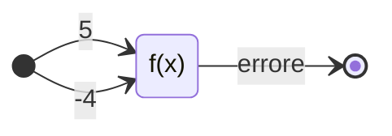
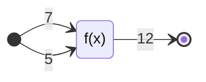

# Appunti del 09-03-2023

## Programmazione difensiva

aggiunta codice per casi impossibili

```c
if (age < 0 || age > MAX_AGE) {
  range = "???";
} else if (age <= 18) {
  range = "Teenager";
} // ...
```

non si può assumere che i dati ricevuti in input dal programma siano corretti,
il più delle volte non lo sono. in questo modo, il programma si cautela da
qualsiasi input venga inserito.

## Controllo dei valore di errore restituiti

se una funzione restituisce dei valori di errore questi vanno verificati dal
chiamante.

```c
range = num_to_range(age);
if (strcmp(range, "???") == 0) {
  /* errore */
  // ...
} else {
  // ...
}
```

la funzione non deve preoccuparsi di scrivere all'utente che sia sbagliato,
etc. riceve un numero e trova la categoria. le cose precedenti se le accolla
la funzione chiamante. altrimenti la funzione chiamante farà il suo normale
lavoro.

È possibile che la funzione chiamante non gestisca direttamente l'errore ma
restituisce un valore specifico e lo gestirà un'altra funzione ancora.

una funzione dovrebbe avere un solo compito e un solo output, così se sbaglia è
più facile capire chi ha sbagliato e dove, rispettoa all'avere più compiti per
la stessa funzione.

un solo compito = più facile capire chi sbaglia.

## Testing sistematico

- verifica incrementale;
- verifica bottom-up (ha a che fare con più di un'unità);
- verifica dei risultati attesi (ha a che fare con più di un'unità);
- verifica della copertura: si incarica di vedere cosa c'è dentro la funzione.

### Verifica dei risultati attesi

non prevede la conoscenza dell'algoritmo, anzi meglio se non la si conosce.

per ogni test, occorre conoscere il risultato atteso.

Ovvio per molti casi ma non per tutti.



oppure



### Verificare la copertura dei test

test devono garantire ogni istr sia exe almeno una volta; then-else, tutti
i casi si uno switch, exe dei cicli.

Classi di equivalenza

il test di copertura è un po' più complicato poiché non si basa più soltanto
sulla conoscienza dei dati di input.

la scelta deve essere tale da far attraversare al dato un ramo specifico,
oppure un altro, in modo tale da verificare ogni possibilità.

es.

```c
A = 0;
B = 5;
if (A > B) {
  /* then */
} else {
  /* else */
}
```

i percorsi sono due (then e else). all'aggiunta di un if raddoppiano. col
l'aggiunta di un ciclo aumentano un sacco.

non è detto che ogni f debba essere testata con ogni tipo di test.

se c'è molta elaborazione conviene il test di copertura. raramente si hanno
funzioni con sia molti input che molta elaborazione.

## CUnit

cos'è non lo richiede, gli interessa solo l'esito.

### Unit test

è una tecnica di progetto e sviluppo software

serve a ottenere evidenza che le singole unità SW siano corrette e pronte
all'uso.

si possono exe test su valori attesi in CUnit. dici cosa ti aspetti e lui ti
dice se va bene o meno.

si scrivono unit test rappresentanti una sorta di "contratto scritto" che la
porzione di codice testata deve soddisfarre.

la scocciatura di CUnit è che bisogna trovare un altro progetto in cui si
sostituisce il main in quello di CUnit e si lascia tutto il resto. Viene exe
quel progetto, se ci sono errori la correzione va effettuata nel progretto
principale.

### Asserzioni di base CUnit

| Asserzione                   | Significato                               |
| --                           | --                                        |
| `CU_ASSERT`<br>`CU_TEST`     | asserisce che expr è TRUE                 |
| `CU_ASSERT_TRUE`             | asserisce che il val è TRUE               |
| `CU_ASSERT_FALSE`            | asserisce che il val è FALSE              |
| `CU_ASSERT_EQUAL`            | asserisce che reale == atteso             |
| `CU_ASSERT_NOT_EQUAL`        | asserisce che reale != atteso             |
| `CU_ASSERT_STRING_EQUAL`     | asserisce che il val della str sia uguale |
| `CU_ASSERT_STRING_NOT_EQUAL` | asserisce il val della stringa è diverso  |

```c
void test_max(void) {
  CU_ASSERT_EQUAL(max(0, 2), 2);
  CU_ASSERT_TRUE(max(0, -2) == 0);
  CU_TEST(max())
}
```

***

## ho mancato il titolo

### Procedure e funzioni

istr non primitive per risolvere parti specifiche di un problema:
sotto-programmi. (o **metodi**).

realizzate mediante la def di unità programmata distinta dal prog principale
(main).

rappresentano nuove istr/op che agiscono sui dati utilizzati dal programma

possono essere a uso personale o a uso generico (le possono usare tutti)

sono definite a partire di una seq di istr primitive e altre procedure/func.

#### definizione

in questa fase si definisce:

- un identificatore del sottoprogramma (il nome dev'essere chiaro così nel
  test fornisce un'indicazione rapida di ciò che fa);
- corpo del sottoprogramma (stessa cosa, nome var significativi);
- lista di parametri formali.

=== "funzione"

    hanno output

    ```c
    // prototipo
    int sum(int a, int b);

    // dichiarazione
    void sum(int, a, int b) {
        int c = a + b;
        return c;
    }

    // chiamata
    int sum(void) { // da continuare!
        int value;
        // ...
        print(value);
    }
    ```

=== "procedura"

    non hanno output

    ```c
    // prototipo
    void print(int a);

    // dichiarazione
    void print(int, a) {
        printf("%d", a);
    }

    // chiamata
    int main(void) {
        int value;
        // ...
        print(value);
    }
    ```

### Parametri formali e attuali

=== "formali"

    - specificati nella def del sotto-programma
    - sono in numero prefissato e ad ognuno di essi viene associato un tipo
    - le istruzioni del corpo del sotto-programma utilizzano parametri formali

=== "attuali"

    sono i valori effettivamente forniti dall'unità chiamante al
    sotto-programma all'atto della invocazione.

### Associazione tra parametri formali e attuali

il passaggio può avvenire in due modi:

- per valore;
- per indirizzo o riferimento (+ avanti).

il C di default adotta il passaggio per valore.

- val copiato nello stack;
- passaggio per riferimento si ottiene memorizzando nello stack l'indirizzo
  in cui è allocata una variabile;
- il passaggio per valore è anche più "sicuro".

(test a copertura vedere codice, a valori attesi no)

riesercitarsi sulle funzioni così dalla prox sett si è in grado di scrivere il
codice assegnato.
