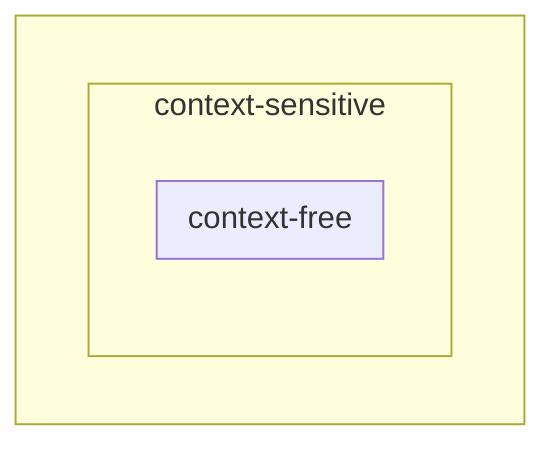

# Linguaggi liberi da contesto e linguaggi dipendenti da contesto

## Grammatica libera da contesto

Una grammatica \(\grammar\) è **libera da contesto** (o **context-free**) se,
per ogni produzione, \(v \to w\) è un simbolo non-terminale.

\[
    G \text{ context-free } \deff \forall v \to w \in P : v \in V
\]

## Linguaggio context-free

Un linguaggio \(L\) su un alfabeto \(X\) è **libero da contesto** se può essere
generato da una grammatica libera da contesto

\[
    L \text{ context-free} \deff \exists G \text{ context-free} \tc L(G) = L
\]

Se si ha una grammatica context-free che genera \(L\), non è detto che non
esista un'altra grammatica che generi lo stesso linguaggio.

La maggior parte dei linguaggi di programmazione sono context-free. Il termine
context-free nasce dal fatto che la sostituzione di un simbolo non-terminale non
è condizionata dal contesto, ossia dai caratteri adiacenti in cui compare.

Un simbolo non-terminale A in una forma di frase può sempre essere sostituito
usando una produzione del tipo \(A \to \beta\). La sostituzione è sempre valida.

Viceversa, se \(L = L(G)\) e \(G\) non è context-free, non è possibile concludere
che \(L\) non è context-free perché non è possibile escludere che esista una
grammatica context-free \(G'\) per cui \(L = L(G')\).

!!! example "Esempi"

    - Il linguaggio delle parentesi ben formate o quello dei numeri interi
      relativi o il linguaggio delle stringhe con egual numero di \(0\) e \(1\);
    - Il linguaggio \(L = \set{a^n b^n \mid n > 0}\) o il linguaggio
      \(L = \set{a^n b^{2n} \mid n > 0}\);

## Grammatica dipendente da contesto

Una grammatica \(\grammar\) è **dipendente da contesto** (o **context-sensitive**),
se ogni produzione è in una delle seguenti forme:

1. \(yAz \to ywz\) con \(A \in V\), \(y,z \in \XuVast\), \(w \in \XuVplus\) che
   si legge: "\(A\) può essere sostituita con \(w\) nel contesto \(y{-}w\)"
   (contesto sinistro \(y\) e contesto destro \(z\));
2. \(S \to \lambda\) purché \(S\) non compaia nella parte destra di alcuna
   produzione.

## Linguaggio dipendente da contesto

Un linguaggio \(L\) è **dipendente da contesto** se può essere generato da una
grammatica dipendente da contesto.

## Linguaggi context-free e context-sensitive

La relazione è la seguente

<!-- markdownlint-disable MD046 -->

<!-- markdownlint-enable MD046 -->

Tale relazione sussiste perché le regole di produzione context-sensitive sono
una generalizzazione di quelle context-free. Le produzioni context-free sono un
caso particolare delle produzioni di tipo 1. delle grammatiche context-sensitive,
che si verifica quando \(y = z = \lambda\), ovvero il contesto destro e sinistro
sono equivalenti alla parola vuota.

!!! warning "Eccezione"

    Osservando con attenzione la definizione di grammatica context-free, si nota
    che \(w \in \XuVast\) mentre nella definizione di grammatica context-sensitive
    \(w \in \XuVplus\).

    Dunque le grammatiche context-free ammettono produzioni del tipo \(A \to \lambda\)
    con \(A\) che può anche non essere il simbolo iniziale, mentre le grammatiche
    context-sensitive non ammettono tali produzioni.

    Verranno chiamate tutte le produzioni del tipo \(\lambda\)-**produzioni** o
    \(\lambda\)-**regole**.

Alcuni esempi di produzioni contestuali sono i seguenti:

- \(bC \to bc\);
- \(baACba \to baAabA\).

Esempi di grammatica contestuale sono i seguenti:

- \(S \to \lambda \mid bC\)[^1];
- \(bC \to bC\)

Un esempio di produzione non context-sensitive (né context-free) è il seguente:

\[ CB \to BC \]

Quest'ultima non è né context-sensitive né context-free. È una produzione
**monotona** perché del tipo \(v \to w\) con \(\abs{v} \leq \abs{w}\).

## Grammatica monotona

Una grammatica \(\grammar\) è **monotona** se ogni sua produzione è monotona,
ovvero se

\[ \forall v \to w \in P : \abs{v} \leq \abs{w} \]

## Linguaggio monotono

Un linguaggio \(L\) è monotono se può essere generato da una grammatica monotona.

### Esempio

Produzioni monotone:

- \(AB \to CDEF\);
- \(CB \to BC\).

Una produzione monotona può essere sostituita da una sequenza di produzioni
contestuali senza alterare il linguaggio generato; la prima produzione può
essere sostituita dalle seguenti produzioni contestuali:

- \(AB \to AG\);
- \(AG \to CG\);
- \(CG \to CDEF\).

La seconda produzioni, può essere sostituita dalle seguenti produzioni contestuali:

- \(CB \to XB\);
- \(XB \to XC\);
- \(XC \to BC\);

oppure

- \(CB \to X_1 B\)
- \(X_1 B \to X_1 X_2\);
- \(X_1 X_2 \to X_1 C\);
- \(X_1 C \to BC\);

## Proposizione

La classe dei linguaggi contestuali coincide con la classe dei linguaggi monotoni.

Tale proposizione deriva immediatamente dal teorema seguente

## Teorema

Sia \(G\) una grammatica monotona, ovvero tale che ogni produzione di \(G\) è
della forma \(v \to w\), con \(\abs{v} \to \abs{w}\), eccetto che è possibile
un'unica \(\lambda\)-produzione \(S \to \lambda\) se \(S\) non appare alla destra
di una produzione. Esiste allora una grammatica context-sensitive \(G'\)
equivalente a \(G\), ovvero tale che \(L(G) = L(G')\).

È possibile enunciare il teorema nel seguente modo:

Un linguaggio \(L\) è dipendente da contesto se e solo se \(\exists G : L = L(G)\)
e ogni produzione di \(G\) nella forma \(u \to v\) ha la proprietà
\(0 < \abs{u} \leq \abs{v}\), con una sola eccezione: se \(\lambda \in L(G)\)
allora \(S \to \lambda\) è una produzione di \(G\) e in tal caso \(S\) non può
comparire nella parte destra di altre produzioni.

### Dimostrazione

\(\implies\)

Se \(L\) è dipendente da contesto allora, per definizione, esiste \(G\) dipendente
da contesto tale che \(L = L(G)\):

\[
    L \text{ context-sensitive} \deff
    \exists G \text{ context-sensitive } : L = L(G)
\]

allora ogni produzione di \(G\) è in una delle seguenti due forme:

1. \(yAz \to ywy\) con \(A \in V,\; y,z \in \XuVast,\; w \in \XuVplus\);
2. \(S \to \lambda\) con \(S\) che non compare nelle parte destra di alcuna
   produzione.

Dunque, ogni produzione di \(G\) verifica la condizione \(u \to v\), con
\(0 < \abs{u} \leq \abs{v}\) se è del tipo 1., mentre con \(S\) che non compare
a destra di alcuna produzione se è del tipo 2. ricade nell'eccezione. Pertanto
la grammatica \(G\) è quella cercata.

\(\impliedby\)

Sia \(G\) una grammatica in cui ogni produzione è nella forma \(u \to v\) con
\(0 < \abs{u} \leq \abs{v}\). Senza ledere alla generalità della dimostrazione,
è possibile supporre che una generica produzione di \(G\) sia del tipo:

\[
    A_1 A_2 \dots A_m \to B_1 B_2 \dots B_n \; m \leq n
\]

con \(A_i \in V,\; i = 1, 2, \dots, m\). È legittimo affermare ciò in quanto, se
\(A_j\) fosse un simbolo terminale, sarebbe possibile sostituirlo nella produzione
con un nuovo simbolo non-terminale e aggiungere la nuova produzione \(A_j' \to A_j\).

Si denotino con \(C_1,\, C_2,\, \dots,\, C_m\) gli \(m\) simboli non-terminali
non presenti in \(G\). Utilizzando i \(C_k\) simboli, con \(k = 1, 2, \dots, m\)
per costruire le nuove regole contestuali che riscrivono la stringa
\(A_1 A_2 \dots A_m\) con \(B_1 B_2 \dots B_n\), si ha:

\[
    \left.\begin{array}{@{}ll@{}}
        A_1\, A_2 \dots A_m \to C_1\, A_2 \dots A_m                 \\
        C_1\, A_2 \dots A_m \to C_1\, C_2\, A_3 \dots A_m           \\
        \vdots                                                      \\
        C_1\, C_2 \dots C_{m-1}\, A_m \to
              C_1\, C_2 \dots C_{m-1}\, C_m\, B_{m+1} \dots B_n     \\
        C_1\, C_2 \dots C_{m-1}\, C_m\, B_{m+1} \dots B_n \to
              C_1\, C_2 \dots C_{m-1}\, C_m\, B_{m+1} \dots B_n     \\
        \vdots                                                      \\
        C_1\, B_2\, \dots B_n \to B_1\, B_2 \dots B_n
    \end{array}\right\}
\]

La nuova grammatica che incorpora queste produzioni è contestuale e si può
dimostrare che \(L(G) = L(G')\).

[^1]:
    \(S \to \lambda\) è una produzione context-sensitive e \(S\) non compare a
    destra di un'altra produzione.
