# Introduzione ai linguaggi di programmazione ed alla teoria dei linguaggi formali

## Apprendimento di un linguaggio di programmazione

Una delle competenze fondamentali di un buon informatico è quella di apprendere
un nuovo linguaggio di programmazione con naturalezza e velocità. Questa
competenza non la si acquisisce soltanto imparando ex novo molti linguaggi
diversi.

Nelle _lingue naturali_ esistono delle analogie, delle somiglianze dovute dalla
genealogia. Ad esempio tra l'italiano e il rumeno: cioccolata/ciocolata,
insalata/salata, treno/tren.

È invece difficile conoscere un gran numero di linguaggi di programmazione in
modo approfondito, è però possibile conoscerne a fondo i meccanismi che ne
ispirano il progetto e l'_implementazione_.

## Implementazione dei linguaggi di programmazione

!!! question "Che significa _implementare_ un linguaggio di programmazione?"

    Si tratta di un concetto strettamente legato a quello di **macchina astratta**.

Un **calcolatore** è una macchina fisica che:

- consente di eseguire algoritmi opportunamente formalizzati[^1] perché siano
  "comprensibili" all'esecutore;
- la formalizzazione consiste nella codifica degli algoritmi in un certo
  linguaggio $\ll$ definito da una specifica sintassi;
- la sintassi di $\ll$ permette di utilizzare determinati costrutti per comporre
  programmi in $\ll$
- Un programma in $\ll$ è una sequenza di istruzioni del linguaggio $\ll$.

Una _macchina astratta_ è un'astrazione del concetto di calcolatore fisico.

### Macchina astratta e linguaggio macchina

Una macchina astratta per $\ll$ è un insieme di algoritmi e strutture dati che
permettono di memorizzare ed eseguire programmi scritti in $\ll$.

Si denota con $\ml$ ed è composta da:

- una memoria per immagazzinare dati e programmi;
- un interprete che esegue le istruzioni contenute nei programmi.

!!! def "Linguaggio Macchina"

    Data una macchina astratta $\ml$, il linguaggio $\ll$ "compreso"
    dall'interprete di $\ml$ è detto linguaggio macchina di $\ml$.

### Struttura di una macchina astratta

Vediamo la struttura di una macchina astratta:


La memoria viene utilizzata per contenere sia i programmi che i dati utili a
questi ultimi. \ll'$interprete ha tre moduli e ha anche accesso ad una serie di
operazioni. Queste sono operazioni sui tipi e sui parametri dei dati, ma anche
operazioni e istruzioni per il controllo della sequenza di esecuzione.

Dunque, operazioni per l'elaborazione dei dati primitivi: numeri interi, reali,
operazioni aritmetiche.

Le operazioni e strutture dati per il controllo della sequenza di esecuzione:

- servono per gestire il flusso di controllo delle istruzioni;
- strutture dati per memorizzare l'indirizzo della prossima istruzione;
- operazioni per manipolare le strutture dati (es. calcolo dell'indirizzo
  della prossima istruzione).

Operazioni e strutture dati per il controllo del trasferimento dei dati:

- gestiscono il trasferimento dei dati dalla memoria all'interprete e viceversa
  (es.: recupero degli operandi);
- possono far uso di strutture dati ausiliarie (es. pila).

Operazioni e strutture dati per la gestione della memoria, relative all'allocazione
di memoria per dati e programmi.

## Ciclo di esecuzione del generico interprete

```mermaid
flowchart TD
    start((Start)) --> AcqProx(Acquisisci la<br>prossima istruzione)
                   --> Decode(Decodifica)
                   --> AcqOps(Acquisisci gli operandi)
                   --> Choose(Seleziona);

    Choose --> Eop1("Esegui 𝑂𝑃ₙ") &  Eop2("Esegui 𝑂𝑃₂") & Eopn("Esegui 𝑂𝑃₁")
           --> MemRes(Memorizza il risultato)
           ---> start;

    Choose --> Halt("Esegui 𝐻𝐴𝐿𝑇")
           --> stop((Stop));
```



## Realizzazione di una macchina astratta

Per essere effettivamente utilizzata, $\ml$ dovrà prima o poi utilizzare
qualche dispositivo fisico, ovvero mediante una realizzazione "fisica" in
hardware. In questo caso gli algoritmi di $\ml$ sono realizzati direttamente
mediante dispositivi fisici.

È possibile pensare a delle realizzazioni che fanno uso di livelli intermedi tra
$\ml$ e il dispositivo fisico:

- simulazione mediante software;
- emulazione mediante firmware (microprogrammi in linguaggi di basso livello).

La realizzazione hardware è la più semplice ma al contempo la più onerosa a
livello di costi. È necessario realizzare delle macchine fisiche che, al termine
della vita del linguaggio di programmazione saranno obsolete.

I metodi più convenienti sono quelli software o firmware[^2]. La grande
maggioranza simula via software e in questo modo viene svincolata la macchina
astratta da quella fisica.

Una macchina astratta non è altro che l'insieme di linguaggio e software di base
che permettono di eseguire il linguaggio su varie piattaforme.

### Realizzazione mediante software

Per poter realizzare via software una macchina astratta è necessario realizzare
degli algoritmi e delle strutture dati di $\ml$ in un altro linguaggio $\ll'$
che sia già implementato. Dunque, $\ml$ viene realizzata mediante dei programmi
in $\ll'$ che simulino le funzionalità di $\ml$.

La macchina $\ml$ viene realizzata attraverso la macchina $\mlp$. Quest'ultima
viene detta macchina ospite e si denota con $\molo$.

Intuitivamente l'implementazione di $\ll$ sulla macchina ospite avviene mediante
una qualche "traduzione" di $\ll$ in $\llo$;

 A seconda di come avvenga la traduzione di parla di implementazione

- _interpretativa_;
- _compilativa_.

## I programmi definiscono funzioni parziali[^3]

Prendiamo ad esempio la seguente funzione in Pascal:

```pascal
read(x);
if x == 1 then print(x) else
    while (x <> 1) do skip;
```

La seguente relazione è presente:

$$
f(x) =  \begin{cases}
            1 & \text{se } x = 1  |
            \nexists & \text{se } x \in \R \setminus \{1\}
        \end{cases}
$$

## Definizione di

### ...interprete

In generale un programma scritto in $\ll$ si può vedere come una funzione
parziale[^3]:

$$ \prgm^\ll\colon D \times D \tc \prgm^\ll(Input) = Output $$

Possiamo dare la seguente definizione di interprete di $\ll$ in $\llo$:

$$
\intr^\llo_\ll\colon (\prgm^\ll \times D) \to D \tc
\intr^\llo_\ll(\prgm^\ll, Input) = \prgm^\ll(Input)
$$

In un interprete non vi è una traduzione esplicita dei programmi scritti in $\ll$
ma solamente un procedimento di decodifica dello stesso.

L'interprete per eseguire un'istruzione $i$ di $\ll$,fa corrispondere a questa
un insieme di istruzioni di $\llo$. Tale decodifica **non è una traduzione
esplicita** poiché il codice corrispondente ad $i$ è eseguito direttamente e non
prodotto in uscita.

### ...compilatore

Un compilatore da $\ll$ a $\llo$ è un programma che realizza la funzione:

$$ \cmp_{\ll,\ \llo}\colon \prgm^\ll \to \prgm^\llo $$

$$
\cmp_{\ll,\ \llo}(\prgmcomp^\llo) \qquad \prgm^\ll(Input) = \prgmcomp^\llo(Input)
$$

Questo significa che avviene una traduzione esplicita dei programmi scritti in
$\ll$ in programmi scritti in $\llo$.

Per poter eseguire $\prgm^\ll$ su $Input$ bisogna eseguire $\cmp_{\ll,\ \llo}$
con $\prgm^\ll$ come input. Si avrà come risultato un programma compilato
$\prgmcomp^\llo$ scritto in $llo$ che sarà eseguito su $\molo$ con il dato di
ingresso $Input$.

### Interpretazione vs. Compilazione

L'interpretazione ha una scarsa efficienza perché la decodifica dei costrutti
avviene a _runtime_[^4] e inoltre viene rieseguita la decodifica di un comando
che viene ripetuto. Però l'interpretazione presenta una grande flessibilità,
rendendo il debugging più semplice.

Al contrario, la compilazione offre un'efficienza superiore poiché la decodifica
di un'istruzione avviene una singola volta, indipendente da quante volte viene
eseguita. Offre però meno flessibilità dato che varie informazioni vengono perse
rispetto al programma sorgente, è difficile tracciare errori e dunque maggiori
difficoltà nel debugging.

## Gerarchie di macchine astratte

È possibile pensare ad una gerarchie di macchine astratte
$\mm_{\ll_0},\ \mm_{\ll_1},\ \dots,\ \mm_{\ll_n}$. In questo modo la macchina
$\mm_{\ll_i}$ viene implementata sfruttando il linguaggio della macchina
sottostante $\mm_{\ll_{i-1}}$. A sua volta la macchina $\mm_{\ll_i}$ fornisce
a sua volta il proprio linguaggio alla macchina sottostante $\mm_{\ll_{i+1}}$.

Questo permette di avere una **indipendenza tra livelli**, ovvero le modifiche
_interne_ alle funzionalità di un livello non hanno alcuna influenza sugli altri
livelli.


Un LdP non è altro che un formalismo per portare al livello della macchina
fisica l'algoritmo solutivo $A_P$ per un certo problema $P$. In generale


L'esecutore deve essere in grado di intepretare la descrizione del metodo
solutivo.

## Il problema della fermata

Esistono dei problemi i quali non possono essere risolti tramite l'uso di un
programma? La risposta dipende dal LdP?

### Funzioni parziali calcolabili

Una funzione parziale $f\colon A \to B$ è calcolabile nel linguaggio $\ll$ se
esiste un programma $\prgm$ scritto in $\ll$ tale che:

- se $f(a) = b$ allora $\prgm(a)$ termina e produce come output $b$;
- se $f(a)$ non è definita allora $\prgm(a)$ va in ciclo.

### Il problema

Si vuole stabilire se un programma $H$ termina su un dato input. Il programma
$H$ riceve in ingresso un qualsiasi programma $\prgm$ scritto nel linguaggio
$\ll$ ed è un generico input $x$ per tale programma:

```pascal
Boolean H(P, x)
    boolean term;
    if (P(x) termina) then term = true;
        else term = false;
    return term;
```

dunque

$$
H(P,\ x) \text{ ritorna }
\begin{cases}
    \text{true}  & \text{se } P(x) \text{ termina}  |
    \text{false} & \text{se } P(x) \text{ va in loop}
\end{cases}
$$

È possibile costruire un altro programma $K$, scritto in $\ll$, che prenda in
input un programma $\prgm$ (sempre scritto in $\ll$). Il programma $K$ sfrutta
$H$ per decidere sulla terminazione di $\prgm$.

```pascal
K(P)

if (H(P,\ P) = false) then print("LOOP");
    else while (true) do print("TERMINA");
```

quindi si ha che

$$
K(P)
\begin{cases}
    \text{stampa 'LOOP'}  & \text{se } P(\prgm) \text{ non termina}  |
    \text{va in loop} & \text{se } P(\prgm) \text{ termina}
\end{cases}
$$

in pratica la terminazione di $K$ è opposta rispetto a quella del suo input.

!!! question "Cosa accadrebbe se $K$ ricevesse in input se stesso?"

    otterremmo un assurdo perché:

    - $K(K)$ termina con una stampa se $K(K)$ non termina;
    - $K(K)$ non termina se $K(K)$ termina;

    l'assurdo deriva dall'aver supposto l'esistenza del programma $H$.

Il problema della terminazione è **indecidibile**: non è possibile costruire e
formalizzare un algoritmo che sia in grado di risolverlo.

Dunque la prima domanda diventa: "Esistono funzioni non calcolabili?" e la
risposta è sì, infatti il problema della terminazione è uno di questi.
Questo risultato dipende dal linguaggio $\ll$? Ovvero, dipende dal formalismo
usato per descrivere l'algoritmo? Per rispondere, introduciamo la macchina di
Turing.

## Macchine di turing

Esse si basano su un modello matematico di computazione introdotto negli anni
'20, ed è stato il primo formalismo col quale è stato dimostrato l'indecibilità
del problema della fermata.

La macchina di Turing è costituita da:

- un nastro potenzialmente infinito diviso in celle (memoria), dove ogni cella
  contiene un simbolo preso da un alfabeto finito;
- una testina di lettura/scrittura che, a sua volta:
      - può leggere/scrivere una cella per volta;
      - può spostarsi a destra o a sinistra di una cella per volta;
      - viene gestita da un controllo espresso sotto forma di un numero finito
      di stati;
- unità di controllo, che decodifica e esegue comandi rivolti alla testina.

L'unità di controllo esegue un programma $\prgm$ sui dati memorizzati sul nastro.
Le istruzioni del programma $\prgm$ sono del tipo:

```text linenums="0"
<simbolo_letto, stato corrente, simbolo_da_scrivere, Sx/Dx, nuovo_stato>
```

### Il modello matematica

Una MdT p definita dalla quintupla $M = (X,\ Q,\ f_m,\ f_d,\ \delta)$, dove:

- $X$ è un insieme finito di simboli che comprende anche _blank_ ovvero la cella
  vuota;
- $Q$ è un insieme finito di stati che comprende _HALT_ che definisce la
  terminazione;
- $fm$ è la funzione macchina, definita come $f_m\colon Q \times X \to X$ che
  determina il simbolo da scrivere sul nastro;
- $f_d$ è la funzione di direzione, definita come
  $f_d\colon Q \times X \to \set{Sx,\ Dx,\ F}$ che determina lo spostamento
  della testina, dove $F$ sta per "ferma".

### Scrivere algoritmi per MdT

È necessario definire un'opportuna configurazione iniziale del nastro e
codificare i dati. Ad esempio

[^1]:
    Si intende la codifica degli algoritmi in un certo linguaggio $\ll$ che è
    definito da una certa sintassi. Questa deve consentire di usare solo
    determinati costrutti.

[^2]:
    Nasce poiché esistono chip programmabili che permettono di bruciare/mantenere
    connessioni attraverso dei flussi di corrente. Vantaggioso rispetto
    all'hardware poiché non è necessario progettare una macchina fisica dato che
    si usa una general-purpose.

[^3]:
    Una funzione parziale è una relazione binaria tra due insiemi che associa
    ogni elemento del primo insieme ad al più un elemento del secondo insieme.
    Generalizza il concetto di funzione (totale) poiché non richiede che ogni
    elemento del primo insieme sia associato ad esattamente un elemento del
    secondo insieme.

[^4]:
    Runtime indica il momento in cui un programma per computer viene eseguito,
    in contrapposizione ad altre fasi del ciclo di vita del software.
