# Introduzione ai linguaggi di programmazione ed alla teoria dei linguaggi formali

## Apprendimento di un linguaggio di programmazione

Una delle competenze fondamentali di un buon informatico è quella di apprendere
un nuovo linguaggio di programmazione con naturalezza e velocità. Questa
competenza non la si acquisisce soltanto imparando ex novo molti linguaggi diversi.

Nelle _lingue naturali_ esistono delle analogie, delle somiglianze dovute dalla
genealogia. Ad esempio tra l'italiano e il rumeno: cioccolata/ciocolata,
insalata/salata, treno/tren.

È invece difficile conoscere un gran numero di linguaggi di programmazione in modo
approfondito, è però possibile conoscerne a fondo i meccanismi che ne ispirano
il progetto e l'_implementazione_.

## Implementazione dei linguaggi di programmazione

!!! question "Che significa _implementare_ un linguaggio di programmazione?"

    Si tratta di un concetto strettamente legato a quello di **macchina astratta**.

Un **calcolatore** è una macchina fisica che:

- consente di eseguire algoritmi opportunamente formalizzati[^1] perché siano
  "comprensibili" all'esecutore;
- la formalizzazione consiste nella codifica degli algoritmi in un certo linguaggio
  $\lng$ definito da una specifica sintassi;
- la sintassi di $\lng$ permette di utilizzare determinati costrutti per comporre
  programmi in $\lng$
- Un programma in $\lng$ è una sequenza di istruzioni del linguaggio $\lng$.

Una _macchina astratta_ è un'astrazione del concetto di calcolatore fisico.

### Macchina astratta e linguaggio macchina

Una macchina astratta per $\lng$ è un insieme di algoritmi e strutture dati
che permettono di memorizzare ed eseguire programmi scritti in $\lng$.

Si denota con $\mcl$ ed è composta da:

- una memoria per immagazzinare dati e programmi;
- un interprete che esegue le istruzioni contenute nei programmi.

!!! def "Linguaggio Macchina"

    Data una macchina astratta $\mcl$, il linguaggio $\lng$ "compreso"
    dall'interprete di $\mcl$ è detto linguaggio macchina di $\mcl$.

### Struttura di una macchina astratta

Vediamo la struttura di una macchina astratta:

La memoria viene utilizzata per contenere sia i programmi che i dati utili a
questi ultimi. \lng'$interprete ha tre moduli e ha anche accesso ad una serie di
operazioni. Queste sono operazioni sui tipi e sui parametri dei dati, ma anche
operazioni e istruzioni per il controllo della sequenza di esecuzione.

Dunque, operazioni per l'elaborazione dei dati primitivi: numeri interi, reali,
operazioni aritmetiche.

Le operazioni e strutture dati per il controllo della sequenza di esecuzione:

- servono per gestire il flusso di controllo delle istruzioni;
- strutture dati per memorizzare l'indirizzo della prossima istruzione;
- operazioni per manipolare le strutture dati (es. calcolo dell'indirizzo
  della prossima istruzione).

Operazioni e strutture dati per il controllo del trasferimento dei dati:

- gestiscono il trasferimento dei dati dalla memoria all'interprete e viceversa
  (es.: recupero degli operandi);
- possono far uso di strutture dati ausiliarie (es. pila).

Operazioni e strutture dati per la gestione della memoria, relative all'allocazione
di memoria per dati e programmi.

## Ciclo di esecuzione del generico interprete

```mermaid
flowchart TD
    start((Start)) --> AcqProx(Acquisisci la<br>prossima istruzione)
                   --> Decode(Decodifica)
                   --> AcqOps(Acquisisci gli operandi)
                   --> Choose(Seleziona);

    Choose --> Eop1("Esegui 𝑂𝑃ₙ") &  Eop2("Esegui 𝑂𝑃₂") & Eopn("Esegui 𝑂𝑃₁")
           --> MemRes(Memorizza il risultato)
           ---> start;

    Choose --> Halt("Esegui 𝐻𝐴𝐿𝑇")
           --> stop((Stop));
```

## Realizzazione di una macchina astratta

Per essere effettivamente utilizzata, $\mcl$ dovrà prima o poi utilizzare
qualche dispositivo fisico, ovvero mediante una realizzazione "fisica" in
hardware. In questo caso gli algoritmi di $\mcl$ sono realizzati direttamente
mediante dispositivi fisici.

È possibile pensare a delle realizzazioni che fanno uso di livelli intermedi tra
$\mcl$ e il dispositivo fisico:

- simulazione mediante software;
- emulazione mediante firmware (microprogrammi in linguaggi di basso livello).

La realizzazione hardware è la più semplice ma al contempo la più onerosa a
livello di costi. È necessario realizzare delle macchine fisiche che, al termine
della vita del linguaggio di programmazione saranno obsolete.

I metodi più convenienti sono quelli software o firmware[^2]. La grande maggioranza
simula via software e in questo modo viene svincolata la macchina astratta da
quella fisica.

Una macchina astratta non è altro che l'insieme di linguaggio e software di base
che permettono di eseguire il linguaggio su varie piattaforme.

### Realizzazione mediante software

Algoritmi e strutture dati di $\mcl$ realizzati in un altro linguaggio
$\lng'$ già implementato

- $\mcl$ è realizzata mediante programmi in \lng'$ che simulano le
funzionalità di $\mcl$
- $\mcl$ è realizzata attraverso la macchina $\mc_\lng'$
- $\mc_\lng'$ è detta macchina ospite e si denota con MoLo
- Intuitivamente l'implementazione di L sulla macchina ospite
avviene mediante una qualche “traduzione” di L in Lo
- A seconda di come avvenga la traduzione di parla di:
 implementazione interpretativa
 implementazione compilativa

[^1]:
    Si intende la codifica degli algoritmi in un certo linguaggio $\lng$ che è
    definito da una certa sintassi. Questa deve consentire di usare solo determinati
    costrutti.

[^2]:
    Nasce poiché esistono chip programmabili che permettono di bruciare/mantenere
    connessioni attraverso dei flussi di corrente. Vantaggioso rispetto all'hardware
    poiché non è necessario progettare una macchina fisica dato che si usa una
    general-purpose.
