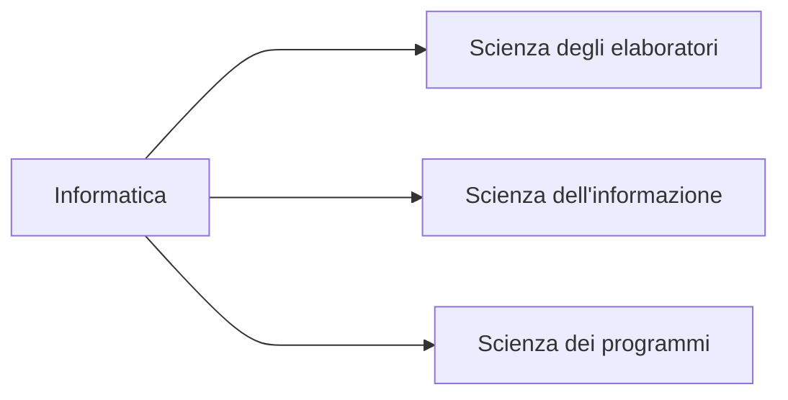
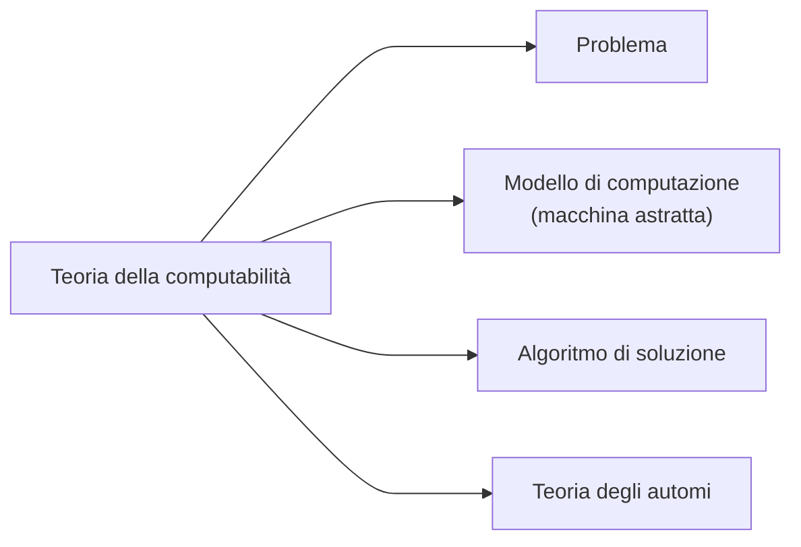
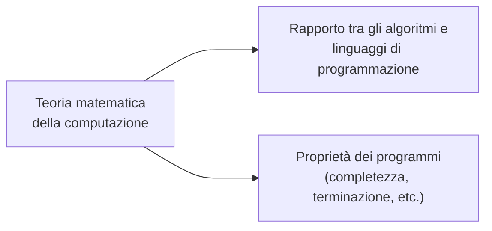
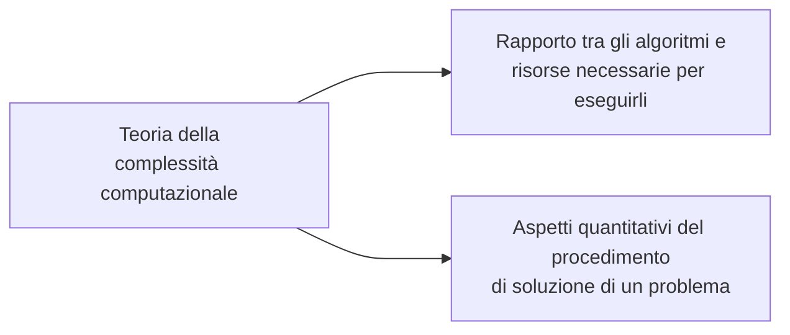
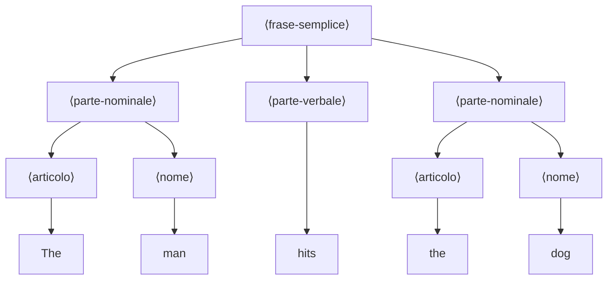

# Introduzione alla teoria dei linguaggi formali

La teoria dei linguaggi formali rappresenta spesso uno scoglio per gli studenti
di informatica a causa della sua forte dipendenza dalla notazione.

L'argomento, d'altra parte, non può essere evitato perché ogni laureato in
informatica deve possedere una buona comprensione dell'operazione di compilazione
e questa, a sua volta, si fonda pesantemente sulla teoria dei linguaggi formali.

Vi sono diversi livelli di descrizione di un linguaggio:

- grammatica, indica quali frasi sono corrette;
- semantica, indica il significato di una frase corretta;
- pragmatica, indica come fare uso di una frase corretta e sensata;
- implementazione (per i linguaggi di programmazione), indica come eseguire una
  frase corretta in modo da rispettarne il significato.

Le grammatiche sono uno strumento utile per descrivere la sintassi di un
linguaggio di programmazione. È costituita dall'alfabeto del linguaggio, ovvero
un insieme di simboli con cui "costituire" le parole del linguaggio (es. alfabeto
latino con $22$ o $26$ lettere), il lessico costituisce le parole del linguaggio
(es. informatica), la sintassi determina quali sequenze di parole costituiscono
frasi legali (o corrette).

Questa prima parte del programma ha l'obiettivo di fornire una base sufficiente
alla comprensione delle tecniche di compilazione, oggetto della seconda parte
del corso.

È per questa ragione che ci si concentrerà quasi esclusivamente su due tipi di
grammatiche:

- regolari;
- libere da contesto.

poiché i linguaggi formali utilizzati in informatica sono per lo più di questi
tipi.

# Introduzione

L'informatica teorica è la scienza degli algoritmi, in tutti i loro aspetti,
poiché è il concetto di algoritmo che è in qualche modo comune a tutti i settori
dell'informatica.



Gli *elaboratori* sono macchine che eseguono degli algoritmi; l'*informazione*
è la materia su cui lavorano gli algoritmi; i *programmi* sono algoritmi
descritti in un particolare linguaggio.

## Aree di ricerca dell'informatica teorica

<!-- ```mermaid
mindmap
    root{{Algoritmi}}

        Teoria della<br>complessità computazionale
            Risorse
            Modelli di computazione
                Teoria degli automi

        Teoria della<br>computabilità
            Modelli di computazione
            Problemi

        Teoria della<br>computazione
            Programmi
            Linguaggi
                Teoria dei linguaggi formali
``` -->

<!-- TODO: aggiungere immagine, oppure trovare modo di scriverlo -->
Lo schema riportato in figura fornisce una panoramica delle aree di ricerca che
ricadono nell'ambito più generale dell'informatica teorica. Tali aree sono le
seguenti:







Particolarmente feconda si è rivelata l'interazione tra la Teoria degli Automi
e la Teoria dei Linguaggi Formali.

Quest'ultima, nata in ambito linguistico per caratterizzare i linguaggi naturali,
è stata sviluppata e utilizzata dagli informatici teorici, che avevano l'esigenza
di descrivere gli algoritmi con linguaggi di programmazione comprensibili dalla
macchina, ma non troppo difficili per l'uomo e soprattutto non ambigui.

## Studio dei linguaggi

Quando si inizia a studiare un linguaggio, formale o meno, tutti quanti sono
esperti di un linguaggio, quello con cui si comunica con altre persone.

Oltre ad essere competenti in uno (o più) linguaggi naturali, lo studente in
informatica ha familiarià con diversi linguaggi di programmazione, come FORTRAN,
PASCAL, C, PROLOG, etc.

Questi linguaggi vengono (o venivano) usati per scrivere programmi e quindi per
comunicare con il computer. Chiunque utilizzi un computer potrà notare che esso
sia particolarmente limitato nel comprendere il significato desiderato dei
programmi.

In linguaggio naturale è solitamente possibile comunicare anche attraverso frasi
mal strutturate e incomplete, per il computer non è così.

## Sintassi e Semantica

I programmi devono aderire rigorosamente a regole stringenti e anche differenze
minori verranno rigettate come errate. Idealmente, ogni frase in un linguaggio
dovrebbe essere corretta sia semanticamente (avere cioè il corretto significato)
sia sintatticamente (avere la corretta struttura grammaticale).

Nell'italiano parlato, le frasi sono spesso sintatticamente sbagliate,
ciononostante convogliano la semantica desiderata.

In programmazione, comunque, è essenziale che la sintassi sia corretta al fine
di comunicare una qualsivoglia semantica. Quando si studia la semantica di una
frase, ne si studia il significato.

Tutte le frasi che seguono hanno la stessa interpretazione semantica, cioè lo
stesso significato, sebbene siano sintatticamente differenti:

- The man hits the dog;
- The dog is hit by the man;
- L'homme frappe le chien

Lo studio della sintassi è lo studio della grammatica, cioè della struttura
delle frasi. La frase "The man hits the dog" può essere analizzata sintatticamente,
cioè risolta nelle parti grammaticali componenti, come segue:

$$
\underbrace{\text{The man}}_{\bnf{parte-nominale}} \quad
\underbrace{\text{hits}}_{\bnf{parte-verbale}}     \quad
\underbrace{\text{the dog}}_{\bnf{parte-nominale}} \quad
$$

e ogni frase in questa forma è sintatticamente valida in inglese.

Possiamo descrivere un particolare insieme di tali frasi semplici in inglese
usando le seguenti regole:

$$
\bnf{frase-semplice} \Coloneqq \bnf{parte-nominale}
                               \bnf{parte-verbale}
                               \bnf{parte-nominale}
$$

segue dunque

$$
\begin{align}
    \bnf{parte-nominale} &\Coloneqq \bnf{articolo} \bnf{nome} \\
    \bnf{nome}           &\Coloneqq \textbf{ car $\mid$ man $\mid$ dog} \\
    \bnf{articolo}       &\Coloneqq \textbf{ The $\mid$ a} \\
    \bnf{parte-verbale}  &\Coloneqq \textbf{ hits $\mid$ eats}
\end{align}
$$

Le precedenti regole sono scritte in BNF, una notazione usata comunemente per
descrivere la sintassi dei linguaggi di programmazione. BNF sta per Backus Naur
Form, ed è un metalinguaggio.

Nell'esempio, $\bnf{frase-semplice}$ è definita come una $\bnf{parte-nominale}$
seguita da una $\bnf{parte-verbale}$ seguita, a sua volta, da un'altra
$\bnf{parte-nominale}$.

Ciascuna delle due occorrenze di $\bnf{parte nominale}$ deve essere espansa in
$\bnf{articolo}$ seguito da un $\bnf{nome}$.

Scegliendo di espandere la prima occorrenza di $\bnf{articolo}$ in **The**, la
prima occorrenza di $\bnf{nome}$ in **man**, la $\bnf{parte-verbale}$ in **hits**,
il secondo $\bnf{articolo}$ in **The** e infine l'ultimo $\bnf{nome}$ in **dog**,
si dimostra che la frase **The man hits the dog** è una frase semplice.

Tutto ciò si può riassumere nel seguente **Albero di derivazione**:



La definizione data di $\bnf{frase-semplice}$ dà luogo a $72$ diverse frasi
derivabili. Sebbene tutte siano sintatticamente corrette, in base alla nostra
definizione, alcune non hanno un'interpretazione semantica sensata (non hanno
senso compiuto). Una di queste è la frase: **The car eats the man**. Non
necessariamente una frase corretta ha senso.

Consideriamo la seguente frase (non derivabile da $\bnf{frase-semplice}$
utilizzando le regole date in precedenza): **They are flying planes**.

Un'analisi sintattica di questa frase è:

$$
\underbrace{\text{They}}_{\bnf{pronome}} \quad
\underbrace{\text{are}}_{\bnf{verbo}} \quad
\underbrace{
    \underbrace{\text{flying}}_{\bnf{aggettivo}} \quad
    \underbrace{\text{planes}}_{\bnf{nome}}
}_{\bnf{parte-nominale}}
$$

Quest'analisi suggerisce che **they** si riferisce a **planes** (aerei nel cielo
che volano). Un'analisi alternativa sarebbe:

$$
\underbrace{\text{They}}_{\bnf{pronome}} \quad
\underbrace{\text{are flying}}_{\bnf{verbo}} \quad
\underbrace{\text{planes}}_{\bnf{nome}}
$$

e questa implicherebbe un'interpretazione semantica completamente differente,
in cui **they** si riferisce a chiunque sia attualmente al controllo dei **planes**
(*essi stanno pilotando gli aerei*).

Nell'esempio, l'analisi sintattica è di aiuto all'interpretazione semantica.
Per quanto sia scelto "ad hoc" e mostri un fenomeno poco comune nel linguaggio
naturale, l'esempio è illustrativo di un concetto importante in computazione.
Una fase cruciale nel processo di compilazione di un programma è l'analisi
sintattica, come passo essenziale per la sua interpretazione semantica.
