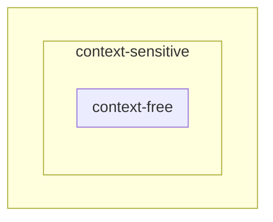

# Linguaggi liberi da contesto e linguaggi dipendenti da contesto

## Grammatica libera da contesto

Una grammatica \(\grammar\) è **libera da contesto** (o **context-free**) se,
per ogni produzione, \(v \to w\) è un simbolo non-terminale.

\[
    G \text{ context-free } \deff \forall v \to w \in P : v \in V
\]

## Linguaggio context-free

Un linguaggio \(L\) su un alfabeto \(X\) è **libero da contesto** se può essere
generato da una grammatica libera da contesto

\[
    L \text{ context-free} \deff \exists G \text{ context-free} \tc L(G) = L
\]

Se si ha una grammatica context-free che genera \(L\), non è detto che non
esista un'altra grammatica che generi lo stesso linguaggio.

La maggior parte dei linguaggi di programmazione sono context-free. Il termine
context-free nasce dal fatto che la sostituzione di un simbolo non-terminale non
è condizionata dal contesto, ossia dai caratteri adiacenti in cui compare.

Un simbolo non-terminale A in una forma di frase può sempre essere sostituito
usando una produzione del tipo \(A \to \beta\). La sostituzione è sempre valida.

Viceversa, se \(L = L(G)\) e \(G\) non è context-free, non è possibile concludere
che \(L\) non è context-free perché non è possibile escludere che esista una
grammatica context-free \(G'\) per cui \(L = L(G')\).

!!! example "Esempi"

    - Il linguaggio delle parentesi ben formate o quello dei numeri interi
      relativi o il linguaggio delle stringhe con egual numero di \(0\) e \(1\);
    - Il linguaggio \(L = \set{a^n b^n \mid n > 0}\) o il linguaggio
      \(L = \set{a^n b^{2n} \mid n > 0}\);

## Grammatica dipendente da contesto

Una grammatica \(\grammar\) è **dipendente da contesto** (o **context-sensitive**),
se ogni produzione è in una delle seguenti forme:

1. \(yAz \to ywz\) con \(A \in V\), \(y,z \in \XuVast\), \(w \in \XuVplus\) che
   si legge: "\(A\) può essere sostituita con \(w\) nel contesto \(y{-}w\)"
   (contesto sinistro \(y\) e contesto destro \(z\));
2. \(S \to \lambda\) purché \(S\) non compaia nella parte destra di alcuna
   produzione.

## Linguaggio dipendente da contesto

Un linguaggio \(L\) è **dipendente da contesto** se può essere generato da una
grammatica dipendente da contesto.

## Linguaggi context-free e context-sensitive

La relazione è la seguente

Tale relazione sussiste perché le regole di produzione context-sensitive sono
una generalizzazione di quelle context-free. Le produzioni context-free sono un
caso particolare delle produzioni di tipo 1. delle grammatiche context-sensitive,
che si verifica quando \(y = z = \lambda\), ovvero il contesto destro e sinistro
sono equivalenti alla parola vuota.

!!! warning "Eccezione"

    Osservando con attenzione la definizione di grammatica context-free, si nota
    che \(w \in \XuVast\) mentre nella definizione di grammatica context-sensitive
    \(w \in \XuVplus\).

    Dunque le gramamtiche context-free ammettono produzioni del tipo \(A \to \lambda\)
    con \(A\) che può anche non essere il simbolo iniziale, mentre le grammatiche
    context-sensitive non ammettono tali produzioni.

    Verranno chiamate tutte le produzioni del tipo \(\lambda\)-**produzioni** o
    \(\lambda\)-**regole**.

Alcuni esempi di produzioni contestuali sono i seguenti:

- \(bC \to bc\);
- \(baACba \to baAabA\).

Esempi di grammatica contestuale sono i seguenti:

- \(S \to \lambda \mid bC\)[^1];
- \(bC \to bC\)

Un esempio di produzione non context-sensitive (né context-free) è il seguente:

\[ CB \to BC \]

Quest'ultima non è né context-sensitive né context-free. È una produzione
**monotona** perché del tipo \(v \to w\) con \(\abs{v} \leq \abs{w}\).

## Grammatica monotona

Una grammatica \(\grammar\) è **monotona** se ogni sua produzione è monotona,
ovvero se

\[ \forall v \to w \in P : \abs{v} \leq \abs{w} \]

## Linguaggio monotono

Un linguaggio \(L\) è monotono se può essere generato da una grammatica monotona.

[^1]:
    \(S \to \lambda\) è una produzione context-sensitive e \(S\) non compare a
    destra di un'altra produzione.
