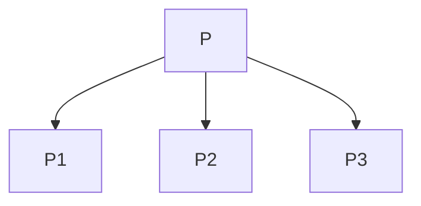
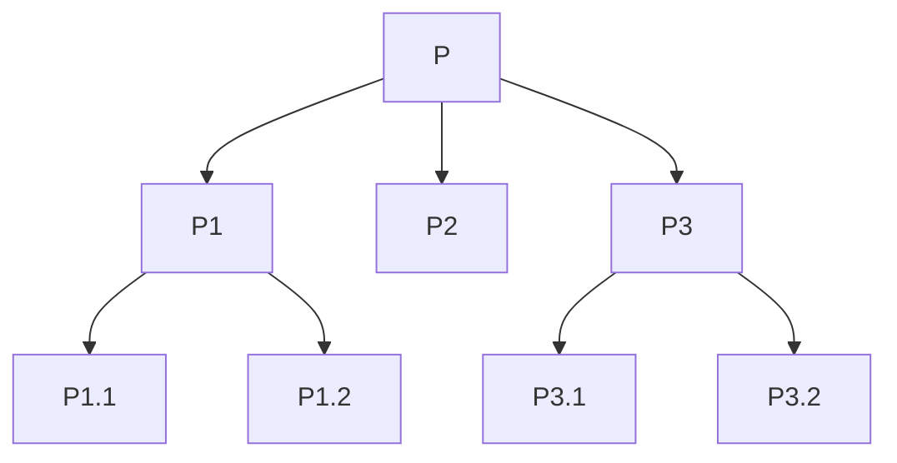

# Metodologia Top-Down

La metodologia di sviluppo di un programma Top-Down riguarda i metodi di
risoluzione di un problema, basati sulla decomposizione del problema.

Lo _stepwise_ refinement (ovvero raffinamento per passi successivi), è una
strategia di sviluppo Top-Down proposta da N. Wirth nell'ambito della
programmazione strutturata, nell'articolo "Program Development by Stepwise
Refinement", 1971.

## Metodologia Top-Down nell'analisi del problema

L'analisi Top-Down prevede la scomposizione del problema generale da risolvere
in più sotto-problemi.

La scomposizione del problema in sotto-problemi, si ottiene attraverso la
decomposizione del problema in sotto-problemi, che a loro volta possono essere
decomposti in altri sotto-problemi, e così via.

Ognuno di questi sotto-problemi, va analizzato e risolto in modo indipendente dal
problema principale. In questo modo, si ottiene una soluzione al problema generale
risolvendo i sotto-problemi.

Così facendo, il problema generale viene decomposto in sotto-problemi più semplici
del principale. Questi possono essere rappresentati come un albero, in cui il nodo
radice rappresenta il problema generale, e i nodi foglia rappresentano i
sotto-problemi più semplici. Quest'albero viene chiamato _albero di decomposizione
funzionale_.

## Albero di decomposizione

L'albero di decomposizione funzionale, è un albero che rappresenta la scomposizione
del problema in sotto-problemi. Ad esempio, il problema iniziale \(P\), può essere
decomposto in \(P_1\), \(P_2\) e \(P_3\):

Nel caso in cui i sotto-problemi \(P_1\), \(P_2\) e \(P_3\) siano a loro volta
troppo complessi, possono essere decomposti in altri sotto-problemi.

Quindi si ha che nella radice dell'albero di decomposizione, si ha il problema
principale \(P\), e i nodi foglia \(P_{1.1}\), \(P_{1.2}\), \(P_2\), \(P_{3.1}\)
e \(P_{3.2}\) si hanno i sotto-problemi più semplici, considerati più facilmente
risolvibili.

## Come comporre le soluzioni dei sotto-problemi

Lo scopo del processo di decomposizione, è quello di scomporre la soluzione del
problema principale nelle soluzioni di altri problemi, ma molto più semplici e
dunque più facilmente risolvibili.

La soluzione per un problema \(P\) si ottiene combinando le soluzioni dei suoi
sotto-problemi utilizzando le strutture di controllo, ovvero sequenza, selezione
e iterazione.

La situazione è differente se il problema ammette una soluzione ricorsiva.

### Specifica di un problema

La specifica di un problema, è una descrizione formale del problema, che permette
di definire il problema in modo univoco. La specifica di un problema, è composta
da:

- il compito o _funzione_ che il problema richiede che sia svolto;
- i dati di **input** e di **output**.

### Soluzione

La descrizione della soluzione del problema \(P\), è basata sulla descrizione
delle soluzioni dei suoi sotto-problemi, ovvero:

- la specifica di ogni singolo sotto-problema (compito/funzione);
- i dati di input e output di ciascun sotto-problema.

## Metodologia Bottom-Up

La metodologia Bottom-Up, è una metodologia di progettazione e sviluppo di un
programma che riguarda i metodi di risoluzione di un problema per sintesi, ovvero
basandosi sull'interconnessione di componenti già disponibili.

Questo porta alla creazione di componenti standard che possono essere riutilizzati.

## Programmazione in grande e in piccolo

Il compito della _programmazione in grande_ è quello di progettare la struttura
del programma come se fosse un insieme di parti, detti moduli.

La _programmazione in piccolo_ è la fase di sviluppo del programma, in cui si
descrivono i singoli moduli, implementando e progettando i singoli algoritmi.

## Pseudo-codifica

Il linguaggio che viene utilizzato per descrivere i singoli algoritmi, è detto
_pseudo-codice_. Questo è un linguaggio che non è un vero linguaggio di
programmazione, ma che è molto simile ad esso.

### Livelli di astrazione

L'algoritmo viene inizialmente espresso in maniera molto astratta, utilizzando
il linguaggio naturale (con astrazioni sui controlli, sui tipi di dato e sulle
funzioni). Successivamente, si passa ad un livello di astrazione più basso,
utilizzando lo pseudo-codice. Infine, si passa al linguaggio di programmazione
