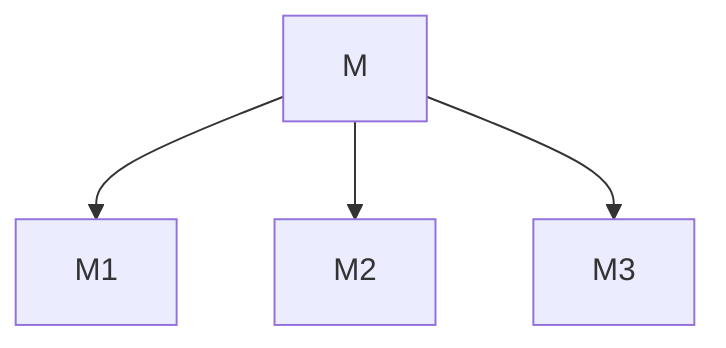
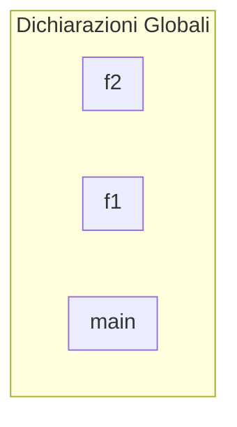
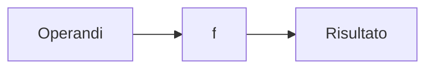

# Funzioni e procedure

Come accennato in precedenza, un programma può essere organizzato in un
programma principale e un insieme di sotto-programmi. Ad esempio



scomponiamo il problema \(M\) nei sotto-problemi \(M_1, M_2, M_3\)

## Struttura di un programma in C

Nel C, un programma è costituito da una sezione di dichiarazioni globali, dalla
funzione `#!C main() {}` e da altre funzioni, in questo caso \(f_1\) e \(f_2\).



È presente un'analogia tra la scomposizione di un problema e la struttura di un
programma. Intuitivamente si può affermare che la soluzione di ciascun
sotto-problema sia un sotto-programma a sè stante.

## Sotto-programmi

Vari linguaggi di programmazione forniscono dei costrutti sintattici per

- creare delle unità di programma (sotto-programmi), dando un nome ad un gruppo
  di istruzioni;
- Attivare tali unità con modalità di comunicazione stabilite con l'unità
  chiamante.

### Caratteristiche di un sotto-programma

Un sotto-programma è:

- identificato da un nome;
- costituito da istruzioni.

Generalmente con gli stessi costrutti di un programma, ovvero **dichiarazioni**
e **blocco delle dichiarazioni eseguibili**

### Attivazione o chiamata di un sotto-programma

Un sotto-programma va in esecuzione solo se la sua attivazione viene richiesta
da parte di un'altra unità di programma (che sia in grado di rilevare la presenza
del sotto-programma).

L'attivazione viene richiesta utilizzando il nome del sotto-programma. Tale nome
va utilizzato ogni volta che si vuole eseguire quel determinato blocco di
istruzioni.

I programmi possono essere sia interni che esterni all'unità che li utilizza.

### Parametri di un sotto-programma

I sotto-programmi possono comunicare con l'unità chiamante attraverso i
_parametri_.

Il nome del sotto-programma e l'elenco dei suoi parametri vengono dichiarati
esplicitamente nell'intestazione dei sotto-programmi, ovvero la prima istruzione
del sotto-programma.

I parametri consentono di rappresentare i dati di comunicazione tra il sotto-programma
e il programma chiamante, ovvero i **dati di ingresso** e quelli di **uscita**
del sotto-programma.

Ogni parametro è _individuato_ da un **nome** e da un **tipo**. Inoltre, la lista
dei parametri va definita in modo esplicito nell'intestazione del sotto-programma.

### Attivazione di un sotto-programma

Al momento dell'attivazione del sotto-programma:

1. viene sospesa l'esecuzione dell'unità contenente la richiesta di attivazione
   e il controllo passa al sotto-programma attivato;
2. al termine dell'esecuzione, l'attivazione viene terminata e il controllo
   ritorna all'unità chiamante.

### Astrazione funzionale e procedurale

Mediante i sotto-programmi è possibile ampliare l'insieme degli operatori e
delle istruzioni disponibili in un linguaggio di programmazione. I
sotto-programmi sono di due tipi:

- Funzioni mediante le quali è possibile introdurre nuovi operatori (astrazione
  funzionale o astrazione della nozione di operatore);
- Procedure mediante le quali è possibile introdurre nuove istruzioni
  (astrazione procedurale o astrazione della nozione di istruzione).

#### Funzioni matematiche

Un sotto-programma di tipo funzione consente di costruire una funzione
matematica.

Una funzione matematica \(f\) associa ad un valore del suo dominio \(\dom f\)
un valore del dominio del risultato, il \(\codom f\). Ad esempio sia \(f = \sqrt{x}\),
si ha:

\[ f \colon \R \to \R \]

### Funzioni

In un linguaggio di programmazione una funzione \(f\) può essere vista come un
operatore che opera su **operandi**, ovvero i parametri in input, e produce un
risultato o valore di output



Ai parametri di input e al valore di output deve essere associato un **tipo**.
Il valore di output è necessariamente **scalare**.

#### Attivazione di una funzione

Una funzione viene attivata (o chiamata) inserendo il nome della stessa e la sua
lista dei parametri (se presente) in un'espressione dello stesso tipo della
funzione.

Per poter chiamare una funzione è sufficiente conoscere il nome di quest'ultima
e la sua lista di parametri, dunque una funzione può essere vista come una scatola
nera della quale si conoscono soltanto i dati d'ingresso e il risultato.

### Astrazione funzionale

Una funzione \(f\) può essere vista come un operatore che opera su tipi di dati
primitivi o definiti dal programmatore.

Con l'introduzione di una funzione viene ampliato l'insieme degli operatori del
linguaggio utilizzato.

## Funzioni in C

Il linguaggio C fornisce il costrutto function per realizzare sia funzioni che
procedure. Le differenze consistono essenzialmente nel modo di

- Modo di comunicare i dati di uscita
- Modo di chiamare il sotto-programmi

Per poter utilizzare una funzione è necessario:

- definire il sotto-programma, cioè scrivere in C tutte le istruzioni necessarie;
- dichiarare il sotto-programma nella parte dichiarativa del programma.

### Definizione di una funzione

La definizione di una funzione è costituita da: un'intestazione e un blocco di
dichiarazioni e istruzioni, ovvero sezioni di:

1. dichiarazioni di costanti, tipi e variabili
2. di istruzioni

La sintassi per definire una funzione nel C è la seguente:

```c title="Funzione in C"
<tipo> <identificatore>(<parametri>) {
    <dichiarazioni locali>
    <istruzioni>
}
```

Dopo l'intestazione della funzione vi sono:

- le dichiarazioni locali, cioè le dichiarazioni di tutte le risorse (costanti,
  tipi, variabili, funzioni) necessarie;
- il blocco delle istruzioni

Infine è presente l'istruzione `#!C return <valore>;` che restituisce il valore
calcolato dall'espressione

### Intestazione di una funzione

Nell'intestazione di una funzione:

```c linenums="0"
<tipo> <identificatore>(<parametri>)
```

il `#!c <tipo>` sarebbe il tipo del valore che la funzione restituisce,
`#!c <identificatore>` sarebbe il nome della funzione e `#!c <parametri>`
sarebbe la lista di parametri che la funzione accetta.

### Lista di parametri formali

Ogni parametro della lista è definito come tipo e identificatore

```c linenums="0"
(<parametri>) := (<tipo> <identificatore>)
```

I parametri sono tra loro separati da virgole.

<!-- markdownlint-disable MD046 -->

!!! example "Esempi di intestazione"

    ```c linenums="0"
    int abs(int x);
    ```

    oppure

    ```c linenums="0"
    float somma(int a, int b);
    ```

<!-- markdownlint-enable MD046 -->

### Lista di parametri attuali

I parametri attuali indicano i valori degli argomenti rispetto ai quali la funzione
deve essere calcolata. Un parametro attuale può essere:

- Una costante;
- Una variabile;
- Una espressione;
- Una chiamata ad una funzione;

<!-- markdownlint-disable MD046 -->

!!! example "Esempi di attivazione"

    Data la seguente funzione

    ```c linenums="0"
    float somma(int a, int b);
    ```

    esempi di attivazione della stessa sono i seguenti:

    ```c
    z = somma(a, b);
    z = somma(2, 5*b);
    z = c + somma(a, b);
    y = somma(x, abs(z));
    ```

<!-- markdownlint-enable MD046 -->

L'attivazione di una funzione può essere inserita dovunque possa essere
inserito un operatore sul tipo del parametro della funzione.

### Prototipi

Una funzione deve essere dichiarata prima del suo utilizzo. La dichiarazione è
costituita dal suo prototipo.

Il prototipo è uguale alla intestazione della funzione:

```c linenums="0"
<tipo> <identificatore>(<parametri>)
```

Nel prototipo gli identificatori dei parametri sono opzionali, si può quindi
avere:

```c linenums="0"
<tipo> <identificatore>(<tipi>)
```

Il prototipo di una funzione deve essere inserito nella parte dichiarativa del
programma, prima del codice che utilizza la funzione stessa.

In tal modo il compilatore può facilmente controllare il numero ed il tipo dei
parametri di input ed il tipo del valore restituito.
