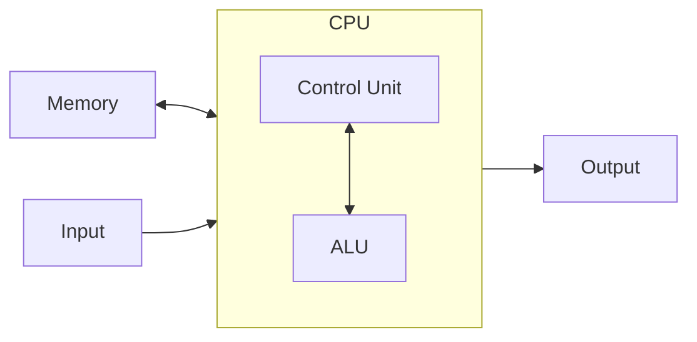

# Introduzione ai calcolatori

## Sistemi di elaborazione dell'informazione

Gli elementi principali di un sistema di calcolo si suddividono in 2 categorie:

**Hardware**
: La parte fisica dell'elaboratore che è costituita da componenti elettronici e elettromagnetici

**Software**
: Tutti i programmi che consentono all'Hardware di realizzare specifici compiti

Senza Hardware il Software è inutile e viceversa. Questi si completano.

## Software

I Software sono di due tipi

**Software di base**
: Funzionale all'utilizzo dell'elaboratore e di tutte le sue periferiche, questo
  comprende sia il sistema operativo, che i programmi che traducono i linguaggi
  di programmazione.

**Software applicativo**
: Mostra all'utente il calcolatore come una macchina virtuale che è possibile
  utilizzare per la risoluzione di problemi specifici.

Il Software applicativo comprende tutte le applicazioni che l'utente utilizza
come giochi, fogli elettronici, editor di testo, etc.

È necessario saper utilizzare correttamente il SO poiché saper impostare la
macchina al meglio è fondamentale.

## Architettura di un calcolatore

I componenti fondamentali dell'architettura dei calcolatori sono:

- Unità centrale di elaborazione (CPU) che preleva le istruzioni dalla memoria
  e le esegue, dunque legge e/o scrive dati dalla memoria;
- Memoria principale (RAM, ROM) che contiene i dati e le istruzioni dei
  programmi;
- Memoria secondaria o di massa (HD, CD, DVD, ecc.) per memorizzare dati e
  programmi in maniera permanente;
- Dispositivi di input (tastiera, mouse, touch pad, ecc.) per l’inserimento dei dati;
- Dispositivi di output (monitor, stampante, ecc.) per ricevere i risultati.

Ogni calcolatore è progettato secondo l'architettura di Von Neumann



Dove ALU sta per Unità Logica Aritmetica.

## Memoria

Vi sono due tipi di memoria: memoria principale, chiamata RAM (Random Access
Memory) e la memoria ROM (Read Only Memory).

### Memoria Principale (RAM)

La memoria principale contiene i dati e le istruzioni che il processore deve
elaborare. Se lo spazio della RAM è esaurito, il programma verrà eseguito molto
lentamente oppure non verrà eseguito.
L'elemento base della memoria principale è la _cella di memoria_, la quale ha
delle caratteristiche specifiche:

- Può assumere solo due stati: $0$ oppure $1$;
- È possibile scrivere nella cella per cambiarne lo stato;
- È possibile leggere lo stato della cella.

La cella di memoria da sola non è molto utile ed è per questo motivo che vengono
organizzate in _locazioni di memoria_ da $8$, $16$ o anche più celle. Lavorando
con questi dati si ha a che fare con $8$, $16$, etc. byte. La singola cella
viene chiamata bit, dunque una cella equivale a $1$ bit.
Ogni locazione di memoria è individuata da un indirizzo univoco che permette di
specificarne la posizione. Lavorando con le locazioni di memoria si lavora
indirettamente anche con questo indirizzo.

### Memoria ROM

La ROM è una memoria a **sola lettura** e contiene delle informazioni permanenti
e non modificabili.
Spesso utilizzata per memorizzare istruzioni di sistema, ad esempio le istruzioni
necessarie per avviare il SO e per il riconoscimento delle periferiche.

### Memoria di Massa

Detta anche memoria secondaria, viene utilizzata per memorizzare grandi volumi
di dati in modo persistente.

## Codici di caratteri

Un codice di caratteri è un codice alfabetico, ovvero un insieme di caratteri e
può comprendere caratteri alfabetici (minuscoli e maiuscoli), caratteri numerici,
segni di punteggiatura, altri simboli stampabili e caratteri di controllo.

I due principali codici di caratteri sono ASCII e UNICODE.

Questi codici di caratteri servono alla macchina per capire come interpretare le
stringhe di $0$ e $1$ in caratteri.

Con il codice ASCII si hanno a disposizione $256$ simboli distinti

fig.

I primi $32$ simboli sono caratteri di controllo e hanno codici che vanno da $0$
a $31$, sempre sotto forma di $0$ e $1$. I simboli sono $256$ poiché con $8$ bit
è possibile rappresentare da $0$ a $255$ combinazioni differenti. Inizialmente
il codice ASCII utilizzava $7$ bit, in seguito l'ASCII esteso porta il numero
di bit a $8$.

## Sistemi di numerazione

È un insieme di simboli (cifre) e regole che assegnano ad ogni sequenza di cifre
uno e un solo valore numerico. Questo può essere:

- non posizionale, come ad esempio il sistema di numerazione degli antichi romani;
- posizionale, come ad esempio il sistema di numerazione decimale.

### Sistema di numerazione posizionale

Il sistema di numerazione posizionale è un sistema di numerazione in cui ogni
cifra ha un valore diverso a seconda della sua posizione. Il sistema di
numerazione decimale è un sistema di numerazione posizionale. Dato un numero
$b > 1$ detto base e un insieme di $n$ cifre $I = \{0, 1, 2, \dots, n-1\}$, una
stringa di $n$ simboli $x_{n-1}, x_{n-2}, \cdots, x_1, x_0$ si interpreta come:

$$
x_{n-1}\cdot b^{n-1}+x_{n-2}\cdot b^{n-2}+\cdots + x_1 \cdot b^1 + x_0 \cdot b^0
$$

#### Sistema di numerazione decimale

Nel sistema di numerazione decimale la base è $10$ e le cifre sono
$0, 1, 2, \dots, 9$. Ad esempio la stringa $2014$ rappresenta il numero

$$2 \cdot 10^3 + 0 \cdot 10^2 + 1 \cdot 10^1 + 4 \cdot 10^0$$

#### Sistema di numerazione binario

Nel sistema di numerazione binario la base è $2$ e le cifre sono $0, 1$. Ad
esempio la stringa $11110$ rappresenta il numero

$$1 \cdot 2^4+ 1 \cdot 2^3 + 1 \cdot 2^2 + 1 \cdot 2^1 + 0 \cdot 2^0$$

che equivale a $30$ nel sistema decimale.

### Conversione da decimale a binario

La conversione di un numero da base $10$ a base $2$ è un processo iterativo che
consiste nel dividere il numero per $2$ e prendere il resto della divisione. Il
risultato della divisione viene utilizzato come nuovo numero da dividere per $2$
e così via fino a quando il risultato della divisione non è $0$. I resti delle
divisioni vengono riportati in ordine inverso.

<!-- markdownlint-disable MD046 -->

!!! example "Esempio"

    Convertiamo:

    === "Numero $7$"

        ```txt
        7/2 = 3, resto 1
        3/2 = 1, resto 1
        1/2 = 0, resto 1
        ```

        Il numero $7$ in binario è $111$

    === "Numero $14$"

        ```txt
        14/2 = 7 resto 0
        7/2 = 3 resto 1
        3/2 = 1 resto 1
        1/2 = 0 resto 1
        ```

        Il numero $14$ in binario è $1110$.

<!-- markdownlint-enable MD046 -->
