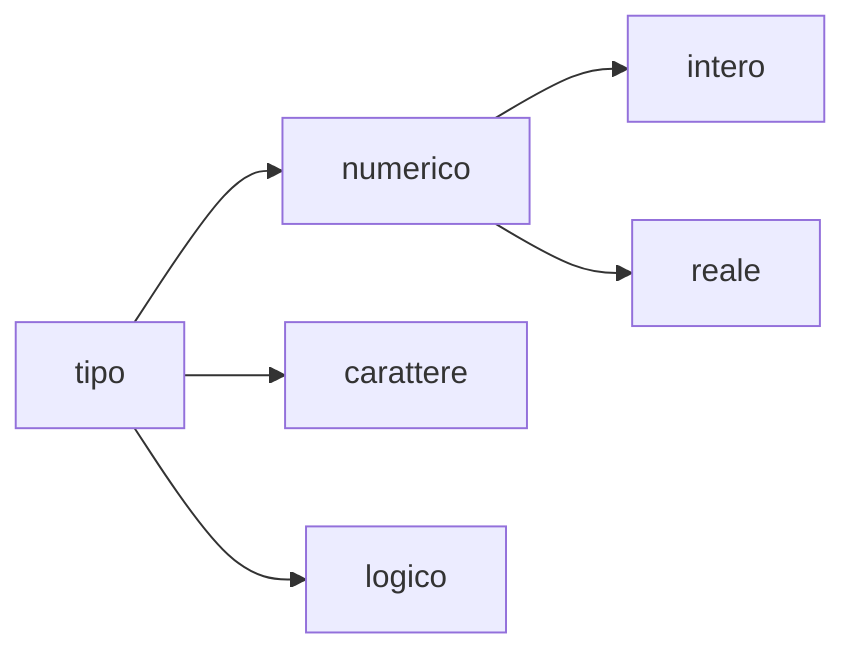

# Tipi semplici

## Linguaggi di programmazione

Un linguaggio di programmazione rappresenta un elaboratore astratto, capace
di comprendere i termini del linguaggio che, generalmente, sono delle astrazioni
degli oggetti della macchina reale. Ad esempio una variabile è un'astrazione della
memoria centrale.

## Dati

I dati rappresentano oggetti e proprietà della realtà rilevanti per il problema
in esame. I dati sono una astrazione di oggetti del mondo reale.

Che cosa si intende per astrazione? È un processo per il quale si ignorano gli
aspetti reali che non sono rilevanti, in modo tale da concentrarsi completamente
sugli aspetti più importanti. Una astrazione è dunque una semplificazione.

### Dati semplici e strutturati

I dati semplici o elementari rappresentano oggetti, entità, proprietà elementari
o atomiche non decomponibili.

I dati strutturati rappresentano oggetti, entità o proprietà più complessi,
sono dunque aggregati di dati elementari.

### Identificatori di variabili e costanti

Una variabile è identificata da un nome, detto identificatore, ed assume un
valore che può essere modificato durante l’esecuzione di un programma.

Una costante è identificata da un nome, detto identificatore, ed assume un
valore che non può essere modificato durante l’esecuzione di un programma.

### Tipi di dati

Ad ogni dato, variabile o costante, deve essere associato un tipo. Generalmente
tale associazione è dichiarata nella sezione dichiarativa del programma.

I tipi sono: numerici, logici, alfanumerici o caratteri:



Un tipo di dato o semplicemente tipo indica:

- Un insieme di valori $D$ (dominio);
- Un insieme di operazioni $O$ che si applicano agli elementi di $D$, operatori
  e predicati;
- Un insieme di costanti, cioè di simboli con cui si denotano i valori del
  dominio $D$.

### Dichiarazione di una variabile

Per dichiarare una variabile `#!c a` è necessario associare ad essa un tipo che
indichi:

- i valori che questa può assumere;
- le operazioni che possono essere effettuate sull'insieme di tali valori;
- i simboli con cui si indicano tali valori all'interno di un programma.

<!-- markdownlint-disable MD046 -->
!!! example "Dichiarazione di una variabile"

    Un esempio di dichiarazione in C è la seguente

    ```c
    int a
    ```
<!-- markdownlint-enable MD046 -->

### Costanti

<!-- markdownlint-disable MD046 -->
!!! example "Dichiarazione di una costante"

    Dichiarazione in C di una costante intera identificata da `n`:

    ```c
    const int n = 100;
    ```
<!-- markdownlint-disable MD046 -->

La parola chiave è `#!c const`, `#!c int` è lo specificatore del tipo, `#!c 100`
è il valore assegnato alla costante `#!c n`.

Una dichiarazione di costante associa permanentemente un identificatore ad un
valore.

## Tipi e linguaggi di programmazione

I linguaggi di programmazione consentono di:

- Utilizzare tipi di dato predefiniti;
- Definire nuovi tipi;
- Convertire una variabile di un tipo in una variabile di altro tipo in modo
  implicito o esplicito.

### Tipi primitivi

I tipi primitivi sono quelli direttamente disponibili nel linguaggio di
programmazione. In C i tipi primitivi sono:

- Tipi predefiniti:
      - `#!c int`: per i numeri interi;
      - `#!c float`: per i numeri reali;
      - `#!c double`: per i reali in doppia precisione;
      - `#!c char`: per i caratteri;
- Tipi definiti dall’utente:
      - Tipi enumerati definiti tramite la parola chiave `#!c enum`.

### Tipi semplici e tipi strutturati

I tipi primitivi sono detti anche tipi semplici ovvero il loro dominio è
elementare, dunque costituito da elementi atomici non decomponibili
(es. `#!c int`).

I tipi strutturati sono quelli il cui dominio è composito, ovvero è composto
aggregando dati più elementari (es. vettore e struttura).

## Dati numerici interi e reali

I linguaggi di programmazione consentono di rappresentare ed elaborare dati
numerici interi e reali. Il linguaggio C fornisce tre tipi predefiniti:

- `#!c int` per rappresentare ed elaborare un sottoinsieme dei numeri interi
- `#!c float` e double per rappresentare ed elaborare un sottoinsieme dei
  numeri reali

### Tipo int

I dati di tipo int costituiscono un sottoinsieme dei numeri interi, positivi e
negativi. Un `#!c int` è rappresentato generalmente in una parola, $2 {\rm\,byte}$
o $4 {\rm\,byte}$. Nel caso in cui la parola sia di $2 {\rm\,byte}$ il dominio
del tipo `#!c int` è costituito dall’insieme.

$$D = [-2^{15}, 2^{15} -1] = [-32768, 32767]$$

Il minimo e il massimo valore intero hanno una rappresentazione simbolica
denominata `#!c INT_MIN` e `#!c INT_MAX`.

`#!c INT_MIN` e `#!c INT_MAX` sono identificatori di costanti predefinite e
contengono il valore del più piccolo e del più grande intero rappresentabile.

La definizione delle due costanti è contenuta nel file `limits.h`.

### Operatori aritmetici

Siano $a, b$ due operandi di tipo `#!c int`. Gli operatori aritmetici
restituiscono un valore di tipo `#!c int`

| Operatore        | Simbolo   |
| :--------------- | :-------- |
| Addizione        | `+`       |
| Sottrazione      | `-`       |
| Moltiplicazione  | `*`       |
| Divisione        | `/`       |
| Modulo           | `%`       |

La divisione restituisce il quoziente della divisione, ovvero la parte intera.
Il modulo restituisce il resto della divisione.

### Operatori relazionali

Restituiscono un valore vero (`1`) o falso (`0`)

| Operatore         | Simbolo  |
| :---------------- | :------- |
| Uguale            | `==`     |
| Diverso           | `!=`     |
| Minore            | `<`      |
| Maggiore          | `>`      |
| Minore uguale     | `<=`     |
| Maggiore uguale   | `>=`     |

## Costanti intere

I valori del dominio del tipo `#!c int` sono denotati, all’interno di un programma,
con un insieme di valori costanti (costanti intere).

Ogni costate intera è rappresentatata come un numero intero decimale eventualmente
con segno. Ad esempio: `#!c 0`, `#!c -151`, `#!c +41`.

## Espressione aritmetica

Una espressione aritmetica intera è costituita da termini separati dagli operatori
`+` e `-`. Ogni termine è costituito da fattori, variabili e costanti, separati
dagli operatori `*`, `/,` `%`.

!!! example "Esempio"

    ```c
    int a, b, c;   // dichiarazione di variabili intere
    c = b / a - 1; // espressione costituita da un solo termine costante
    a = 4, b = 2;  // espressione costituita da 2 termini
    c = b % a;     // espressione costituita da un termine
    ```

In ogni caso il risultato è un intero.

## Compatibilità tra tipi

Siano $T_1$ e $T_2$ due tipi differenti. Variabili di tipo differente possono
comparire in una stessa espressione? Generalmente sì, se il linguaggio di
programmazione fornisce delle regole di conversione implicite tra i due tipi.
